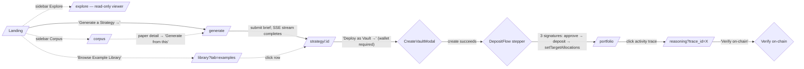

# Archimedes

> # Agentic trading, grounded in research.
>
> Tell Archimedes what you want from a portfolio in plain English. It fuses your intent with the quant-finance literature, live market data, and statistical rigor — into an autonomous on-chain strategy that runs in a non-custodial vault on Arc, with every decision hashed and verifiable on-chain.
>
> *The lever is academic research. The fulcrum is autonomous AI. The world is your portfolio.*

[](LICENSE)
[](https://luma.com/7i50p2r9)
[](https://www.arc.network/)
[](ARC-OSS-SHOWCASE.md)

## TL;DR

Describe what you want; Archimedes fuses your intent with live market data and a quantitative-finance research library (1,014 papers ingested into Postgres so far; ~10,000-paper manifest seed target hydrates incrementally) into novel strategies, gates them through selection-bias rigor (Deflated Sharpe, Probability of Backtest Overfitting), and lets you execute them into non-custodial vaults on Arc testnet — every reasoning step traceable to a source paper and anchored on-chain.

**Hackathon RFB alignment.** Archimedes is built against **[RFB 04 — Adaptive Portfolio Manager](https://luma.com/7i50p2r9)** — the only one of the six Agora Request-For-Builds whose primitives map one-to-one onto what we ship (regime detection, asset allocation by regime, autonomous rebalancing, Kelly + risk-parity sizing, correlation-based diversification, cross-chain-ready execution). **Adjacent fit:** RFB 02 (Prediction Market Trader Intelligence — our +EV / Kelly primitive maps without requiring us to ship prediction markets) and RFB 06 (Social Trading Intelligence — our Tier-1 verified library + paper-anchored passport + DSR/PBO rigor *is* the "AI selects, weights, monitors" leaderboard pattern the RFB describes). RFB 04 is the core claim; the others are bonus surface area.

### Run it locally in three commands

```bash
git clone --recurse-submodules git@github.com:a-apin/archimedes-arcadia.git archimedes && cd archimedes
cp .env.example .env       # fill in ANTHROPIC_AUTH_TOKEN (GLM via Canteen, or BYO Anthropic key)
docker compose up -d --build
```

Then open <http://localhost>. Full walkthrough: [`SETUP.md`](SETUP.md).

> ⚠️ **`pytest` requires the docker stack to be running.** Before running the test suite,
> always spin up the services first: `docker compose up -d --build` (the `--build` flag
> rebuilds images after dependency changes). The tests depend on Postgres + Redis being
> reachable; without the stack you'll see connection errors, not test failures. Full
> testing notes in [`SETUP.md` § Running the test suite](SETUP.md#running-the-test-suite).

### Common dev commands (`make help`)

The repo ships a [`Makefile`](Makefile) with shortcuts for the daily workflow.
Run `make` (or `make help`) for the full list. Most useful:

```
make up         # docker compose up -d --build (starts the stack)
make down       # stop the stack
make logs       # tail backend logs
make pytest     # run the backend test suite (stack must be up)
make lint       # ruff check
make format     # ruff format
make ui-dev     # Vite dev server (ui/)
make routes     # dump FastAPI route inventory
make clean      # nuke __pycache__/.pytest_cache/.ruff_cache
```

Foundry, Circle wallet, and oracle targets (`compile`, `test`, `wallet`, `feed`, …) are also there — see `make help`.

## Status (2026-05-25 — submission day)

**Live on the Arc public testnet** (chain ID `5042002`): grab faucet USDC at <https://faucet.circle.com/> (20 USDC / 2h — on Arc, USDC *is* gas) and try the full flow with test funds. **No real money at risk, by design.** Arc has no mainnet yet (Circle's docs list mainnet as "upcoming"); mainnet launch, real-funds custody, and the regulatory architecture (off-chain redemptions, preset-strategy / RIA posture) are the **business-plan roadmap**, not hackathon scope — see [`docs/competitor-landscape.md`](docs/competitor-landscape.md).

**Built today — visible on the live site right now:**

- **Live HTTPS testnet deploy** at <[https://archimedes-arc.com](https://archimedes-arc.com/)/> behind nginx + Route 53 + ACM. 11 Solidity contracts deployed on Arc testnet (chain ID `5042002`).
- **SPEC-1 end-to-end evidence on-chain** — submission-day dress-rehearsal walkthrough captured in [`docs/runbooks/arc-testnet-e2e-evidence.md`](docs/runbooks/arc-testnet-e2e-evidence.md). Two vaults deployed by a real user wallet, **8 transactions confirmed** on Arc testnet (`txreceipt_status: 1` for every one), `vault.creator == user wallet` verified on each — the architectural proof that user funds never pass through platform custody. **The wedge held empirically**: of 6 strategies in the library, exactly the 2 that pass DSR ≥ 0.95 + PBO < 0.5 + OOS Sharpe ≥ 0.5 + look-ahead audit were deployed; the other 4 were correctly gate-blocked.
- **Real on-chain rebalance traces in production** — the autonomous agent has been writing rebalance txs against the deployed `Vault` + `ReasoningTraceRegistry` contracts; `curl https://archimedes-arc.com/api/traces/?limit=10` returns `arc_tx_hash` values verifiable on `testnet.arcscan.app`.
- **End-to-end deposit flow** — `CreateVaultModal` → `DepositFlow` stepper signs 3 wallet txs (USDC.approve → vault.deposit → vault.setTargetAllocations). `StrategyPublisher` anchors the passport's `methodology_hash` on the `StrategyRegistry` contract per vault created.
- **Verify-on-chain (O(1))** — the Reasoning page's "Verify on-chain" button runs a single `eth_getTransactionReceipt` + log decode and surfaces a `testnet.arcscan.app/tx/...` link on success.
- **Multi-wallet UX** with EIP-6963 wallet discovery — MetaMask, Coinbase, and Circle Modular Wallets passkey paths all working. Wallet-gated routes (Library / Portfolio / Learnings) render an explicit "Connect Wallet" CTA when logged-out so we never imply personalization the user doesn't have.
- **Three-mode Generate page** — agentic streaming (LLM portfolio agent with 12-iteration tool-use), fusion (novel multi-paper synthesis), and architect (curated-library selection). All three feed the same selection-bias rigor gate (DSR + PBO + walk-forward OOS + look-ahead audit) before a strategy is admitted as Tier-1.
- **Regime-conditional Kelly sizing** in the optimizer — effective γ scales with the live regime per Ang & Bekaert 2002, so the same strategy generates regime-appropriate sizing without parallel agents.
- **Honest Explore page** — `is_stale` reflects the *displayed* price's freshness window per source (on-chain oracle 5min / yfinance fallback 4 days / no source = stale). The page no longer flags every asset STALE; the `price_source` field discloses where each price came from.
- **Unified `strategy_passports` store on Postgres** — both curated and generated strategies live in one typed table; the Considered-Alternatives panel reads from `strategy_proposals` so judges see what was rejected and why.
- **806+ backend tests** + 16 analytics-engine tests green; server-side ruff format guard (`main-format-guard.yml`) auto-heals direct-to-main commits if any land unformatted.

## Why Archimedes

| Category                  | Examples                                  | What's missing                                            |
| ------------------------- | ----------------------------------------- | --------------------------------------------------------- |
| TradFi robo-advisors      | Wealthfront, Betterment                   | Rule-based, opaque, no on-chain settlement                |
| DeFi yield aggregators    | Yearn, Morpho-curated vaults              | Chase live yield, curation without proof of methodology   |
| AI-flavored crypto agents | Virtuals, SingularityDAO, Theoriq         | Token-mediated speculation; reasoning opaque              |

**Nobody is grounding portfolio decisions in bleeding-edge academic quant research with verifiable on-chain reasoning, settled in pure USDC.** That's the gap. Full thesis: [`docs/competitor-landscape.md`](docs/competitor-landscape.md).

## User journey

**Canonical user journey** — 7 click steps from cold land to a verified on-chain decision.



Every other route (Library tabs, Corpus Graph/KG, Explore sparklines, Learnings) is reachable from the sidebar but supplementary.

## Documentation map

Three documents are the front door for different audiences:

| If you want to… | Read |
|---|---|
| Run Archimedes locally | [`SETUP.md`](SETUP.md) |
| Operate the live stack + understand the RPC | [`OPERATIONS.md`](OPERATIONS.md) |
| Understand Arc / Circle integration | [`ARC.md`](ARC.md) |
| Know what the product *is* (the locked spine) | [`docs/user-stories.md`](docs/user-stories.md) |
| Browse all design + planning docs | [`docs/README.md`](docs/README.md) |
| Submit Archimedes to the Arc OSS Showcase | [`ARC-OSS-SHOWCASE.md`](ARC-OSS-SHOWCASE.md) |
| Project context for a Claude Code session | [`CLAUDE.md`](CLAUDE.md) |

## Repository structure (top level)

```
archimedes/
├── README.md             ← this file
├── SETUP.md              ← prerequisites + 5-step install + platform notes + test suite
├── OPERATIONS.md         ← run the stack + RPC deep-dive + LLM backends + traction logging + security
├── ARC.md                ← Arc testnet reference + Circle sponsor alignment + context-arc submodule
├── ARC-OSS-SHOWCASE.md   ← positioning + forkable primitives for the Arc OSS Showcase
├── CLAUDE.md             ← project context for Claude Code sessions
├── LICENSE               ← Unlicense (public-domain dedication)
│
├── docs/                 ← design + planning + specs + ADRs + archive (see docs/README.md)
├── backend/              ← FastAPI app (Python 3.12) — see docs/chuan-architecture-survey.md
├── analytics-engine/     ← backtest engine (uv-managed)
├── contracts/            ← Solidity (Foundry layout) — 11 contracts deployed on Arc testnet
├── ui/                   ← React 19 + Vite 8 + viem 2.48 (the live frontend)
├── nginx/                ← reverse-proxy + UI build container
├── wallet-setup/         ← Circle Wallets scripts (oracle wallet, entity-secret rotation)
├── infra/                ← Terraform (EC2 deploy)
└── submodules/           ← context-arc + KnowledgeBase + Linus (git submodules)
```

## Tech stack

| Layer             | Technology                                                                                |
| ----------------- | ----------------------------------------------------------------------------------------- |
| Backend           | Python 3.12 · FastAPI · Uvicorn · SQLAlchemy                                              |
| Frontend          | React 19 + Vite 8 + [viem](https://viem.sh/) 2.48 (plain CSS)                             |
| Database          | PostgreSQL 16 + Redis 7                                                                   |
| LLM               | Provider-agnostic (`LLM_*` env): GLM via z.ai, Anthropic, OpenAI, Ollama                  |
| Backtesting       | [backtrader](https://github.com/mementum/backtrader) ([ADR](docs/adr/backtrader-vs-vectorbt-decision-memo.md)) |
| Smart contracts   | Solidity targeting Arc (EVM-compatible) + [Foundry](https://book.getfoundry.sh/)          |
| On-chain          | Circle SDK (Wallets, Gateway, CCTP) + viem on the UI side                                 |
| Hackathon CLI     | [arc-canteen](https://github.com/the-canteen-dev/ARC-cli) (RPC proxy + telemetry)         |
| Deployment        | Docker compose (6-service stack) on EC2; GitHub Actions CI/CD                             |

Full architecture: [`docs/design.md`](docs/design.md) + [`docs/chuan-architecture-survey.md`](docs/chuan-architecture-survey.md).

## Development workflow

See [`CLAUDE.md`](CLAUDE.md) for full conventions. Headline points:

- **Branch model:** `main` is the single live branch — build-on-deploy (every merge triggers a CI deploy). Short-lived `<discord-handle>/<name>` branches → PR → `main`; rebase late, merge fast.
- **One approving review** for non-contract changes; two for contract changes.
- **Commit style:** imperative mood with optional scope tags (`[strategy]`, `[backend]`, `[contracts]`, `[docs]`, `[infra]`).
- **Lanes are descriptive, not prescriptive** — everyone is full-stack ([`CLAUDE.md` § Lead + coverage](CLAUDE.md)).

## Team

5 builders across 5 timezones with deep coverage on every load-bearing skill — see the team table in [`CLAUDE.md`](CLAUDE.md).

## Contributing

Fork, branch (`<your-handle>/<short-name>`), PR to `main`. One logical change per PR. Never force-push `main`. Never commit secrets. See [`CLAUDE.md`](CLAUDE.md) for full conventions.

## Cited literature

The deck, the rigor gate, and the pitch all rest on a specific reading of the academic
record. The five papers below are load-bearing and worth reading first if you want to
audit our claims.

| Citation | What it gives us |
|---|---|
| **Xia et al. 2026** — *Agentic Trading: When LLM Agents Meet Financial Markets*. ESWA. [arxiv 2605.19337](https://arxiv.org/abs/2605.19337) | The audit-grade survey our R3 reproducibility target is built against (**15/19 trading-agent papers are R0**, **0/19 reach R3**). We implement all five named protocols Xia formalizes (Outcome Embargo, Time-Aware Retrieval, Hierarchy of Truth, Source Tracking, `V_check`) as enforced mechanisms — see [`docs/specs/xia-2026-protocols.md`](docs/specs/xia-2026-protocols.md). |
| **Chen et al. 2026** — *StockBench: A Contamination-Free, Closed-Loop Trading Agent Benchmark*. [arxiv 2510.02209](https://arxiv.org/abs/2510.02209) | The empirical proof-point our LLM family ranks #3 globally on (GLM-4.5, behind Kimi-K2 and Qwen3-235B; ahead of Claude-4-Sonnet #7 and GPT-5 #9). Our own Strategy Generation Agent layered on top ran the harness and landed #15/15 (Sortino -0.91) — surfaced honestly in [`docs/benchmarks/stockbench-results.md`](docs/benchmarks/stockbench-results.md) rather than hidden. |
| **Bailey & López de Prado 2014** — *The Deflated Sharpe Ratio*. Journal of Portfolio Management. | The first of the four selection-bias controls every Tier-1 strategy must pass before admission to the library. Detail in [`docs/specs/selection-bias-corrections-spec.md`](docs/specs/selection-bias-corrections-spec.md). |
| **Bailey, Borwein, López de Prado & Zhu 2014** — *Pseudo-Mathematics and Financial Charlatanism*. Notices of the AMS. | The CSCV-PBO procedure (Probability of Backtest Overfitting) — Tier-1 admission control #2. Our `fusion_evaluator` computes real CSCV PBO over the parameter-variant grid generated per strategy. |
| **Ang & Bekaert 2002** — *International Asset Allocation with Regime Shifts*. Review of Financial Studies. | Empirical basis for the regime-conditional risk-aversion γ scaling in the Kelly optimizer — γ widens in `risk_off` / `crisis` regimes so a single strategy generates regime-appropriate sizing without needing two parallel agents. |

**Where else literature is cited.** Every Tier-1 strategy passport (`/library?tab=examples`) links to the paper that backs it. Every reasoning trace anchored on-chain via `ReasoningTraceRegistry` includes a `consulted_paper_hashes` field binding the decision to a specific corpus snapshot. The full implementation is in [`backend/archimedes/services/source_tracker.py`](backend/archimedes/services/source_tracker.py).

## Known Limitations (testnet)

- **AMM liquidity:** Only the sTSLA/USDC pool has reserves ($3.97 USDC). The 4 remaining pools (sNVDA, sSPY, sBTC, sGOLD) are deployed but empty — the synthetic token mint authority (`0x0546…`) is a separate Foundry deployer wallet not accessible to the bootstrap script's Circle signer. The autonomous agent's liquidity guard honestly skips swaps into empty pools and logs the reason on-chain. This is the rigor system working as designed: capital is never exposed to doomed trades.

## License

[Unlicense](LICENSE) — full public-domain dedication. Use, modify, distribute freely. No warranty.

---

> *In classical Athens, the agora was the heart of the city — the original information-processing machine. AI agents are the new citizens.*
>
> — [Agora Agents Hackathon](https://luma.com/7i50p2r9)
