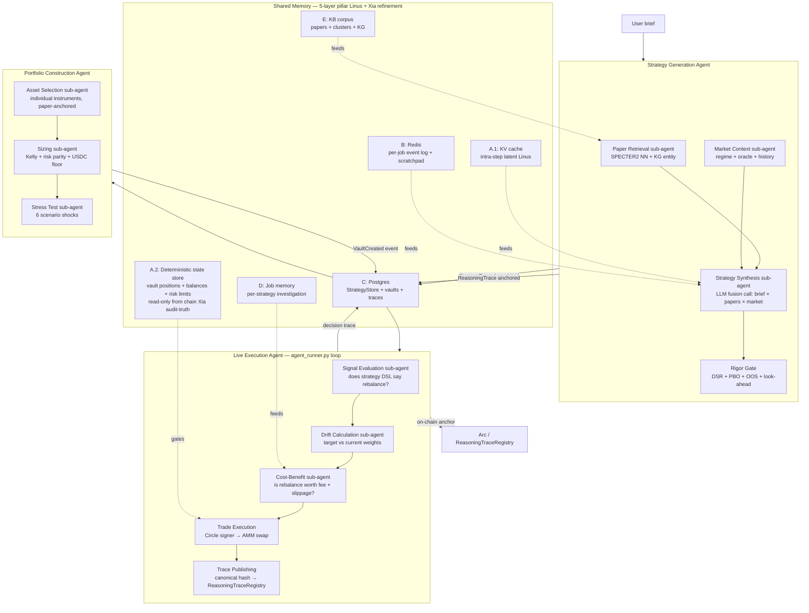

# Architectural Principles for a Defensible Portfolio Agent

> **Audience:** Archimedes hackathon team.
> **Purpose:** Establish the design philosophy underneath the strategy passport, the
> on-chain reasoning-trace anchoring, and the non-custodial vault. The "why" doc;
> the "what" details live in the specs in [`specs/`](specs/) and in
> [`design.md`](design.md).
> **Status:** Day-10 update (2026-05-22). The four primitives below — paper-claim
> binding, reasoning trace, tool-call provenance, selection-bias correction — are
> **all shipped and live** as of Day-10. The selection-bias gate has 2 Tier-1
> strategies that currently pass (Faber 2007 SMA-200, Moreira-Muir 2017
> vol-managed) against 22 years of real SPY data. The four primitives remain the
> philosophical core; Day-10 added a *fifth* operational capability — the LLM-driven
> agentic portfolio advisor ([`portfolio_agent.py`](../backend/archimedes/services/portfolio_agent.py))
> — which sits *on top of* the four primitives (it cannot bypass the passport,
> rigor gate, or trace anchor). See
> [`chuan-architecture-survey.md`](chuan-architecture-survey.md) for the current
> shipped-state per file.

## The frame: portfolio agents that don't ship verifiable history don't earn trust

Every portfolio agent — robo-advisor, DeFi yield aggregator, copy-trading platform, AI
trading product — makes a competence claim of some kind. The differences are in **what
backs the claim**. Three categories:

1. **Self-reported metrics.** "Our AI delivered 18% returns last year, trust us." Cheapest
   to ship; weakest defensibility. The user has no way to audit how the returns were
   generated, what risks were taken, or whether the methodology survives out-of-sample.
2. **Audited backtests.** "Here's our 10-year backtest, audited by Firm X." Better than
   self-report, but the user still can't audit a *specific* portfolio decision the agent
   made — only the aggregate historical claim.
3. **Verifiable per-decision history.** A machine-readable record of every decision the
   agent makes — what regime it detected, which strategies it selected, why it allocated
   weights as it did, what trades it executed — with each decision's reasoning trace
   hashed and anchored on-chain. This is what Trading-R1 (Wang et al. 2025,
   [arxiv:2509.11420](https://arxiv.org/abs/2509.11420)) calls "reasoning trace as the
   product."

**Archimedes' reputation system is in category 3.** This is the load-bearing architectural
commitment from which everything else flows.

## Why category 3 is non-negotiable

Three independent arguments converge:

1. **The market is crowded with category-1 and category-2 products.** Wealthfront,
   Betterment, Schwab Intelligent Portfolios, every DeFi yield aggregator, every "AI ETF"
   on Twitter — none of them surface per-decision auditable reasoning. Without that, we're a
   late entrant to a saturated category.
2. **The Agora hackathon's framing rewards it.** [Canteen's positioning](https://luma.com/7i50p2r9):
   *"AI agents are the new citizens... continuous, comparative reasoning... treat the agora
   as substrate."* The Agora's whole pitch is that markets are information-processing
   machines; reasoning traces ARE information. RFB 04's "Adaptive Portfolio Manager" lives
   most credibly when each adaptation has an auditable reasoning trail.
3. **Past performance does not persist out-of-sample.** This is the canonical failure mode
   of leaderboard-based reputation (see [`reputation-and-vertical-selection.md`](reputation-and-vertical-selection.md)
   in the prior agent-marketplace work; the same principle applies). A portfolio agent
   that claims "X% returns last year, so you can trust me" inherits the regression-to-mean
   problem of every leaderboard. **Verifiable reasoning history bypasses the prediction
   problem**: we don't claim the past predicts the future; we claim the past is auditable.

## The four primitives that make verifiable history work

These are the architectural commitments. Schema details in
[`specs/strategy-passport-spec.md`](specs/strategy-passport-spec.md) and
[`specs/selection-bias-corrections-spec.md`](specs/selection-bias-corrections-spec.md);
principle here.

> **Day 3 update:** The fourth primitive — selection-bias correction — was added on
> 2026-05-13 after the red-team review documented in
> [`agora_project_analysis.md`](archive/agora_project_analysis.md) § 5.3. The three original
> primitives address *auditability*; the fourth addresses *credibility* of admission to
> the library in the first place.

### Primitive 1: paper-claim binding (the strategy passport)

Every strategy in the library carries a verifiable provenance trail:

- **Source paper(s):** arxiv ID, title, authors, publication venue, our methodology
  summary.
- **Methodology hash:** a content-hash of the extracted methodology — what the LLM read
  from the paper and turned into a strategy definition.
- **Backtest results:** Sharpe, Sortino, max drawdown, CAGR, equity curve, the works.
  Critically: comparison against the paper's *claimed* metrics. If the paper said Sharpe
  4.6 and our re-implementation got Sharpe 1.8, we record and surface the delta.
- **Validation gate timestamp:** when did this strategy graduate from "candidate" to
  "validated" to "live"?
- **Curator signature** (v1 — Dan's wallet): an audit trail of who vetted the strategy.

The strategy passport answers: *"Why should I trust this strategy?"* with concrete,
verifiable answers rather than self-reported metrics.

### Primitive 2: reasoning trace (the decision passport)

For every agent decision (portfolio construction, rebalance, strategy rotation, regime
change), capture:

- **The trigger** that caused the decision (drift threshold, regime change, calendar,
  strategy decay).
- **The market context** at decision time (regime classification, key metrics, correlations).
- **The reasoning** — LLM-generated explanation of why the decision was made, what
  alternatives were considered, what tradeoff was made.
- **The action taken** — concrete trades, weight changes, rebalance details.
- **The expected outcome** — what the agent predicts will happen.
- **The content hash** of the full trace.
- **The on-chain anchor tx hash** — recorded on Arc via the ReasoningTraceRegistry
  contract.

Each decision is a single record; the user's full decision history is queryable in order;
any decision can be audited end-to-end.

### Primitive 3: tool-call provenance

For every tool the agent invoked during a decision (market data fetch, paper search,
regime computation, USYC yield lookup), capture which tool was called, the inputs, and the
outputs. This is what makes the agent's *information surface* auditable.

- A reasoning trace can claim "I checked the VIX and saw it spike to 35," but without
  tool-call provenance, that's just a claim.
- Provenance proves the agent had that specific tool, queried it with that specific
  input, and got that specific output.
- Critically, this enables backtesting the *agent's behavior* on historical data — if the
  agent's tool calls are recorded, we can replay them later with different LLM prompts
  and see how decisions would have differed.

### Primitive 4: selection-bias correction (the admission gate)

Auditability proves that the agent *did what it claims*. Selection-bias correction proves
that the strategies in the library *deserve to be there* — that they survive the
statistical tests separating curve-fit artifacts from credible predictors.

For every strategy admitted to the Tier-1 library, the
[`specs/selection-bias-corrections-spec.md`](specs/selection-bias-corrections-spec.md)
contract requires:

- **Deflated Sharpe Ratio (DSR)** — Sharpe corrected for non-normality and multiple
  testing (Bailey & López de Prado 2014). `dsr_p_value >= 0.95`.
- **Probability of Backtest Overfitting (PBO)** — CSCV-framework probability that the
  in-sample-optimal strategy underperforms the OOS median (Bailey, Borwein, López de
  Prado, Zhu 2014). `pbo_score < 0.5`.
- **Walk-forward out-of-sample Sharpe** — held-out slice metric. Must reach at least
  50% of the in-sample Sharpe (no cliff).
- **Look-ahead audit** — static checks confirm no future-bar references in strategy
  code or data slicing.
- **Paper-claim delta surfaced**, not hidden — `sharpe_vs_paper`, `cagr_vs_paper`, and
  McLean-Pontiff post-publication decay estimate all visible in the passport.

This addresses the strongest red-team critique of an LLM-driven strategy pipeline:
*published academic alpha is mostly dead alpha* (McLean & Pontiff 2016 — 58% of
in-sample Sharpe lost post-publication on average). The four corrections do not make a
strategy "right"; they reduce the false-positive rate and surface the residual
uncertainty so the user can audit it.

**Tier-2 community vaults are exempt from primitive 4.** That is by design — see the
two-tier section below.

## Two-tier marketplace: how the primitives apply to each tier

Per [`specs/ecosystem-design-spec.md`](specs/ecosystem-design-spec.md), Archimedes runs a
two-tier vault marketplace. The primitives are not uniformly required; the tiers are
*defined* by which primitives they commit to.

| Primitive | Tier 1 (Archimedes Verified 🏆) | Tier 2 (Community 👥) |
|---|---|---|
| 1. Paper-claim binding | **Required** — every strategy traces to published research | Optional — community vaults need no paper backing |
| 2. Reasoning trace | **Required** — every agent decision is hashed and anchored | **Required** if agent-assisted; manual vaults log creator-attributed decisions |
| 3. Tool-call provenance | **Required** — every tool invocation recorded with input/output hashes | **Required** for agent-assisted actions |
| 4. Selection-bias correction | **Required** — DSR + PBO + OOS Sharpe + look-ahead audit must all pass | Not required — Tier 2 is freestyle by design |

The Tier 1 badge means "this vault's strategies survive all four primitives." The Tier 2
flag means "this vault carries reasoning traces but the strategies have not been
paper-grounded or selection-bias-corrected." Both are useful; neither is misrepresented.

## Agent architecture overview

Archimedes ships three top-level agents (Strategy Generation, Portfolio Construction, Live Execution), each with sub-agents, connected by a 5-layer shared memory pillar (Layer A's two-sublayer split per Xia et al. 2026):

The custody + authority boundary — agents have rebalance authority only; users sign all 4 binding deployment transactions — is what makes Archimedes non-custodial in the strong sense. See [`docs/archive/launch-execution-plan-2026-05-23.md` § 3.3.1](archive/launch-execution-plan-2026-05-23.md#331-who-does-what--agent--user-interaction-model) for the sequence-diagram detail.

## The three layers, named explicitly

Borrowing a framing from prediction-market architecture (Canteen's _Unbundling the
Prediction Market Stack_ post):

- **Agent layer** — the LLM-driven thing that does the work (strategy selection, regime
  detection, rebalance execution). Producible from any framework; framework-agnostic by
  design.
- **Identity layer** — the strategy passport + reasoning trace + tool-call provenance.
  Verifiable, hashed, on-chain-anchored. **This is what Archimedes actually owns and
  operates.**
- **Venue layer** — Arc as the settlement substrate. Sub-second finality, USDC
  denomination, ~$0.01 fees via Paymaster.

Most portfolio products fold these together (the agent's logic is the platform's IP, the
identity is opaque, the venue is implicit). **Archimedes keeps them explicitly decoupled**
because that's the architectural choice that makes "paper-grounded provenance +
MCP-native + verifiable history" credible as a pitch.

## Design constraints these primitives imply

Once you commit to the four primitives, several design choices are forced:

1. **You commit to an on-chain anchoring path.** The verifiability depends on the hash
   being checkable independent of the platform. The
   [`specs/ecosystem-design-spec.md`](specs/ecosystem-design-spec.md) § 3.4 keeps
   `ReasoningTraceRegistry.sol` from the original design unchanged. Don't skip it.
2. **You commit to content-hashing as the integrity primitive.** Not signatures, not
   platform attestations. The trace is what it is; any change to it changes the hash;
   anyone with the trace can verify it themselves.
3. **You commit to "verifiable history, not predictive performance" as the reputation
   thesis.** Don't ship a numeric score that claims to predict future performance. Ship
   the queryable, auditable history + the selection-bias-corrected admission record.
4. **You commit to non-custodial settlement.** Platform never holds user funds. Vault
   contracts (ERC-4626 per ecosystem-design-spec § 3.2) hold user USDC and synth tokens;
   the agent has rebalance authority only, not withdraw-to-platform authority.
5. **You commit to paper-grounded curation for Tier 1, not LLM-blind ingestion.** Tier 1
   strategies come from real published research with verifiable methodology. The arxiv
   pipeline can
   *propose* strategies, but a human curator (Dan in v1) validates before listing.
6. **You commit to selection-bias-corrected admission for Tier 1.** Every Tier-1
   strategy passes DSR (Bailey & López de Prado 2014), PBO (Bailey/Borwein/López de
   Prado/Zhu 2014), walk-forward OOS Sharpe, and a look-ahead static audit before
   promotion from CANDIDATE → VALIDATED. The numbers, including the paper-claim delta,
   are surfaced in the passport — never hidden behind an aggregate score.

## What this doesn't commit you to

A short list of architectural choices that are NOT forced by these principles — they remain
open, and the team can pick later:

- **Encryption of traces.** v1 traces are public. v2 can add encrypt-trace +
  share-key-with-buyer for use cases where strategy secrecy matters.
- **Slashing for bad agent performance.** Don't ship in v1. The passport with verifiable
  history is already a defensible reputation system; slashing adds complexity without
  proving the wedge.
- **Token economics.** No native token. Take-rate on USDC settlement + USYC yield share
  is the revenue model.
- **Specific UI patterns for the reasoning trace.** The data model dictates what's
  possible; how the team renders it (timeline view, decision drilldown, trace viewer) is
  a separate decision.
- **Specific LLM provider.** Claude API for v1; multi-provider support is a v2 question.

## How to evaluate proposed features against these principles

When the team is deciding whether to add a feature, run it through this six-question filter:

1. **Does it make any prior decision's record less auditable?** If yes, push back hard.
2. **Does it tie reputation to predicted performance rather than actual history?** If yes,
   replace with a history-based equivalent.
3. **Does it move user funds into platform custody?** If yes, redesign.
4. **Does it lock us into a single framework or LLM provider?** If yes, push back.
5. **Does it bypass the Tier 1 paper-claim binding?** (E.g., "let community strategies
   carry the Verified badge.") If yes, push back — paper-grounded curation is the badge.
   Tier 2 is the legitimate freestyle path.
6. **Does it bypass the Tier 1 selection-bias gate?** (E.g., "skip DSR/PBO for strategies
   we feel good about.") If yes, push back — the four-primitive admission gate is the
   only thing that distinguishes rigor from hand-waving.

A feature that fails any of these is a feature that erodes the architectural moat.
Sometimes it's worth the erosion (e.g., a v2 fiat on-ramp may require custodial
intermediaries — but that's a known v2 conversation). For v1, hold the line.

## How this differs from the prior agent-marketplace work

Some of these principles are direct ports of the architectural thinking that went into
the prior agent-marketplace project. The translation:

- **Agent passport → strategy passport.** Same primitive (verifiable identity for an
  agent's work), applied to strategies instead of generic agents.
- **Reasoning trace → reasoning trace.** Same primitive; same on-chain anchor pattern.
- **Tool-call provenance → tool-call provenance.** Same.
- **Verifiable history > predicted performance.** Same thesis.
- **Non-custodial escrow → non-custodial vault.** Same pattern; the contract surface is
  different (a vault holds aggregate user deposits + RWA tokens rather than per-job
  escrows), but the principle that the platform never custodies is identical.

What's NEW for Archimedes:

- **Paper-claim binding.** This is specific to Archimedes' strategy-engine framing — the
  agent's strategies come from published research, and the provenance trail back to the
  paper is part of the verifiable history. The agent-marketplace project didn't have an
  equivalent because agents there could be anything; Archimedes constrains itself to
  paper-grounded strategies precisely because that constraint is the defensibility moat.
- **Methodology re-validation.** We don't trust the paper's claimed metrics; we re-run the
  backtest and surface the delta. This is a quality discipline the prior work didn't need.

---

_The core claim of this doc: paper-grounded provenance + on-chain reasoning trace anchoring
+ non-custodial settlement is the architectural commitment that makes Archimedes' pitch
survive contact with a saturated robo-advisor / DeFi-yield-aggregator / AI-portfolio market.
Everything else flows from this._
