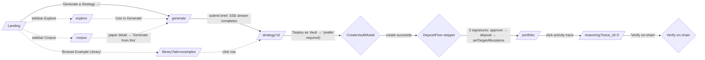
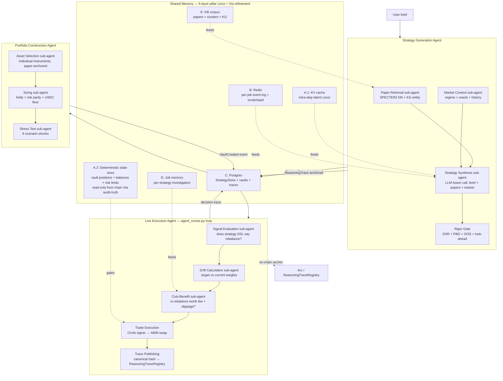

# Archimedes Launch Execution Plan

**Window:** Saturday 2026-05-23 → Sunday 2026-05-24 (target submission) → Monday 2026-05-25 23:59 ET (hard deadline; buffer day).
**Author:** Daniel Browne, with Claude (Opus 4.7) as planner. Marten + Chuan signed off on Phase 4/5 driver authority 2026-05-23 AM. Chuan confirmed full AWS provisioning autonomy for the `t2o2` bot system 2026-05-23 AM.
**Status:** Locked. Issue specs ready to file.

---

## Context

We are 36–48 hours from submission of the Agora Agents Hackathon (Canteen × Circle × Arc). This document is the single source of truth for what we ship between now and the deadline, who drives each track, and how we verify the bot system's output before merging to `main`.

The plan compresses three things into one document so a teammate (or a fresh Claude session) can pick it up cold:

1. **The locked product/scope decisions** that resolved planning ambiguity (Section 1).
2. **Executable, machine-grade issue specs** for the bot system to consume (Sections 4–6).
3. **Four parallel-track Maestro prompts** so Claude sessions on separate Macs can run independent tracks without stepping on each other (Section 8).

Pitch framing locked: Wall Street has the rigor toolkit (DSR/PBO/walk-forward OOS/look-ahead audit + multi-asset NAV vaults + stress tests + multi-agent risk pricing); most people don't. Archimedes brings that rigor to anyone with idle USDC. *Win more than you lose, not never lose.*

---

## Table of contents

1. [Locked decisions](#1-locked-decisions)
2. [Operating mechanics](#2-operating-mechanics)
   - [Naming conventions](#21-naming-conventions-cleared-up)
   - [Issue lifecycle (manual `t2o2` assignment)](#22-issue-lifecycle-manual-t2o2-assignment)
   - [PR disposition + merge order](#23-pr-disposition--merge-order)
   - [Spec writing protocol — machine-grade template](#24-spec-writing-protocol--machine-grade-template)
   - [Verification protocol](#25-verification-protocol)
   - [Spec elaboration process (hybrid Maestro pattern)](#26-spec-elaboration-process-hybrid-maestro-pattern)
3. [Pitch frame + architecture](#3-pitch-frame--architecture)
   - [Canonical pitch frame](#31-canonical-pitch-frame) — opens with Xia et al. 2026 protocol-audit numbers
   - [User journey — directed click-graph](#32-user-journey--directed-click-graph)
   - [Agent architecture — 3 top-level agents × sub-agents × shared memory](#33-agent-architecture)
   - [Who does what — agent ↔ user interaction model](#331-who-does-what--agent--user-interaction-model)
   - [Shared memory — 5-layer pillar (Linus lineage + Xia refinement)](#34-shared-memory--5-layer-pillar-linus-lineage--xia-refinement)
   - [Corpus seeding strategy](#35-corpus-seeding-strategy)
   - [Named protocols (Xia et al. 2026)](#36-named-protocols-xia-et-al-2026) — Outcome Embargo, Time-Aware Retrieval, Hierarchy of Truth, Source Tracking, V_check contract
4. [Track A — vault execution path (T1.x)](#4-track-a--vault-execution-path-t1x)
5. [Track B — UI/UX surface cleanup (T2.x)](#5-track-b--uiux-surface-cleanup-t2x)
6. [Track C — AWS infrastructure + KB pipeline + virality-readiness + Xia protocols + StockBench (T3.x)](#6-track-c--aws-infrastructure--kb-pipeline-t3x)
   - Includes T3.6 ALB + CloudFront + ASG, T3.7 Xia named protocols, T3.8 StockBench harness
   - [**6.5 Track E — Strategy Passport unification + bear-strategy architecture (T-PE.x)**](#65-track-e--strategy-passport-unification--bear-strategy-architecture-t-pex) — T-PE.1 StrategyRegistry contract, T-PE.2 multi-paper refactor, T-PE.3 unified store, T-PE.4 spec rewrite, T-PE.5 regime_tag, T-PE.6 always-both generation, T-PE.7 regime-aware weighting
7. [Security pillar (TS.x)](#7-security-pillar-tsx)
8. [Manual deliverables (M.x)](#8-manual-deliverables-mx)
9. [Parallel-track Maestro prompts](#9-parallel-track-maestro-prompts)
10. [Saturday → Sunday → Monday execution timeline](#10-execution-timeline-utc)
11. [Risks + degradation plan](#11-risks--degradation-plan)
12. [Appendices](#12-appendices)
    - [Bot system operational notes](#a-bot-system-operational-notes)
    - [Foreground Explore subagent verification prompt](#b-foreground-explore-subagent-verification-prompt)
    - [Claude design prompt for the design-language refresh](#c-claude-design-prompt-for-design-language-refresh)

---

## 1. Locked decisions

| Decision | Locked answer |
|---|---|
| **Scope tier** | All Tier A demo essentials + real KB pipeline on bot-provisioned GPU EC2 + AWS S3/DynamoDB papers infrastructure. **No required auth**; wallet IS the identity. Optional opt-in profile (name/email/interests/attribution/marketing-opt-in) after wallet connect. |
| **Generate consolidation** | Single input + single Generate button. Backend `_pick_pipeline()` heuristic auto-routes between Fusion (novel synthesis — default), Architect (fast curated-library preview — fallback), and the agentic SSE pipeline (third). All three result components remain; UI renders whichever the backend picked. |
| **KB pipeline** | Bot system stands up GPU EC2 + runs SPECTER2 embeddings + HDBSCAN clusters + REBEL/SciSpacy KG over the 10k q-fin corpus + persists artifacts to S3 + DynamoDB + serves via `/api/papers/corpus/graph` + `/kg`. |
| **Identity** | Wallet = identity. No required signup. Optional `WelcomeProfileModal` on first wallet connect captures display_name + email + interests + attribution + marketing_opt_in. All fields optional; user can Skip. Header shows "Welcome, &lt;name&gt;" when set. |
| **HTTPS + domain** | Chuan's bots register `archimedes-arc.com` via AWS Route 53 + obtain Let's Encrypt cert via certbot + configure nginx + force HTTP→HTTPS + HSTS. The `.app` TLD forces HTTPS via the HSTS preload list. End-to-end bot-provisioned. |
| **Scalability + load-balancing** | First-class architectural pillar — virality-ready from day one. AWS Application Load Balancer in front of an auto-scaling group of EC2 (min=2, max=4, desired=2) for the backend tier; CloudFront distribution in front of ALB caches static assets at the edge and absorbs cold spikes. Postgres + Redis move to a dedicated database EC2 (v1) — RDS + ElastiCache is the v2 hop. Closes the "we go viral and our single EC2 dies" failure mode that would forfeit traction at the worst possible moment. T3.6 ships this; § 11 confirms the risk is mitigated, not just accepted. |
| **LLM backend** | GLM-4.7 stays primary (working, tested, free tier). **Empirically validated:** GLM-4.5 ranks #3 globally on the StockBench benchmark (Chen et al. 2026, [arxiv 2510.02209](https://arxiv.org/abs/2510.02209)) — behind only Kimi-K2 (Moonshot) and Qwen3-235B-Instruct, ahead of Claude-4-Sonnet (#7) and GPT-5 (#9). StockBench also found that reasoning-tuned models DO NOT systematically outperform instruction-tuned in trading workflows — sharpens our skepticism of reasoning-mode-by-default. Ship BYOK header support (`X-Anthropic-Api-Key`) so judges + users can self-fund Claude direct. Bedrock spec is filed on-record but **unassigned** to `t2o2`; we activate it only if we choose to deploy. |
| **Submission deadline** | Hard: Monday 2026-05-25 23:59 ET (Tue 04:59 UTC). Personal target: Sunday 2026-05-24 23:59 CT. Monday is buffer (final video re-record, late docs polish). |
| **Delivery surface** | Three artifacts: (1) public GitHub repo at `a-apin/archimedes-arcadia` (org renamed from `a-apin` 2026-05-23 PM; GitHub auto-redirects old URLs), (2) live HTTPS website at `https://archimedes-arc.com`, (3) ≤ 3-minute demo video. All other docs are supporting evidence. |
| **RFB alignment** | **Primary: [RFB 04 Adaptive Portfolio Manager](https://luma.com/7i50p2r9)** — direct hit (regime detection, asset allocation, rebalancing, risk management; goal-based PM interface; correlation-based diversification; cross-chain-ready rebalancing infra). **Adjacent: RFB 02 Prediction Market Trader Intelligence** (our Kelly Criterion + risk parity + +EV sizing maps to the "optimal bet sizing" primitive) and **RFB 06 Social Trading Intelligence** (our Tier-1 verified strategy library + paper-anchored passport + DSR/PBO rigor IS the "AI selects, weights, and monitors" pattern applied to strategies-as-traders; the rigor-gated library IS the leaderboard). Every refreshed doc in M.4 makes this alignment explicit. |
| **Security posture** | First-class pillar (Section 7). Zero-trust, secrets out of `.env` into AWS SSM Parameter Store + IAM instance profile, HTTPS everywhere, security headers, CORS lockdown, rate limits, dependency scanning, secret-leak detection, user-data minimization with KMS encryption. Same rigor as the statistical pipeline. |
| **Reproducibility target** | **R3 per Xia et al. 2026** ([arxiv 2605.19337](https://arxiv.org/abs/2605.19337)). Their audit of 19 trading-agent papers found **15/19 are R0** (no code/data artifacts), **0/19 reach R3** (fully replayable with artifact versioning + immutable provenance). Archimedes is engineered to be the first production trading-agent system to ship at R3: on-chain `ReasoningTraceRegistry` provides immutable timestamped anchors for every agent decision; KB pipeline artifacts persisted to S3 with versioned manifests; strategy DSLs + backtest seeds committed to git; vault contracts + ABIs verifiable on Arc. This is a pitch beat and a verification goal. |
| **Academic backstop** | Two bleeding-edge papers anchor our pitch: **Xia et al. 2026 — "Agentic Trading: When LLM Agents Meet Financial Markets"** (arxiv 2605.19337, ESWA) for the architecture/protocol critique that frames our wedge; and **Chen et al. 2026 — "StockBench"** (arxiv 2510.02209) for the empirical benchmark our LLM backend ranks #3 on. Both go into the seed corpus (§ 3.5) and are cited explicitly in README + deck + ARC-OSS submission. |
| **AWS account ownership** | Chuan's AWS account. The `t2o2` bot system provisions into it; Chuan absorbs the spend with anti-goals + budget alarms keeping costs bounded (T3.6 daily AWS spend monitor: pause if > $50/day). |
| **Process: t2o2 assignment** | Claude + subagents **file** every issue but **do not assign** `t2o2`. Dan manually assigns + tracks via the GitHub Kanban board. This gives Dan a review-and-tweak gate before each issue fires; protects against spec ambiguity propagating into bot work. |
| **Process: spec elaboration** | Hybrid model per § 2.6. Maestro subagents spawn a dedicated audit Explore subagent for the BIG specs (T2.2 / T2.7 / T3.1 / T3.2 / T3.6) — file:line precision, function signatures, exact grep patterns, test names, edge cases. For SMALL specs (T1.4 / T2.4 / T2.5 / TS.4 / TS.5) the Maestro does inline audit with Read + Grep tools. **Filed specs are bot-grade, not seed-grade.** The specs in §§ 4–7 of this plan are SEEDS — Maestros elaborate them against actual code before filing. |
| **PR ordering** | (1) Daniel R's #144 (UI prep — touches 18 files that collide with our T2.x specs); (2) Dan's #142 (Phase 4 scaffold; bring out of draft + merge); (3) Dan's #143 (Phase 5 runbook doc). Track A specs (T1.x) land after #142 + #143 merge. Track B specs (T2.x) land after #144 merges. |

---

## 2. Operating mechanics

### 2.1 Naming conventions (cleared up)

- **Chuan** = the human teammate (CTO @ Gyld Finance; owner of contracts + on-chain integration + infra).
- **t2o2** = Chuan's GitHub bot system handle. Assignment of an issue to `t2o2` triggers autonomous execution against `main`.
- **moonshot** = Chuan's Discord handle in the Archimedes Arcadia server. **Not the same** as the unrelated `moonshot` Discord handle in the Canteen admin server (which is Anuhya, a Canteen admin). Avoid the name "moonshot" in this plan to prevent confusion; we use Chuan and t2o2 instead.
- **a-apin** = our GitHub organization (`github.com/a-apin`), renamed from `a-apin` on 2026-05-23 PM. GitHub auto-redirects the old `a-apin/archimedes-arcadia` URL, but every committed reference + the git remote should be updated to the new org name when convenient.
- **archimedes-arc.com** = our live HTTPS domain (registered via Route 53 in T3.6 / TS.1). All deploy + demo links use this. The IP `13.40.112.220` is the legacy EC2 origin; CloudFront sits in front of the ALB which sits in front of the auto-scaling backend tier.

### 2.2 Issue lifecycle (manual `t2o2` assignment)

```
human/Claude drafts spec  →  gh issue create  →  Dan reviews + (if needed) tweaks
                                                 →  Dan manually adds t2o2 assignee
                                                 →  bot picks up + executes
                                                 →  bot commits to main (squash/rebase)
                                                 →  Dan + Claude run Verification Protocol
                                                 →  approve or file follow-up issue
```

**Issues filed without `t2o2` assignment sit safely on the Kanban board.** Dan moves them through the pipeline at the pace he can review them. This is the lever that keeps spec quality high and bot drift low.

### 2.3 PR disposition + merge order

| PR | Title | Owner | Action | Why first/later |
|---|---|---|---|---|
| **#144** | UI fixes: onboarding tour, analytics viz, footer spacing | Daniel R. | **Merge first** | Touches 18 frontend files including Landing/Layout/Generate/Portfolio/Reasoning — direct collision with T2.x specs. Merge first; specs reference latest code; avoid conflicts. |
| **#142** | Phase 4 scaffold (StrategyPassport route + Deploy modal + Stress panel) | Dan | Bring out of draft, then merge | Track A's DepositFlow stepper (T1.3) builds on CreateVaultModal which ships in #142. Marten/Chuan signed off on the 5 default choices 2026-05-23 AM. |
| **#143** | Phase 5 planning-only runbook | Dan | Merge | T1.5 (end-to-end smoke test) references the runbook. Docs-only change. |
| **T2.x specs** | UI/UX cleanup batch | Claude → t2o2 | File after #144 merges | Re-read Daniel R's changes; tweak T2.1/T2.2/T2.6/T2.7 specs if his onboarding-spotlight + Layout changes shift the surgery surface. |
| **T1.x specs** | Vault execution batch | Claude → t2o2 | File after #142 + #143 merge | Track A depends on CreateVaultModal + runbook. |
| **T3.x specs** | AWS + KB pipeline | Claude → t2o2 | File independently (no PR collision) | T3.1 is the foundation; T3.2 depends on T3.1. |
| **TS.x specs** | Security pillar | Claude → t2o2 | File alongside T3.x | TS.2 depends on T3.1's IAM pattern; TS.3 depends on TS.1's 443 server block. |

### 2.4 Spec writing protocol — machine-grade template

Every issue follows this shape. **Imperative. Grep-checkable acceptance. Explicit anti-goals. Cited precedent.**

```
APIN - <Area> - <Imperative title>

## TLDR
(one paragraph — optional, for humans scrolling the queue)

## Summary
(2–3 sentences MAX. What + why, one line each.)

## Scope
Files to ADD: <list>
Files to MODIFY: <list>
Files to NOT TOUCH: <list>
("Do exactly this, nothing more.")

## Acceptance
- [ ] <each criterion is a runnable command + EXACT expected output>
- [ ] (no prose. no "robust"/"production-ready"/"comprehensive".)

## Verify
<literal commands a reviewer + bot will run, in order>

## Anti-goals
- DO NOT <thing>
- DO NOT <thing>

## Precedent
<existing file/PR/test to copy shape — the bot reuses, doesn't invent>

## Lane note
"Lane: <area>. <human reviewer> reviews. If blocked on <X>, comment + leave open."
(NO `Assigned to t2o2` line — Dan does that manually after his review.)

## Depends on
#<N> #<M>
```

Discipline rules:

- Pin the environment if cold-clone matters (e.g. `clean clone, no docker, no env vars`).
- Author runs the acceptance commands before filing.
- No "make it nice"/"make it good"/"improve the UX" — all anti-language.
- "Match precedent X exactly" beats "follow best practices."
- If a bot PR doesn't satisfy acceptance, reopen with the failing command pasted in a comment as evidence. Do not accept "should be done" without grep proof.

### 2.5 Verification protocol

Every bot PR landing on `main` gets verified against the originating issue's `## Acceptance` section. **"Closed" does not equal "fixed"** — the bot system sometimes leaves issues stale-open even when code lands, and sometimes closes issues without resolving them. We re-check independently.

Two modes, chosen by PR size:

**Maestro inline** — for PRs touching ≤ 5 files / single concept:

1. Read PR diff via `gh pr diff <n>` or `gh pr view <n> --json files`.
2. Run each acceptance command from the originating issue inline (Bash + Read).
3. Paste failing commands into a PR comment if any fail.
4. Approve only if every line passes.

**Foreground Explore subagent fan-out** — for PRs touching > 5 files / multiple concepts / the heavy KB pipeline:

1. Spawn 1 foreground Explore subagent per PR (or 2–3 in parallel for a batch).
2. Use the prompt template in [Appendix B](#b-foreground-explore-subagent-verification-prompt).
3. Maestro reads the subagent's structured pass/fail report and makes the merge call.

**Rejection bar (non-negotiable).** Reject + file a follow-up issue if ANY of:

- Any acceptance criterion fails its runnable command.
- The PR introduces TODO / FIXME / placeholder strings the spec didn't authorize.
- The PR adds files outside the `## Scope` list (scope creep).
- The PR weakens or removes tests to "make CI pass."
- The PR contains fake/mock/canned data where the spec required real.
- The PR closes the issue but doesn't satisfy the acceptance criteria.

### 2.6 Spec elaboration process (hybrid Maestro pattern)

**Premise.** The 14 issue specs in §§ 4–7 of this plan are SEEDS, not finished work. A single planning session cannot produce the file:line precision, function signatures, exact grep patterns, edge-case enumerations, and test-name predictions that make a bot-grade spec ironclad. Each Maestro elaborates against the actual code before filing — that's the lever that closes the slop loop.

**Hybrid model.** Each Maestro picks per spec:

| Mode | When | How |
|---|---|---|
| **Audit subagent** | Big specs touching > 5 files / multiple subsystems / unfamiliar code. Designated set: **T2.2, T2.7, T3.1, T3.2, T3.6**. Plus the new ALB+CloudFront spec T3.6. | Spawn 1 foreground Explore subagent with the audit prompt template below. Subagent reports back; Maestro folds output into the spec body before `gh issue create`. |
| **Inline Maestro** | Small specs touching ≤ 3 files / single subsystem / well-understood code. Designated set: **T1.4, T2.4, T2.5, T2.6, TS.3, TS.4, TS.5, TS.7**. | Maestro reads + greps directly; writes elaborated spec inline; files. |
| **Either** | Specs in between (T1.3, T1.5, T2.1, T2.3, T2.8, T3.3, T3.4, T3.5, TS.1, TS.2, TS.6, TS.8). | Maestro's call based on its current context window depth and familiarity with the surface. |

**Audit-subagent prompt template** (copy + paste; fill in `<...>`):

```
You're doing a read-only audit of <subsystem> to inform a bot-grade GitHub issue spec.
The seed spec is below — your job is to make it bot-proof. Do not modify any file.

Seed spec:
<paste the spec from launch-execution-plan-2026-05-23.md>

Audit deliverables (report in this order, under 800 words total):

1. **Files to ADD / MODIFY / NOT TOUCH** — verified against current code.
   For each MODIFY entry, list specific function names + line ranges that the bot
   should touch. For each ADD entry, name the import surface (what other files will
   import from it).

2. **Acceptance criteria — sharpened to grep-checkable form.**
   Take each criterion from the seed and rewrite it with: exact regex, exact file
   path, exact expected output line count, exact pytest test name. No prose.

3. **Anti-goals — discovered, not assumed.** Read the surrounding code; identify
   patterns that look brittle if the bot blindly extends them. Add an anti-goal
   for each.

4. **Precedent files — specific.** Name the existing file + function the bot should
   copy. Not "follow existing patterns" — "copy the shape of
   backend/archimedes/chain/oracle_updater.py::OracleUpdater._refresh_loop".

5. **Edge cases the seed missed.** Read related tests + recent PRs in this area;
   what failure modes are documented in test_*.py that the bot must handle?

6. **Dependency reality-check.** Are the libraries the spec assumes actually in
   requirements.txt / package.json / Cargo.toml? Are they at the version the spec
   assumes?

7. **Three bot-failure scenarios + how the spec defends against each.** Show your
   work on slop prevention.

Format: structured markdown sections matching the spec template (Scope / Acceptance /
Anti-goals / Precedent). Maestro folds your output directly into the seed.
```

**Rule.** No spec gets filed without at least the inline-Maestro pass. The audit-subagent
pass is required for the 5 big specs above and recommended for any spec the Maestro feels
uncertain about. **A 30-minute audit subagent run that catches one bot ambiguity is worth
3 hours of broken-PR review + follow-up issue cycles.**

---

## 3. Pitch frame + architecture

### 3.1 Canonical pitch frame

**Opening beat (lead the deck with this).** In May 2026, [Xia et al. published](https://arxiv.org/abs/2605.19337) the first audit-grade survey of LLM trading agents. They screened 92 candidate studies, retained 77 in their evidence ledger, and identified 19 primary studies that actually emit tradable actions and evaluate them closed-loop. The numbers are damning: **only 2/19** report time-consistent train/test splits; **only 1/19** has an explicit transaction-cost model; **only 1/19** documents universe/survivorship handling; **15/19 are R0** (no code, no data, not replayable); **0/19 reach R3** (fully replayable with artifact versioning + immutable provenance). The entire trading-agent field is operating without the protocols that make finance a science instead of a story. **Archimedes is built to be the first production system to satisfy every gap Xia identifies — and the first to ship at R3.**

**The problem.** Turning a trading idea into a *rigorously backtested, statistically analyzed, deployable* strategy is gatekept. Wall Street has the toolset (Deflated Sharpe, Probability of Backtest Overfitting, walk-forward OOS, stress tests, multi-agent risk pricing); most people don't. And even where AI-trading agents are being built — in academic labs and crypto-native shops — the protocol rigor isn't there (Xia et al. 2026). Archimedes brings the rigor to anyone with idle USDC, and brings the protocol auditability to the whole field.

**The product.** Describe what you want in plain English. Archimedes' multi-agent system fuses your intent with 10,000 peer-reviewed q-fin papers and live market data into novel strategies, gates them through DSR + PBO + walk-forward OOS + look-ahead audit rigor, executes them in non-custodial vaults on Arc, and anchors every decision on-chain.

**The wedge.** Rigor as the curation protocol. The November-2025 crisis showed trust-based curation breaks under stress. We prove the method, not the returns. *Win more than you lose, not never lose.*

**The multi-agent narrative.** Fusion (novel synthesis from papers) + Architect (curated library picks) + Portfolio Advisor (Kelly sizing + risk parity) + Stress Engine (six-scenario shock testing) — three top-level agents with sub-agents apiece, connected by a 5-layer shared memory pillar borrowed from Linus's architecture (§ 3.4) and refined by Xia's working-memory two-sublayer split for trading contexts. Our agent loop maps cleanly onto Xia's **Architecture-Capability-Adaptation (A-C-A)** taxonomy and implements all four named protocols Xia formalizes — **Outcome Embargo, Time-Aware Retrieval, Hierarchy of Truth, Source Tracking** (§ 3.6 details). The user's role and the trade-execution boundary are spelled out in § 3.3.1. Settlement on Arc with USDC; reasoning traces hashed on-chain via `ReasoningTraceRegistry`.

**The empirical proof point.** Our primary LLM (GLM-4.7) is a direct successor to GLM-4.5, which **ranks #3 globally on StockBench** (Chen et al. 2026) — the first contamination-free, closed-loop, multi-month trading-agent benchmark. GLM-4.5 outranks Claude-4-Sonnet (#7), GPT-5 (#9), and the entire GPT-OSS family in real trading performance (Sortino ratio, max drawdown, return). Our T3.8 spec ships a StockBench harness that runs Archimedes' Strategy Generation Agent against the same evaluation, so the demo video v2 carries a real benchmark number — not a vibes claim.

**Hackathon RFB alignment.** Archimedes is a direct fit for **[RFB 04 Adaptive Portfolio Manager](https://luma.com/7i50p2r9)** — the only one of the six RFBs that names every primitive we ship (regime detection, asset allocation by regime, rebalancing, risk management via Kelly + risk parity, correlation-based diversification, cross-chain-ready execution). The pitch deck and README lead with RFB 04 alignment. **Adjacent fit:** RFB 02 (Prediction Market Trader Intelligence — our +EV / Kelly sizing primitive maps directly without requiring us to ship prediction markets) and RFB 06 (Social Trading Intelligence — our Tier-1 verified strategy library, paper-anchored passport, and DSR/PBO rigor IS the "AI selects, weights, and monitors" pattern applied to strategies-as-traders; our rigor-gated library IS the leaderboard the RFB describes). Adjacencies are pitched as bonus surface area, not core claims.

**Built for the wave we hope arrives.** The architecture is virality-ready from day one. AWS ALB + CloudFront + auto-scaling-group means a successful demo that goes viral does not break the demo. If 50,000 wallets connect in the hour after the showcase, the system absorbs the load instead of forfeiting traction at the exact moment the market is paying attention. This is a deliberate pitch beat as much as it is an infrastructure decision (§ 11 explains how the risk is mitigated rather than merely flagged).

**Tagline candidates:** *Rigor for the rest of us.* / *Wall Street rigor, without the Wall Street gates.* / *Where the agora reasons with rigor.*

### 3.2 User journey — directed click-graph



**Canonical happy path = 7 click steps from cold land to verified on-chain decision.** Every other surface (Library tabs other than examples, Corpus Graph/KG, Explore sparklines, Learnings) is supplementary — reachable from the sidebar but not required for the demo narrative.

**UI constraint:** each page surfaces ONE primary action (the bold button); secondary actions are visually subordinate. T2.1/T2.2/T2.3/T2.5/T2.6/T2.7 enforce this; M.9 visual-review pass checks it.

### 3.3 Agent architecture

Three top-level agents × sub-agents, connected by shared memory.



**Mapping to existing code today:**

| Architecture role | File(s) | LOC |
|---|---|---|
| Strategy Generation orchestrator | `services/generation_pipeline.py` | 643 |
| ├ Paper Retrieval | `services/corpus_service.py` + `strategy_fusion.py::load_corpus` | 295 + n |
| ├ Market Context | `services/asset_market_service.py` + `services/statistical_regime.py` | 195 + 463 |
| ├ Strategy Synthesis | `services/strategy_fusion.py` (Fusion) + `services/portfolio_agent.py` (Agent) + `services/strategy_architect.py` (Architect) | 621 + 851 + 369 |
| └ Rigor Gate | `services/rigor_evaluator.py` + `services/fusion_evaluator.py` | 348 + 339 |
| Portfolio Construction | `services/portfolio_optimizer.py` + `services/strategy_guardrail.py` | 235 + 169 |
| └ Stress Test | `services/stress_engine.py` | 380 |
| Live Execution | `chain/agent_runner.py` | 744 |
| └ Signal Evaluation | `services/strategy_signal_evaluator.py` | 529 |
| └ Trade Execution | `chain/executor.py` + `chain/circle_signer.py` | 442 + 246 |
| └ Trace Publishing | `chain/trace_publisher.py` | 196 |
| Shared Memory B (Redis) | `services/redis_state.py` | 258 |
| Shared Memory C (Postgres) | `models/strategy_store.py` + `models/backtest_store.py` | 188 + 165 |

Our architecture is already multi-agent in the TradingAgents / Linus tradition; T2.8 makes it visibly so by reorganizing the files into a `backend/archimedes/agents/` subpackage with a shared `base_agent.py`.

#### 3.3.1 Who does what — agent ↔ user interaction model

The three top-level agents map to three temporal phases of a strategy's life. The user is the only party with custody of funds and the only party that signs trades that move them; the agents make decisions and surface them on-chain, but **the user is always the one who authorizes** the binding actions. This split is what makes Archimedes non-custodial in the strong sense, not just the marketing sense.

```mermaid
sequenceDiagram
  participant U as User (wallet)
  participant SG as Strategy Generation Agent
  participant PC as Portfolio Construction Agent
  participant V as Vault contract (Arc)
  participant LE as Live Execution Agent (agent_runner)
  participant AMM as AMM + PriceOracle (Arc)
  participant R as ReasoningTraceRegistry (Arc)

  U->>SG: Describe brief on /generate (intent, risk, asset classes)
  SG->>SG: Paper retrieval + market context + synthesis + rigor gate
  SG-->>U: StrategyPassport (paper anchors, DSR/PBO, OOS) on /strategy/:id
  Note over U,SG: No funds moved. Agent has zero trade authority at this point.

  U->>PC: Click 'Deploy as Vault' (CreateVaultModal)
  PC->>PC: Asset selection + Kelly sizing + stress test → vault proposal
  PC-->>U: Vault proposal (target weights, projected behavior, fee model)
  U->>V: Sign #1 vault.create(strategy_id) via wallet (CreateVaultModal)
  U->>V: Sign #2 USDC.approve(vault, amount) (DepositFlow stepper)
  U->>V: Sign #3 vault.deposit(amount, receiver) (DepositFlow stepper)
  U->>V: Sign #4 vault.setTargetAllocations(tokens, weights_bps) (DepositFlow stepper)
  Note over U,V: User has now FUNDED + CONFIGURED the vault. Agent gains *rebalance authority only*.

  loop Every agent tick (default 60s; configurable per strategy)
    LE->>V: Read current vault state (NAV, current weights, USDC balance)
    LE->>AMM: Read oracle prices + AMM pool liquidity
    LE->>LE: Signal evaluation (strategy DSL) → drift calc → cost-benefit
    alt rebalance triggered
      LE->>V: Submit rebalance tx (Circle signer; agent has approved-router role)
      V->>AMM: Execute swap(s) per target weights
      LE->>R: Publish decision trace (canonical hash + paper anchors + reasoning)
    else hold (no profitable rebalance)
      LE->>R: Publish 'hold' trace (auditable inactivity)
    end
  end

  U->>R: Click 'Verify on-chain' on /reasoning?trace_id=X
  R-->>U: VERIFIED ✓ (hash matches anchor) + arcscan tx link
  U->>V: Withdraw (vault.withdraw at any time; agent cannot block)
```

**Custody + authority boundary (the load-bearing line).** Funds sit in the user's ERC-4626 vault contract. The agent's on-chain capability is bounded to `rebalance(tokens, weights_bps)` and `submitTradeViaRouter(...)` — both gated by the user-signed target allocations. The agent CANNOT call `withdraw`, CANNOT change the vault owner, and CANNOT change the target allocations the user signed. If the agent goes rogue, the worst it can do is rebalance within the user's stated risk envelope; the user retains exit authority at all times. This is the technical claim behind the "non-custodial" pitch beat.

**Per-agent responsibility table (read in order; chase code references for detail):**

| Agent | Inputs | Decision domain | Output | Trade authority |
|---|---|---|---|---|
| **Strategy Generation** | User brief (intent, risk, asset classes, depth) + KB corpus + market context | "Is there a paper-grounded strategy that satisfies this brief AND passes our rigor gate?" | StrategyRecord persisted to Postgres; ReasoningTrace anchored on-chain. Surfaced as StrategyPassport at /strategy/:id. | **None.** Pure synthesis + rigor check. |
| **Portfolio Construction** | StrategyRecord | "Given this strategy and the user's USDC budget, what's the concrete set of assets, weights, and sizing — and what does it look like under our six stress scenarios?" | Vault deployment proposal (target weights in basis points + projected behavior + stress outputs). Persisted to Postgres alongside StrategyRecord. | **None.** Produces the proposal the user signs. |
| **Live Execution** (agent_runner.py loop) | Deployed vault + signed target allocations + live oracle + AMM state | "Given current drift from target weights and current AMM cost, is it profitable to rebalance NOW vs hold to next tick?" | Either: (a) rebalance tx via Circle signer → AMM swaps + ReasoningTrace; or (b) hold trace. Both are anchored on-chain. | **Bounded.** rebalance + submitTradeViaRouter within user-signed allocations. NEVER withdraw, NEVER change allocations, NEVER change owner. |

**Where each phase lives (where, when, how):**

| Phase | Where it runs | When it runs | How the user sees it |
|---|---|---|---|
| Strategy Generation | Backend (`generation_pipeline.py` + LLM call out to GLM-4.7 via z.ai) | On-demand when user submits brief; SSE stream returns live progress | `/generate` shows live SSE updates → `/strategy/:id` renders the passport |
| Portfolio Construction | Backend (`portfolio_optimizer.py` + `stress_engine.py`) | When user clicks "Deploy as Vault" | `CreateVaultModal` shows the proposal; user approves or cancels |
| User signing | User's wallet (MetaMask / Coinbase / generic browser wallet via viem) | 4 signatures (vault.create + USDC.approve + vault.deposit + setTargetAllocations) | `CreateVaultModal` + `DepositFlow` stepper components |
| Live Execution | Backend (`agent_runner.py` loop in dedicated `agent` docker service) — continuous, 60s tick default | Continuously from vault funding until user withdraws | `/portfolio` shows position + recent activity; `/reasoning` shows each decision trace; "Verify on-chain" button confirms anchor |

**The architectural shape Dan asked about.** *Strategy Generation* answers "what should be done"; *Portfolio Construction* answers "how exactly do we do it" (and turns that into a deployable, signable proposal); *Live Execution* answers "given we have a configured vault, what do we do this minute, and how do we make it auditable forever." The user is in the loop only at the two binding moments (passport review + 4 signatures to deploy). After that, the user owns the funds and audits the agent's behavior at will; the agent owns the rebalance loop within tight on-chain rails. This is the pitch beat — "we agent the decisions, you sign the trades."

### 3.4 Shared memory — 5-layer pillar (Linus lineage + Xia refinement)

Two lineages compose into one pillar. The **Linus 5-layer model** (DEC-0052) gives us cognitive grounding (A–E from intra-step latent through semantic knowledge). The **Xia et al. 2026 working-memory decomposition** sharpens Layer A specifically for trading-agent contexts by separating the intra-step latent (KV cache / forward pass) from the deterministic, read-only audit-truth substrate (vault positions, USDC balance, on-chain risk limits — sourced from chain, never editable by the LLM). Treating these as one layer would let the LLM hallucinate over the vault's actual state. Treating them separately makes audit-truth a hard wall the agent cannot cross.

| Layer | Lifetime | Linus substrate | Archimedes substrate | Source |
|---|---|---|---|---|
| **A.1 — Intra-step latent** | Single forward pass | KV cache | LLM context (implicit; GLM-4.7 via z.ai) | Linus DEC-0052 |
| **A.2 — Deterministic state store / audit-truth** | Live, externally written | (Linus does not split A) | Vault positions + USDC balance + target weights + risk limits — read from Arc, read-only to the agent. Source of truth for `agent_runner.py` cost-benefit checks. | **Xia et al. 2026 § 4.1** |
| **B — Within-session scratchpad** | Single session | In-context window | SSE event log + RedisState per-job | Linus DEC-0052 |
| **C — Cross-session episodic** | Persistent | SQLite + content hashes + git | StrategyStore + Postgres `papers` + `vault_metadata` | Linus DEC-0052 |
| **D — Investigation memory** | Task-scoped | SQLite `investigations.db` | `generation_pipeline.py` event log per job + `redis_state.recent_traces()` | Linus DEC-0052 |
| **E — Semantic knowledge** | Persistent | KnowledgeBase (RDF + property graph) | q-fin corpus + KB pipeline artifacts (S3 + DynamoDB), with Xia-formalized Source Tracking + Outcome Embargo (§ 3.6) | Linus DEC-0052 + Xia § 4.3 |

**Why the A.1/A.2 split matters operationally.** The Live Execution Agent's cost-benefit sub-agent reads A.2 (real vault state from chain) as the ground truth for "what is my current weight"; it then reasons in A.1 about "should I rebalance." If the agent's KV-cached A.1 state drifts from A.2 (because of stale context or hallucination), the cost-benefit gate catches it because A.2 is sourced from `vault.totalAssets()` and `vault.balanceOf(...)` calls each tick, not from LLM memory. This is Xia's "Hierarchy of Truth" applied to our vault state: chain reads override agent narrative when they conflict.

**Layer C as compounding substrate (T-PE.8 wires the v1).** Linus DEC-0029 specifies Layer C as the cross-session episodic memory that makes a research-intelligence substrate *compound over time*. The Linus-Maestro audit (`submodules/Linus/docs/audits/2026-05-22-reveal-prep/strategy-engine-linus-flavor.md`, Proposal A) identifies this as Archimedes' biggest strategic gap as of 2026-05-23: *"on-chain provenance is being applied to a non-compounding asset."* T-PE.8 closes the gap by persisting every fusion proposal + architect proposal + rigor verdict + user reject as a content-hashed, retrievable row in `strategy_proposals`. The on-chain `ReasoningTraceRegistry` is the externalization of Layer C — the off-chain episodic store is the substrate, the on-chain anchor is the tamper-evident receipt. Reframes the pitch from *"4-strategy verified library"* (static) to *"verified-knowledge substrate that compounds and every increment is provenance-anchored"* (generative).

**K=1 + externalized rigor gate as a deliberate architectural choice.** Multi-Worker fan-out (K parallel candidate generations + critique Worker) is the right pattern when Workers are compute-constrained (local Ollama, free inference). For hosted-LLM budget-constrained Workers (Anthropic, GLM via z.ai, Bedrock), the cost surface inverts: K=1 generation + a strong externalized gate (DSR/PBO/walk-forward OOS/look-ahead audit + the named protocols in § 3.6) is the strictly better pattern. The Linus-Maestro audit validates this explicitly (`strategy-engine-linus-flavor.md` § Retrospective #3): *"the cost surface of the Worker determines whether K-parallel-fanout is the right pattern. Map it deliberately, not by analogy from the host-of-origin's economics."* Our spine-plus-v2 mechanic ("agent runs N candidates internally, surfaces single best, rejects browsable") applies the K=N pattern at the human-facing boundary — externalized critique visible to the user, not at the dispatch boundary. M.4 deck refresh ships this as a dedicated architecture slide.

### 3.5 Corpus seeding strategy

One-time manual rebuild via `python -m archimedes.scripts.run_kb_pipeline --rebuild --seed-config corpus_seed_v2.yaml`. No scheduled auto-refresh in v1.

| Bucket | Categories / sources | Target count |
|---|---|---|
| q-fin foundations | arxiv `q-fin.*` (ST/MF/CP/RM/PM/TR/GN/PR/EC) | 5,000 |
| Machine learning for finance | arxiv `cs.LG` + `stat.ML` AND title/abstract has finance/trading/portfolio | 2,000 |
| Agentic AI architecture | arxiv `cs.AI` + `cs.CL` AND query: "trading agent" OR "financial agent" OR "multi-agent finance" OR "tool-use" OR "ReAct" + manual additions: **Xia et al. 2026 "Agentic Trading: When LLM Agents Meet Financial Markets"** (arxiv 2605.19337, ESWA — the keystone protocol-critique survey we lead the pitch with), **Chen et al. 2026 "StockBench"** (arxiv 2510.02209 — the contamination-free closed-loop benchmark where GLM-4.5 ranks #3), **TradingAgents** (Tauric Research), **Trading-R1** (arxiv 2509.11420), **QuantAgent**, **FinGPT**, **AlphaSeek**, **AutoGen** | 500 |
| Pure mathematics (relevant) | arxiv `math.OC` (optimization+control), `math.PR` (probability), `math.ST` (statistics theory), `stat.AP` (applied stats) | 1,500 |
| Econometrics | arxiv `econ.EM` | 1,000 |
| **Total seed target** | | **~10,000** |

**Why the math + ML buckets matter for our wedge:** SPECTER2 embeddings cluster a TSMOM paper near an LLM-tool-use paper near an optimal-stopping math paper; the fusion engine then synthesizes a strategy drawing from all three. That cross-domain neighborhood is what makes fusion genuinely novel rather than keyword-rearrangement.

### 3.6 Named protocols (Xia et al. 2026)

Xia formalizes four named protocols that close the most common failure modes in trading-agent design. We adopt all four — both as **pitch beats** (each is a verifiable Strategy Passport admission requirement) and as **implemented protocols** (T3.7 ships the code that enforces them; T3.8 ships the benchmark that proves they don't degrade the agent). Adopting these protocols is the literal answer to "what makes Archimedes different from the 19-study primary subset Xia audited."

Plus one formal contract: the **Reasoning I/O contract** that gates every action our agents emit.

| Protocol | What it prevents | How Archimedes enforces it |
|---|---|---|
| **Outcome Embargo** (Xia § 4.2) | Oracle Fallacy — the agent retrieves a past episode and the retrieval surfaces the *outcome* of that episode, leaking future information into the decision. Episodes recorded at time `t` must not expose the outcome field until `t_now ≥ t + k`, where `k` is the realization delay. | KB ingest stamps every paper with a `publication_date`. Strategy Generation Agent's paper retrieval at backtest time `t` filters to `paper.publication_date < t - embargo_days` (default 30 days). On-chain `ReasoningTraceRegistry` anchors decision traces with the block timestamp at which the decision was made; "verify" recomputes against an embargo-respecting view of the KB so a trace cannot be retro-validated using papers that didn't exist at decision time. |
| **Time-Aware Retrieval** (Xia § 4.2) | Regime drift — old episodes with high feature similarity may mislead post-regime-change. | SPECTER2 retrieval applies decay term `e^{−λ(t_now − t_k)}` to similarity scores, where `t_k` is `paper.publication_date` and `λ` is configurable per regime (higher `λ` in high-volatility regimes). The Strategy Generation Agent's market-context sub-agent feeds the current regime classification to choose `λ`. |
| **Hierarchy of Truth** (Xia § 4.4) | Noise Injection — uncurated semantic memory (social signals, hype, manipulated news) overrides core decision logic. | Internal state (vault positions, USDC balance, on-chain risk limits — Layer A.2) **always** overrides external signals. The Live Execution Agent's cost-benefit sub-agent reads chain state directly each tick; if the LLM's narrative diverges from chain truth, chain wins and the decision is rejected. KB-sourced (peer-reviewed) signals also outrank uncurated sources (we currently ingest only peer-reviewed papers — Reddit/social are out of scope). |
| **Source Tracking** (Xia § 4.3) | Provenance loss — agents cite "facts" that cannot be traced back to a verifiable source. | Every KB record stores `(arxiv_id, version, ingested_at, content_hash)`. Every Strategy Generation Agent decision trace includes the list of paper IDs it consulted with content hashes. `ReasoningTraceRegistry` anchors `keccak256(canonical_decision_trace)` on Arc; anyone can recompute and verify the cited papers existed and were not modified between decision time and verification time. |

**Reasoning I/O contract (Xia § 5, V_check formalism).** Every action the Live Execution Agent emits passes through:

```
f(O_t, M_episodic, P_portfolio) → (A_cand, α, V_check)
```

- `O_t` — timestamped market observation (oracle prices + AMM liquidity at block `t`)
- `M_episodic` — embargo-respecting view of past traces + relevant KB papers
- `P_portfolio` — read-only vault state from Layer A.2 (chain-sourced)
- `A_cand` — set of candidate actions (rebalance, hold)
- `α ∈ [0, 1]` — agent confidence score (recorded in trace; threshold for action)
- `V_check` — explicit validity check (e.g., `weights_sum == 10000_bps`, `no_weight_exceeds_max_concentration`, `cost_benefit > min_threshold`) — **rejects the action if any check fails**, regardless of `α`

This contract is the antidote to **Hallucination Propagation** (Xia § 13.1) — the failure mode where multi-step LLM errors compound through agent loops and each step commits capital. `V_check` is mechanical and runs in deterministic Python; the LLM cannot override it.

**Reproducibility tier.** We target **R3** (Xia § 4.2): fully replayable with artifact versioning + immutable provenance. The four named protocols above + on-chain trace anchoring + S3-versioned KB artifacts + git-committed strategy DSLs combine to make this achievable. As of Xia's audit (2026-03-09 screening cutoff), **0/19** primary trading-agent studies reach R3. Archimedes targets being the first.

---

## 4. Track A — vault execution path (T1.x)

Goal: ship the real on-chain trade flow so a judge can connect a wallet on Sunday's demo and execute a real testnet trade end-to-end.

### T1.3 — DepositFlow stepper modal

```
APIN - Frontend - DepositFlow stepper modal: USDC approve → vault.deposit → setTargetAllocations

## TLDR
After CreateVaultModal (PR #142) deploys a vault, currently nothing happens. This issue ships
the multi-step wallet flow: three viem writeContract calls, each with progress + tx-link state.

## Summary
Add `ui/src/components/DepositFlow.jsx` — three-step stepper triggered from CreateVaultModal
on successful vault create. Steps: (1) USDC.approve(vault, amount), (2) vault.deposit(amount,
receiver), (3) vault.setTargetAllocations(tokens, weights_bps). Each step independent and
retryable; tx hashes link to testnet.arcscan.app.

## Scope
Files to ADD:
- ui/src/components/DepositFlow.jsx

Files to MODIFY:
- ui/src/components/CreateVaultModal.jsx — on POST /api/vaults/create success, render
  <DepositFlow vault={...} strategy={...} /> instead of closing the modal.
- ui/src/config.js — confirm USDC_ADDRESS + USDC ABI export. Add Vault ABI export if missing.

Files to NOT TOUCH:
- contracts/
- Any backend file
- environment.yml, docker-compose*.yml

## Acceptance
- [ ] `grep -rn "DepositFlow" ui/src/components/CreateVaultModal.jsx` → at least one match
- [ ] `grep -rn "USDC.*approve.*writeContract\|vault.*deposit.*writeContract\|setTargetAllocations.*writeContract" ui/src/components/DepositFlow.jsx` → three matches (one per step)
- [ ] Manual: after CreateVaultModal creates a vault on testnet, DepositFlow opens with three
      pending steps. Clicking Step 1 prompts wallet for USDC.approve; on signature, step shows
      tx hash + arcscan link + checkmark. Steps 2 + 3 follow the same pattern.
- [ ] If user closes the modal mid-flow, state persists in localStorage keyed by vault address;
      reopening from /portfolio resumes from last incomplete step.
- [ ] `docker compose build nginx` succeeds with no new warnings.

## Verify
docker compose up -d --build nginx
# Browser with MetaMask on Arc testnet: generate strategy → deploy → complete 3 stepper steps
# Verify all 3 tx hashes on testnet.arcscan.app

## Anti-goals
- DO NOT change /api/vaults/create or /api/vaults/metadata.
- DO NOT use server-side signing (user-wallet signed only).
- DO NOT add new backend service.
- DO NOT add toast/notification libraries — use existing UI primitives.
- DO NOT introduce wagmi or other new wallet libs — viem only.

## Precedent
- viem writeContract shape: `ui/src/components/WalletConnect.jsx`.
- Multi-step modal UX: `ui/src/components/OnboardingTour.jsx`.

## Lane note
Frontend lane (Daniel R. reviews). If blocked on Vault ABI / USDC ABI, comment + leave open.

## Depends on
#142 (must merge first to land CreateVaultModal)
```

### T1.4 — `/api/health/amm` + agent-runner polls VaultFactory

```
APIN - Backend - /api/health/amm endpoint + agent_runner picks up new vaults via VaultFactory poll

## TLDR
Two coupled backend additions: (1) health endpoint reporting per-pool AMM liquidity so we
can verify pools have enough USDC depth before a demo, (2) agent_runner adds a
VaultFactory.getAllVaults() poll to each tick so newly-created user vaults get picked up
within one interval.

## Summary
Adds GET /api/health/amm to backend/archimedes/api/agent_routes.py reporting per-synth
pool {symbol, liquidity_usdc, oracle_price, last_update}. Extends
backend/archimedes/chain/agent_runner.py tick loop to call VaultFactory.getAllVaults()
and add any address not currently in AGENT_VAULT_ADDRESSES/state to the rebalance queue.

## Scope
Files to MODIFY:
- backend/archimedes/api/agent_routes.py — add /health/amm handler.
- backend/archimedes/api/schemas.py — add AMMHealthResponse Pydantic model.
- backend/archimedes/chain/agent_runner.py — add VaultFactory polling at top of tick.
- backend/archimedes/services/amm_bootstrap.py — expose pool_liquidity(symbol) helper if missing.

Files to NOT TOUCH:
- contracts/, frontend/, environment.yml, docker-compose*.yml

## Acceptance
- [ ] `curl -s http://localhost:8000/api/health/amm | jq '.pools | length'` → ≥ 1
- [ ] `curl -s http://localhost:8000/api/health/amm | jq '.pools[0] | keys'` →
      ["last_update","liquidity_usdc","oracle_price","symbol"]
- [ ] `grep -n "VaultFactory.*getAllVaults\|all_vaults" backend/archimedes/chain/agent_runner.py`
      → at least one match in the tick loop
- [ ] `pytest -q backend/tests/test_api_routes.py -k "amm or health"` → all pass
- [ ] Create vault via POST /api/vaults/create (test fixture); on next agent tick, vault
      appears in redis_state.get_managed_vaults() without manual env var update.

## Verify
docker compose up -d --build backend
curl -s http://localhost:8000/api/health/amm | jq
docker compose logs agent | tail -50  # expect "discovered new vault 0x..." line

## Anti-goals
- DO NOT change setTargetAllocations or rebalance semantics.
- DO NOT remove or weaken existing env-var control on agent runner.
- DO NOT add new docker-compose service.
- DO NOT alter Vault contract.

## Precedent
- Copy /api/health handler shape from existing health route.
- VaultFactory ABI binding: backend/archimedes/chain/contracts.py::ContractLoader.

## Lane note
Chain integration lane (Chuan reviews). If blocked on VaultFactory ABI, comment + leave open.

## Depends on
none (can land in parallel with T1.3)
```

### T1.5 — End-to-end testnet smoke test (evidence capture)

```
APIN - Verification - End-to-end testnet smoke: real wallet → real deposit → agent rebalance → on-chain trace verify

## TLDR
Scripted reproducible smoke test that exercises the entire vault lifecycle on Arc testnet,
captures evidence (arcscan tx hashes, trace verify response), saves to a runbook artifact
we can show judges.

## Summary
Adds backend/archimedes/scripts/verify_arc_e2e.py — given a dev wallet private key + USDC
balance, runs the happy-path verification per docs/specs/phase5-execution-runbook.md.
Writes output to docs/runbooks/arc-testnet-e2e-evidence.md with all arcscan links.

## Scope
Files to ADD:
- backend/archimedes/scripts/verify_arc_e2e.py
- docs/runbooks/arc-testnet-e2e.md

## Acceptance
- [ ] `python -m archimedes.scripts.verify_arc_e2e --dry-run` → exits 0 with clear
      "next steps" list (no signing without --execute)
- [ ] `python -m archimedes.scripts.verify_arc_e2e --execute --wallet <key>` (manual)
      produces populated docs/runbooks/arc-testnet-e2e-evidence.md containing:
      vault address, deposit tx hash, rebalance tx hash, trace anchor tx hash, and
      is_verified=true from /api/traces/{trace_id}/verify
- [ ] Both runbook files exist.

## Verify
python -m archimedes.scripts.verify_arc_e2e --dry-run

## Anti-goals
- DO NOT commit any private keys or test wallet seed phrases.
- DO NOT skip evidence capture — every step must record its tx hash to the evidence file.

## Precedent
- Script pattern: backend/archimedes/scripts/bootstrap_vaults.py
- Trace verification: existing GET /api/traces/{trace_id}/verify handler.

## Lane note
Verification lane. Dan reviews.

## Depends on
#142 (merged) + T1.3 + T1.4
```

---

## 5. Track B — UI/UX surface cleanup (T2.x)

Goal: every page on the live site does what its page-roles-spec says, with no slop, no placeholder, no broken CTA.

**Sequencing note.** Daniel R's PR #144 merges first. After merge, re-read the changed files (Landing, Layout, Generate, Portfolio, Reasoning, Strategies, OnboardingTour, PortfolioAdvisor, RigorExplainer) and confirm the T2.x specs below still match reality; tweak as needed before filing.

### T2.1 — Home page sidebar parity + CTA differentiation

```
APIN - Frontend - Home page: apply Layout sidebar to /; differentiate Strategies vs Browse Library CTAs

## TLDR
Landing has its OWN fixed minimal header (Landing.jsx lines 41–64); WalletConnect IS in the
minimal header (line 61). Apply Layout (sidebar + topbar) to / AND differentiate the CTAs
so users have two distinct paths: create (→ /generate) vs browse (→ /library?tab=examples).

## Summary
Wrap Landing in <Layout>; remove the local minimal header (Layout's topbar takes over).
Re-target the header "Strategies" button to onNavigate('generate'). Re-target the hero
"Browse Example Library" button to onNavigate('library', { tab: 'examples' }). Library
accepts tab as a prop or query param and opens to Examples when set.

## Scope
Files to MODIFY:
- ui/src/App.jsx — confirm / route renders <Layout>{<Landing />}</Layout>
- ui/src/components/Landing.jsx — remove local <header> (lines 40–64); rely on Layout's
  topbar; re-target hero CTAs.
- ui/src/components/Layout.jsx — confirm WalletConnect in topbar; sidebar on every route.
- ui/src/components/Strategies.jsx (or /library renderer) — accept tab prop and default to it.

Files to NOT TOUCH: backend.

## Acceptance
- [ ] Open http://localhost (no wallet) → Layout sidebar visible on left; WalletConnect in topbar
- [ ] Hero "Generate a Strategy →" lands on /generate
- [ ] Hero "Browse Example Library" lands on /library?tab=examples with Examples tab active
- [ ] `grep -c "onNavigate('library')" ui/src/components/Landing.jsx` → 0
- [ ] `grep -n "WalletConnect" ui/src/components/Layout.jsx` → at least one match
- [ ] No regression on /explore /generate /library /portfolio /reasoning /corpus /learnings

## Verify
docker compose up -d --build nginx
# Browser: sidebar on left; wallet top-right; click each hero CTA; click each sidebar item

## Anti-goals
- DO NOT remove hero copy (tagline, headline, marketing paragraph).
- DO NOT change OnboardingTour first-visit gating.
- DO NOT introduce a new routing library; use existing onNavigate() pattern.
- DO NOT add new dependencies.

## Precedent
- /explore /generate /portfolio all use <Layout> wrapper — match that shape.

## Lane note
Daniel R / Marten review.

## Depends on
PR #144 (Daniel R's UI fixes — touches the same files; merge first)
```

### T2.2 — Generate UI consolidation (single input + backend auto-route)

```
APIN - Frontend+Backend - Generate page: single input; backend _pick_pipeline() auto-routes Fusion (default) → Architect → agent

## TLDR
Generate.jsx currently has mode picker `'agent' | 'architect' | 'fusion'` (line 30) with three
forms. Collapse to ONE form. Remove mode picker. Backend _pick_pipeline() decides
fusion/architect/agent based on (fusion_enabled, corpus_size, llm_available, n_candidates).
All three result components stay — UI renders whichever the backend picked.

## Summary
Single text input + risk picker + asset classes + depth (replaces max_papers UI) + Generate
button. POST /api/generate/start accepts unified payload, routes internally. SSE stream's
FIRST event after brief_validated is pipeline_selected { pipeline, reason } so frontend
renders the right result component on job completion.

## Scope
Files to MODIFY:
- ui/src/components/Generate.jsx — DELETE mode picker (three "Streaming agent / Architect
  / Fusion" buttons). Replace with ONE form. Keep imports of StrategyArchitect,
  GenerationStream, FusionResult — they render on job completion, gated by
  pipeline_selected event payload.
- backend/archimedes/services/generation_pipeline.py — add
  _pick_pipeline(brief, env) → ("fusion"|"architect"|"agent", reason: str). Decision tree:
    fusion if fusion_enabled() AND corpus_count >= 20 AND llm_backend_alive()
    else architect if curated library has ≥3 matches for intent
    else agent (SSE portfolio-advisor path)
  Emit pipeline_selected SSE event as FIRST event after brief_validated.
- backend/archimedes/api/generate_routes.py — /start payload accepts
  {brief: {intent, risk_appetite, asset_classes?, depth?}} without `mode` field. If caller
  passes `mode`, ignore (backwards-compat).
- backend/archimedes/api/generate_schemas.py — add pipeline_selected event model.

Files to NOT TOUCH:
- services/strategy_fusion.py, services/strategy_architect.py, services/portfolio_agent.py
  (all three pipelines stay intact).

## Acceptance
- [ ] `grep -c "Streaming agent\|Architect (fast preview)\|Fusion (novel)\|setMode\|useState('agent')" ui/src/components/Generate.jsx` → 0
- [ ] `grep -n "_pick_pipeline\b" backend/archimedes/services/generation_pipeline.py` → at least one match
- [ ] `grep -n "pipeline_selected" backend/archimedes/api/generate_schemas.py backend/archimedes/api/generate_routes.py backend/archimedes/services/generation_pipeline.py` → at least 3 matches
- [ ] `curl -X POST http://localhost:8000/api/generate/start -H "Content-Type: application/json" -d '{"brief":{"intent":"trend-following with low drawdown","risk_appetite":"moderate"}}'` returns 202 with job_id
- [ ] SSE stream emits pipeline_selected event with payload {pipeline, reason} as first event after brief_validated
- [ ] Browser /generate shows ONE form (no mode tabs)
- [ ] On job completion, correct result component renders based on pipeline_selected event
- [ ] `pytest -q backend/tests/services/test_generation_pipeline.py` → all pass

## Verify
docker compose up -d --build
curl -X POST http://localhost:8000/api/generate/start -H "Content-Type: application/json" \
  -d '{"brief":{"intent":"trend-following","risk_appetite":"moderate"}}' | jq
# Browser /generate; one input form; submit; pipeline_selected event arrives first.

## Anti-goals
- DO NOT delete strategy_architect.py, strategy_fusion.py, or portfolio_agent.py.
- DO NOT change SSE event schema for existing events.
- DO NOT couple frontend to a specific pipeline.
- DO NOT add new dependencies.

## Precedent
- SSE event registry: backend/archimedes/api/generate_schemas.py.
- services/generation_pipeline.py::_validate_brief heuristic style for _pick_pipeline.

## Lane note
Daniel R + Daniel B review (cross-lane).

## Depends on
PR #144 (Daniel R's UI fixes)
```

### T2.3 — Explore page real oracle prices

```
APIN - Backend+Frontend - asset_market_service reads on-chain PriceOracle (not yfinance); Explore.jsx renders with non-stale guards

## TLDR
explore_routes.py (36 lines) is correctly structured; the bug is in asset_market_service.py
(yfinance source returns empty / stale) AND Explore.jsx not handling response shape.
For demo we want ON-CHAIN PriceOracle reads (oracle Chuan's runner pushes to). Wire
chain_client reads; cache 30s in Redis; fall back to yfinance only if oracle stale.

## Summary
Rewrite asset_market_service.list_assets() to read each synth's price from PriceOracle via
chain_client (parallel async). Compose 24h/7d/30d change from vault_monitor snapshots in
Redis. Surface last_updated from oracle's lastPushTimestamp(symbol). If a symbol is missing
or stale > 5 min, mark stale: true and render yellow "Stale" badge — no silent zero.

## Scope
Files to MODIFY:
- backend/archimedes/services/asset_market_service.py
- backend/archimedes/api/explore_schemas.py — add stale + last_updated fields if missing
- ui/src/components/Explore.jsx — render table; show "Stale" badge when stale: true;
  render explicit empty state (NOT zeros) when assets empty.

Files to NOT TOUCH:
- backend/archimedes/api/explore_routes.py (already correctly structured)
- contracts/, frontend wallet code, OnboardingTour, Layout

## Acceptance
- [ ] `curl -s http://localhost:8000/api/explore/assets | jq '.assets | length'` → ≥ 7
- [ ] `curl -s http://localhost:8000/api/explore/assets | jq '.assets[0] | keys'` includes
      ["symbol","current_price","oracle_address","last_updated","stale","explanations"]
- [ ] At least one asset has current_price > 0 AND stale == false
- [ ] Browser /explore renders populated table with ≥ 7 rows, real prices (not 0.00 / "—" / "Loading...")
- [ ] Hover any metric → tooltip with plain-English explanation
- [ ] First-render < 1.5s on local stack (Redis cache hit)
- [ ] If all oracle reads stale, page renders "Oracle feed paused — last update <ts>" empty state (NOT silent zeros)
- [ ] `pytest -q backend/tests/services/test_asset_market_service.py` → all pass (mock chain_client)

## Verify
docker compose up -d --build backend nginx
curl -s http://localhost:8000/api/explore/assets | jq '.assets[] | {symbol, current_price, stale, last_updated}'
# Browser /explore → populated table; no Loading... stuck state.

## Anti-goals
- DO NOT introduce fake/stub asset data.
- DO NOT silently return 0.00 when oracle unavailable; show "Stale" or empty state.
- DO NOT make page wallet-gated.
- DO NOT block on synchronous chain reads (Redis cache + 5s timeout per read).
- DO NOT change oracle contract or oracle_runner.py.

## Precedent
- 30s Redis cache: backend/archimedes/chain/oracle_updater.py
- chain_client: backend/archimedes/chain/client.py
- AssetSummary schema: backend/archimedes/api/explore_schemas.py (extend, don't rewrite)

## Lane note
Daniel R + Chuan review.

## Depends on
none
```

### T2.4 — Corpus polish (Catalog default + plain-English category labels)

```
APIN - Frontend - Corpus page: Catalog as default tab + plain-English category labels everywhere

## TLDR
/corpus opens Overview by default; should open Catalog. Category badges show `q-fin.ST`
and don't translate to plain English on hover. corpus_categories.py exists but isn't
applied at API serialization or in badge tooltips.

## Summary
Default tab on /corpus → Catalog. Render plain-English category_label tooltip via the
corpus_categories.py mapping wherever primary_category or categories[] renders. Apply at
API serialization in papers_routes.py so frontend gets both fields.

## Scope
Files to MODIFY:
- ui/src/components/CorpusExplorer.jsx — defaultTab = "catalog"; badges with
  <Tooltip>{label}</Tooltip>
- backend/archimedes/api/papers_routes.py — inject category_label next to primary_category
  in PaperResponse serialization.
- backend/archimedes/services/corpus_categories.py — confirm CATEGORY_LABELS dict complete
  per docs/specs/spine-plus-v2-plan.md § 3.2.

Files to NOT TOUCH: backend models, contracts.

## Acceptance
- [ ] Browser /corpus → Catalog tab active by default
- [ ] `curl -s http://localhost:8000/api/papers/ | jq '.papers[0].category_label'` → non-null plain English
- [ ] Hover any q-fin category badge → tooltip plain English ("Statistical Finance" etc.), not arxiv code
- [ ] `grep -c "q-fin\." ui/src/components/CorpusExplorer.jsx` → only inside CATEGORY_LABELS-equivalent constant; no bare codes in visible text

## Verify
docker compose up -d --build
# Browser: /corpus opens to Catalog; hover any category badge

## Anti-goals
- DO NOT remove arxiv ID display.
- DO NOT translate authors or titles.
- DO NOT change paper sort order.

## Precedent
- corpus_categories.py CATEGORY_LABELS dict; existing Tooltip component.

## Lane note
Frontend + light backend; Daniel R reviews.

## Depends on
none
```

### T2.5 — Reasoning Verify-on-chain ENHANCEMENT (rescoped 2026-05-23 PM)

```
APIN - Frontend - Reasoning: enhance the (already-working) Verify on-chain button with arcscan tx hash + block number inline

## TLDR
**RESCOPED 2026-05-23 PM.** Prior version claimed the Verify button was a no-op. That's
wrong — reading Reasoning.jsx lines 89-104, verifyTrace(traceId) DOES call
/api/traces/{trace_id}/verify and renders the result with check/x icon + details text.
Current state: works, but result UI shows only the truthy `details` field. ENHANCEMENT
adds inline display of anchor_tx + block_number + arcscan.app deep-link, so users see
not just "VERIFIED" but the actual on-chain receipt they can independently verify.

## Summary
Reasoning.jsx already calls /verify. Extend the verifyResults rendering to surface
anchor_tx + block_number + a one-click arcscan link. Add a "Why does this matter?" disclosure
inline that explains the verification semantics (recomputes hash, compares against
ReasoningTraceRegistry, anyone can audit).

## Scope
Files to MODIFY:
- ui/src/components/Reasoning.jsx — extend the `vResult` rendering block (around lines 208-213)
  to display anchor_tx + block_number + arcscan link when is_verified is true.

Files to NOT TOUCH: backend (verify endpoint already works), ReasoningTraceRegistry.sol, trace_publisher.py.

## Acceptance
- [ ] `grep -n "vResult.anchor_tx\|vResult.block_number" ui/src/components/Reasoning.jsx` → ≥ 2 matches
- [ ] `grep -n "arcscan.app\|testnet.arcscan" ui/src/components/Reasoning.jsx` → ≥ 1 match (link target)
- [ ] Browser /reasoning → click Verify on-chain on any anchored trace → see (in addition to the existing check icon + details):
      anchor_tx (truncated 0x1234…5678) + block #N + arcscan link
- [ ] If trace has no on-chain anchor (vResult.is_verified=false because there's nothing to verify against), show "Not yet anchored" inline message (currently: only generic error message)
- [ ] `pytest -q backend/tests -k "verify and trace"` → still pass (no backend change; backend already returns the fields we render)

## Verify
docker compose up -d --build nginx
# Browser /reasoning; click Verify on-chain on any trace with an arc_tx_hash; verify the
# arcscan link is clickable and goes to testnet.arcscan.app/tx/<anchor_tx>

## Anti-goals
- DO NOT modify the backend /verify endpoint — it already returns the fields we need.
- DO NOT add a new contract method.
- DO NOT add caching of verify results (each click stays a fresh check).
- DO NOT change the verify protocol — UI enhancement only.

## Precedent
- ui/src/components/Reasoning.jsx existing verifyTrace handler (line 89-104) — extend, don't rewrite
- arcscan link pattern used elsewhere in the codebase (search for testnet.arcscan)

## Lane note
Frontend; Daniel R reviews.

## Depends on
PR #144
```

### T2.6 — Portfolio Recent Agent Activity honesty

```
APIN - Frontend+Backend - Portfolio: Recent Agent Activity shows only real persisted traces; click navigates to specific trace

## TLDR
Feed currently displays junk/fake traces; clicking lands on generic /reasoning instead
of the specific trace. Honesty fix: render only real redis_state.recent_traces() entries;
click → /reasoning?trace_id=<id> which scrolls + highlights that trace.

## Summary
Backend confirms GET /api/traces?wallet=<addr>&limit=20 returns only real persisted traces.
Frontend Portfolio.jsx consumes this; click → /reasoning?trace_id=<id>. Reasoning page
consumes the param to scroll + highlight.

## Scope
Files to MODIFY:
- backend/archimedes/api/traces_routes.py — confirm wallet filtering + no fixture leakage
- ui/src/components/Portfolio.jsx — wire activity feed; click → /reasoning?trace_id=<id>
- ui/src/components/Reasoning.jsx — read ?trace_id=; scroll + apply "highlighted" class for 3s

Files to NOT TOUCH: backend models; trace_publisher.

## Acceptance
- [ ] Browser /portfolio → Recent Agent Activity shows only traces with non-null vault_address
      matching connected wallet's vaults (or empty state if none)
- [ ] No trace has a "fake" or "demo" tag.
- [ ] Click any trace → URL becomes /reasoning?trace_id=<id>; that card is visible
      (scrolled) and highlighted ~3s
- [ ] `grep -n "trace_id" ui/src/components/Reasoning.jsx` → handler for query param exists
- [ ] If no real traces, feed renders "No agent activity yet — deploy a vault to see decisions here"
      with link to /generate

## Verify
# After deploying ≥ 1 vault on testnet:
open http://localhost/portfolio  # Activity feed only real entries
# Click one → /reasoning?trace_id=...; trace highlighted.

## Anti-goals
- DO NOT seed feed with example traces.
- DO NOT render any trace lacking an on-chain anchor as "anchored on Arc" — badge matches reality.

## Precedent
- redis_state.recent_traces() shape; existing /api/traces endpoint.

## Lane note
Daniel R reviews; cross-lane (backend tiny change).

## Depends on
PR #144
```

### T2.7 — WelcomeProfileModal + personalized header

```
APIN - Frontend+Backend - WelcomeProfileModal on first wallet connect + personalized header

## TLDR
After first wallet connect, optionally collect display_name + email + interests +
attribution + marketing_opt_in via non-blocking WelcomeProfileModal. Persist to new
user_profiles table keyed by wallet. Header shows "Welcome, <name>" (or truncated wallet
fallback) when profile set. UX feels like login.

## Summary
New backend: user_profiles table + GET/POST /api/user/profile. New frontend:
WelcomeProfileModal.jsx opens once on first wallet connect (localStorage gate). All fields
optional except auto-captured wallet address. On save, header switches to "Welcome, <name>".
"Your strategies" / "Your vaults" copy applied throughout.

## Scope
Files to ADD:
- ui/src/components/WelcomeProfileModal.jsx
- backend/archimedes/api/user_routes.py (NEW dedicated router; NOT in routes.py)
- backend/archimedes/api/user_schemas.py
- backend/archimedes/models/user_profile.py (UserProfile ORM)

Files to MODIFY:
- backend/archimedes/main.py — include user_router
- backend/archimedes/db.py — idempotent CREATE TABLE for user_profiles (match existing
  papers.cluster_id patch pattern)
- ui/src/components/Layout.jsx — header renders display_name if set, else truncated wallet
- ui/src/components/WalletConnect.jsx — on first successful connect, open
  WelcomeProfileModal (localStorage gate: welcomeProfileSeen:<wallet>)
- ui/src/components/Portfolio.jsx, Strategies.jsx, Learnings.jsx — copy update to
  "Your strategies" / "Your vaults" / "Your traces"

Files to NOT TOUCH: contracts; environment.yml beyond DATABASE_URL.

## Acceptance
- [ ] `curl -s http://localhost:8000/api/user/profile/<wallet>` → 404 for unknown wallet
- [ ] `curl -X POST http://localhost:8000/api/user/profile -d '{"wallet":"0x...","display_name":"Dan","email":"d@x.com","marketing_opt_in":true}'`
      → 200 with saved record
- [ ] Browser: fresh wallet connect → WelcomeProfileModal opens once
- [ ] Modal fields: display_name (optional), email (optional), interests (optional checkboxes:
      Equities/Bonds/Commodities/Crypto/FX), attribution (free text), marketing_opt_in
      (default unchecked); Submit + Skip both work
- [ ] After saving name "Alice", header reads "Welcome, Alice" until disconnect
- [ ] Modal does NOT reopen after Submit or Skip (localStorage gate works)
- [ ] `grep -n "Your strategies\|Your vaults\|Your traces" ui/src/components/` → ≥ 3 matches
- [ ] No required field on the modal; user can connect wallet and never fill profile
- [ ] `pytest -q backend/tests -k "user_profile or user_routes"` → all pass

## Verify
docker compose up -d --build
# Browser: connect wallet → modal opens → fill name+email+opt-in → Submit
# header now shows "Welcome, <name>"

## Anti-goals
- DO NOT make modal blocking — user can always Skip.
- DO NOT require email or any field except auto-captured wallet address.
- DO NOT add separate "account creation" flow — wallet IS the account.
- DO NOT add password / 2FA / session token concepts.
- DO NOT add this router to routes.py.
- DO NOT send email immediately — opt-in just sets a flag for future use.

## Precedent
- Router pattern: backend/archimedes/api/chat_routes.py (clean 145-line router)
- ORM pattern: backend/archimedes/models/strategy_store.py::StrategyRecord
- Modal-with-localStorage gate: ui/src/components/OnboardingTour.jsx

## Lane note
Daniel R reviews; cross-lane (backend new ORM + router).

## Depends on
T2.1 (Layout/header changes touch same files)
```

### T2.8 — Refactor agentic services into `backend/archimedes/agents/` subpackage (MUST)

```
APIN - Backend - Refactor agentic services into agents/ subpackage with shared base_agent.py

## TLDR
Move strategy_fusion.py, strategy_architect.py, portfolio_agent.py, generation_pipeline.py
into backend/archimedes/agents/. Extract common interface as agents/base.py. Re-export
from services/__init__.py for backwards-compat in any external callers. Makes the
multi-agent architecture visible to judges reading the repo (matches the agent-architecture
diagram in launch-execution-plan-2026-05-23.md § 3.3).

## Summary
Create backend/archimedes/agents/ with __init__.py + base.py (Protocol class). Move four
files; update imports across the codebase; re-export from services for backwards-compat.
Single coherent commit; no behavioral changes.

## Scope
Files to ADD:
- backend/archimedes/agents/__init__.py
- backend/archimedes/agents/base.py (Protocol for AgentLike + shared utilities)

Files to MOVE:
- backend/archimedes/services/strategy_fusion.py → backend/archimedes/agents/strategy_fusion.py
- backend/archimedes/services/strategy_architect.py → backend/archimedes/agents/strategy_architect.py
- backend/archimedes/services/portfolio_agent.py → backend/archimedes/agents/portfolio_agent.py
- backend/archimedes/services/generation_pipeline.py → backend/archimedes/agents/generation_pipeline.py

Files to MODIFY:
- backend/archimedes/services/__init__.py — re-export the four moved modules for backwards-compat
- All import sites across backend/ + scripts/ — update to `from archimedes.agents import ...`

Files to NOT TOUCH:
- The behavior of any moved file.
- contracts/, frontend/, environment.yml.

## Acceptance
- [ ] `ls backend/archimedes/agents/` shows: __init__.py base.py strategy_fusion.py
      strategy_architect.py portfolio_agent.py generation_pipeline.py
- [ ] `grep -rn "from archimedes.services.strategy_fusion\|from archimedes.services.strategy_architect\|from archimedes.services.portfolio_agent\|from archimedes.services.generation_pipeline" backend/`
      → 0 matches (all updated to agents.)
- [ ] `pytest -q backend/tests` → same pass count as before (no behavioral change)
- [ ] `python -c "from archimedes.services import strategy_fusion; assert strategy_fusion"`
      → succeeds (backwards-compat re-export works)
- [ ] `python -c "from archimedes.agents.base import AgentLike"` → succeeds

## Verify
docker compose up -d --build backend
docker compose logs backend | tail -30  # no import errors
pytest -q backend/tests

## Anti-goals
- DO NOT change any behavior of moved files.
- DO NOT change any public API surface.
- DO NOT split or combine the four files.
- DO NOT add new dependencies.

## Precedent
- backend/archimedes/chain/ subpackage layout.

## Lane note
Daniel R + Daniel B review.

## Depends on
PR #144 + T2.1 + T2.2 (avoid mid-flight import churn)
```

---

## 6. Track C — AWS infrastructure + KB pipeline (T3.x)

Goal: production-grade AWS substrate (S3, DynamoDB, GPU EC2 for KB pipeline) with least-privilege IAM and budget caps so the KB pipeline ships.

### T3.1 — S3 + DynamoDB + IAM foundation

```
APIN - Infra - AWS S3 + DynamoDB for paper artifacts + IAM role for backend/bot access

## TLDR
Per Daniel R's architecture call: stop bloating EC2 with paper PDFs + KB artifacts.
Provision S3 buckets + DynamoDB metadata index + IAM roles. Bot system provisions via
Terraform (or aws CLI) under infra/.

## Summary
Bot provisions:
1. S3 bucket archimedes-corpus-artifacts-prod (versioning on, public read OFF)
2. S3 bucket archimedes-paper-pdfs-prod (versioning on, public read OFF)
3. DynamoDB table archimedes-papers-index (PK: arxiv_id; GSI cluster_id, year)
4. IAM role archimedes-backend-role with read/write on both buckets + DynamoDB
5. Backend env vars: AWS_S3_ARTIFACTS_BUCKET, AWS_S3_PDFS_BUCKET, AWS_DYNAMODB_PAPERS_TABLE, AWS_REGION

## Scope
Files to ADD:
- infra/terraform/s3_papers.tf
- infra/terraform/dynamodb_papers.tf
- infra/terraform/iam_archimedes_backend.tf
- backend/archimedes/services/s3_artifact_store.py — thin boto3 wrapper
- backend/archimedes/services/dynamodb_paper_index.py — thin boto3 wrapper

Files to MODIFY:
- .env.example — add 4 new env vars
- backend/archimedes/db.py or corpus_service.py — wire DynamoDB as primary paper-metadata
  read (Postgres fallback for first cycle)
- backend/requirements.txt or environment.yml — add boto3 if missing

Files to NOT TOUCH: contracts; frontend.

## Acceptance
- [ ] `aws s3 ls s3://archimedes-corpus-artifacts-prod/` → succeeds
- [ ] `aws s3 ls s3://archimedes-paper-pdfs-prod/` → succeeds
- [ ] `aws dynamodb describe-table --table-name archimedes-papers-index --region <region>` → ACTIVE
- [ ] IAM role attached to backend EC2 OR temporary credentials configured
- [ ] `python -c "from archimedes.services.s3_artifact_store import S3ArtifactStore; print(S3ArtifactStore().list_keys()[:5])"` → succeeds (empty list OK)
- [ ] `pytest -q backend/tests/services/test_s3_artifact_store.py` → all pass (mock; no real AWS)
- [ ] `grep -n "AWS_S3_ARTIFACTS_BUCKET" .env.example` → match

## Verify
aws sts get-caller-identity
aws s3 ls s3://archimedes-corpus-artifacts-prod/

## Anti-goals
- DO NOT make either bucket publicly readable.
- DO NOT hardcode AWS account ID in any committed file.
- DO NOT commit AWS credentials; use IAM role + STS.
- DO NOT add cross-region replication for v1.
- DO NOT change Postgres schema for papers (DynamoDB is additive index).

## Precedent
- infra/ already has terraform for EC2 (see docs/infra-setup.md); copy provider/region pattern.

## Lane note
Chuan reviews. Bot has full AWS provisioning autonomy in Chuan's AWS account.

## Depends on
none
```

### T3.2 — GPU EC2 + KB pipeline run + artifact persist

```
APIN - Intelligence - Provision GPU EC2 + run KnowledgeBase pipeline on 10k corpus → S3 artifacts + DynamoDB index

## TLDR
Run full submodules/KnowledgeBase pipeline (PyMuPDF + SPECTER2 + HDBSCAN + BERTopic +
REBEL + SciSpacy) on 10k q-fin corpus. Use g4dn.xlarge spot EC2 (~$0.50/hr). Outputs:
embeddings.npy + ids.json + clusters.json + topics.json + kg_triples.jsonl + kg_graph.json
→ S3. cluster_id + topic_label backfilled in Postgres + DynamoDB. Tear down GPU after.

## Summary
Bot provisions g4dn.xlarge spot (~3h runtime), runs
`python -m archimedes.scripts.run_kb_pipeline --corpus-dir /srv/corpus-text --artifact-dir
s3://archimedes-corpus-artifacts-prod/run-<ts>/`, triggers manifest update + DynamoDB
backfill. Tears down GPU on completion.

## Scope
Files to ADD:
- backend/archimedes/scripts/run_kb_pipeline.py — confirm/expand existing skeleton
- backend/archimedes/services/kb_runner.py — confirm body (one-shot fine, no cron required)
- infra/scripts/provision_gpu_ec2.sh — bot's provisioning script

Files to MODIFY:
- backend/archimedes/db.py — confirm cluster_id + topic_label columns exist (they do per Day-11 audit)
- backend/archimedes/services/corpus_service.py — add backfill_from_kb_artifact(s3_key) to
  read manifest + update papers table + DynamoDB

Files to NOT TOUCH: submodules/KnowledgeBase/*; contracts.

## Acceptance
- [ ] `aws s3 ls s3://archimedes-corpus-artifacts-prod/run-*/` shows at least one run with:
      embeddings.npy, ids.json, clusters.json, topics.json, kg_triples.jsonl, kg_graph.json,
      manifest.json
- [ ] manifest.json contains: run_ts, paper_count ≥ 9000, cluster_count > 1,
      kg_node_count > 100, kg_edge_count > 100
- [ ] `psql -c "SELECT COUNT(*) FROM papers WHERE cluster_id IS NOT NULL;"` → ≥ 9000
- [ ] `psql -c "SELECT COUNT(*) FROM papers WHERE topic_label IS NOT NULL;"` → ≥ 9000
- [ ] DynamoDB query on arxiv_id returns cluster_id + topic_label for at least 5 sampled papers
- [ ] GPU instance was terminated after run (bot includes proof in PR comment via
      `aws ec2 describe-instances`)
- [ ] `pytest -q backend/tests/services/test_corpus_service.py -k "backfill"` → all pass

## Verify
aws s3 ls s3://archimedes-corpus-artifacts-prod/
psql -c "SELECT cluster_id, COUNT(*) FROM papers WHERE cluster_id IS NOT NULL GROUP BY cluster_id ORDER BY 2 DESC LIMIT 10;"

## Anti-goals
- DO NOT leave GPU instance running.
- DO NOT re-implement KB pipeline algorithms — invoke submodule directly.
- DO NOT block API container on this pipeline (separate process / instance).
- DO NOT update submodule pin in this issue (separate manual step under M.1).

## Precedent
- submodules/KnowledgeBase/papers_analysis/*.py is reference implementation.
- kb_runner.py skeleton already exists.
- Postgres ALTER TABLE pattern from db.py.

## Lane note
Cross-cutting (AWS infra + backend + intelligence). Long-running — budget 4-6h cold start.
If GPU spot capacity unavailable, fall back to g4dn.xlarge on-demand.
Chuan + Dan review.

## Depends on
T3.1
```

### T3.3 — `/api/papers/corpus/graph` + `/kg` read real artifacts

```
APIN - Backend - Corpus Graph + KG endpoints read from S3-backed KB artifacts (replace metadata-derived stubs)

## TLDR
Replace metadata-derived placeholders with real SPECTER2 similarity graph + REBEL/SciSpacy
KG read from S3 artifacts (T3.2 output).

## Summary
/api/papers/corpus/graph returns UMAP-projected 2D scatter of SPECTER2 embeddings (read S3
embeddings.npy + ids.json; compute UMAP on first call, cache to Redis).
/api/papers/corpus/kg?entity=<name> returns subgraph from kg_graph.json (read S3, filter
by entity neighborhood).

## Scope
Files to MODIFY:
- backend/archimedes/api/corpus_routes.py — replace metadata-derived handlers with
  S3-artifact-backed implementations.
- backend/archimedes/services/corpus_service.py — add load_kb_artifacts() reading S3.

## Acceptance
- [ ] `curl -s "http://localhost:8000/api/papers/corpus/graph" | jq '.points | length'` → ≥ 1000
- [ ] `curl -s "http://localhost:8000/api/papers/corpus/graph" | jq '.points[0] | keys'` includes
      ["arxiv_id","x","y","cluster_id"]
- [ ] `curl -s "http://localhost:8000/api/papers/corpus/kg?entity=momentum" | jq '.nodes | length'` → > 5
- [ ] `curl -s "http://localhost:8000/api/papers/corpus/kg?entity=momentum" | jq '.edges | length'` → > 5
- [ ] Endpoint < 2s on second call (Redis cache working)
- [ ] If no artifact in S3, endpoint returns 503 with {error: "kb_artifact_not_found", retry_after: 60}
      — NOT a fake fallback

## Verify
curl -s "http://localhost:8000/api/papers/corpus/graph" | jq '. | {point_count: (.points | length), cluster_count: ([.points[].cluster_id] | unique | length)}'

## Anti-goals
- DO NOT fall back to metadata-derived output if S3 artifact missing — return 503.
- DO NOT recompute UMAP on every request (Redis cache 1h).
- DO NOT load entire embeddings.npy on every request — stream / partial load.

## Precedent
- Existing corpus_routes.py skeleton.
- KB pipeline output format: docs/specs/kb-integration-spec.md.

## Lane note
Chuan + Daniel R review.

## Depends on
T3.2
```

### T3.4 — CorpusGraph + CorpusKG UI render real data

```
APIN - Frontend - CorpusGraph + CorpusKG components render real SPECTER2 similarity + REBEL KG

## TLDR
Frontend reads real endpoints from T3.3 and renders force-directed graph (SPECTER2
colored by cluster) + queryable knowledge graph (REBEL entities + relations).

## Summary
Extract CorpusGraph + CorpusKG from CorpusExplorer.jsx into their own components. Use
d3-force or react-force-graph for layout. Color nodes by cluster_id. KG tab has entity
search wiring to /api/papers/corpus/kg?entity=<q>.

## Scope
Files to ADD:
- ui/src/components/CorpusGraph.jsx
- ui/src/components/CorpusKG.jsx

Files to MODIFY:
- ui/src/components/CorpusExplorer.jsx — Graph + KG tabs render new components; delete
  "(metadata-derived) placeholder" copy.

Files to NOT TOUCH: backend.

## Acceptance
- [ ] `grep -rn "metadata-derived\|metadata derived\|pending KB pipeline" ui/src/` → empty
- [ ] Browser /corpus → Graph tab renders interactive scatter with ≥ 1000 nodes colored by
      cluster_id; hover shows arxiv_id + title
- [ ] /corpus → Knowledge Graph tab has search input; entering "momentum" renders ≥ 5 entity
      nodes + relations
- [ ] When backend returns 503, UI renders "KB pipeline still running — first artifact pending"
      empty state (NOT fake data)
- [ ] Graph render < 5s first paint

## Verify
# After T3.2 + T3.3 land:
open http://localhost/corpus  # check Graph + KG tabs

## Anti-goals
- DO NOT render fake / generated graph data.
- DO NOT block page render on graph request (lazy-load).

## Precedent
- d3 / force-graph library already in package.json? If not, add react-force-graph-2d.

## Lane note
Frontend; Daniel R reviews.

## Depends on
T3.3
```

### T3.5 — Bedrock migration (OPTIONAL; file but do NOT assign t2o2)

```
APIN - Backend+Security - Add AWS Bedrock as primary LLM with IAM auth; keep GLM as fallback; BYOK header

## STATUS
**OPTIONAL.** Filed on-record. **Do NOT assign t2o2 by default.** Dan activates this only
if we choose to deploy Bedrock. GLM stays primary; BYOK ships independently.

## TLDR
Add AWS Bedrock (Claude Opus 4.7 via IAM) as primary LLM, keep GLM as fallback for cost
control, support BYOK from judges via X-Anthropic-Api-Key header. Closes env-var-secret
risk + upgrades quality. CloudWatch alarm at $100/day Bedrock spend.

## Summary
Add BedrockBackend class to services/llm_backend.py implementing existing LLMBackend
Protocol. Updated make_llm_backend() factory tries Bedrock first (if LLM_PROVIDER=bedrock
and IAM allows bedrock:InvokeModel), falls back to GLM, falls back to CannedBackend.
Add request-scoped BYOK middleware: if request has X-Anthropic-Api-Key, use that for the
call (do NOT log; do NOT persist). CloudWatch alarm at $100/day Bedrock spend.

## Scope
Files to MODIFY:
- backend/archimedes/services/llm_backend.py
- backend/archimedes/main.py — request-scoped BYOK middleware reads X-Anthropic-Api-Key
- backend/requirements.txt — add boto3 if missing
- .env.example — add LLM_PROVIDER=bedrock + AWS_BEDROCK_REGION + AWS_BEDROCK_MODEL_ID

Files to ADD:
- infra/terraform/bedrock_iam.tf — IAM role gets bedrock:InvokeModel on model ARN
- infra/terraform/bedrock_budget.tf — Budget: $100/day → SNS topic → email Dan

Files to NOT TOUCH: existing backend classes (additive only).

## Acceptance
- [ ] `curl -X POST .../api/generate/start -d '{"brief":...}'` works with Bedrock (no API key in env)
- [ ] LLM_PROVIDER=anthropic_compatible triggers GLM fallback path
- [ ] `curl -X POST .../api/generate/start -H "X-Anthropic-Api-Key: sk-ant-..." ...` uses
      supplied key for that single request only (verify via log + CloudTrail absence)
- [ ] AWS Budget for Bedrock spend $100/day exists; alarm threshold set
- [ ] `pytest -q backend/tests/services/test_llm_backend.py` → all pass
- [ ] grep for `os.environ["ANTHROPIC_API_KEY"]` in production code path → only in tests / .env.example

## Verify
aws bedrock list-foundation-models --region us-east-1 --query 'modelSummaries[?contains(modelId, `claude-opus`)].modelId'
aws budgets describe-budgets --account-id $(aws sts get-caller-identity --query Account --output text) --query 'Budgets[?BudgetName==`archimedes-bedrock-daily`]'

## Anti-goals
- DO NOT delete AnthropicBackend / AnthropicCompatibleBackend / CannedBackend.
- DO NOT log BYOK header value (treat as secret).
- DO NOT persist BYOK key anywhere (request-scoped only).
- DO NOT enable Bedrock cross-region inference.
- DO NOT use Bedrock for non-LLM calls (Titan embeddings, etc.) — separate decision.
- DO NOT remove LLM_PROVIDER env-var-driven selection.

## Precedent
- llm_backend.py factory pattern (existing).
- Boto3 Bedrock runtime client docs.

## Lane note
Cross-lane (backend + infra + security). Dan reviews IAM + budget.

## Depends on
TS.2 (SSM pattern), T3.1 (IAM role to extend)
```

### T3.6 — ALB + CloudFront + auto-scaling backend tier (MUST; virality-readiness)

```
APIN - Infra - AWS ALB + CloudFront + auto-scaling group: virality-ready backend tier

## TLDR
Replace single-EC2 origin with: AWS Application Load Balancer (HTTPS termination, health
checks, round-robin to backend tier) + auto-scaling group of EC2 (desired=2, min=2,
max=4, identical AMI) + CloudFront in front of ALB (edge caching for static assets,
rate limits at the edge). Postgres + Redis move to a dedicated database EC2 instance
(v1; RDS + ElastiCache is the v2 hop documented in pitch). Closes the "we go viral and
single EC2 dies" failure mode.

## Summary
1. Refactor docker-compose so postgres + redis run on a dedicated DB EC2 (db.archimedes-arc.internal);
   backend EC2s connect via the AWS-internal network.
2. Create AMI from current backend EC2 state (after #142 + #143 land).
3. Provision ALB (Application Load Balancer) with:
   - Listener 443 → backend target group (TLS via ACM cert for archimedes-arc.com + alt name)
   - Listener 80 → 301 redirect to 443
   - Health check: GET /api/health (200 expected)
   - Sticky sessions OFF (backend is stateless after Postgres + Redis externalization)
4. Provision auto-scaling group:
   - Launch template using the backend AMI
   - min=2, desired=2, max=4
   - Scale-out trigger: avg CPU > 60% for 2 min OR ALB request count > 1000/min
   - Scale-in: avg CPU < 25% for 10 min (slow scale-in to avoid flapping)
5. Provision CloudFront distribution:
   - Origin: ALB
   - Cache behaviors: /assets/* + /static/* + *.js + *.css cached 1h at edge; /api/* + /events/* NOT cached (SSE + dynamic); / (HTML) cached 60s with cache-control respect
   - Origin shield: us-east-1 (cheapest AWS region for ACM)
   - Rate-limit: 2000 req/min per IP at the edge (defense-in-depth alongside slowapi in TS.5)
6. Route 53 record for archimedes-arc.com → CloudFront distribution (replaces direct A record to EC2 IP).

## Scope
Files to ADD:
- infra/terraform/alb.tf — ALB + target group + listeners + ACM cert + Route53 alias
- infra/terraform/asg.tf — launch template + ASG + scaling policies
- infra/terraform/cloudfront.tf — distribution + cache behaviors + origin
- infra/terraform/db_ec2.tf — dedicated database EC2 (postgres + redis only) + security group allowing only backend ASG ingress
- infra/scripts/bake-backend-ami.sh — operator-run script that snapshots current backend EC2 + registers AMI
- docs/runbooks/virality-readiness.md — runbook describing how to scale up + how to monitor

Files to MODIFY:
- docker-compose.production.yml — backend service no longer launches postgres + redis (they live on db EC2)
- .env.example — add DATABASE_HOST + REDIS_HOST env vars (default to db.archimedes-arc.internal)
- backend/archimedes/services/redis_state.py — confirm Redis connection uses REDIS_HOST env, not hardcoded localhost
- backend/archimedes/db.py — confirm Postgres connection uses DATABASE_HOST + reads from SSM if available
- infra/nginx/nginx.conf — backend nginx no longer terminates TLS (ALB does); listen 80 internal; trust X-Forwarded-Proto from ALB
- ui/src/config.js — API base URL = https://archimedes-arc.com (no port)

Files to NOT TOUCH:
- contracts/, oracle_runner (one canonical oracle, not load-balanced)
- agent_runner (single instance — its loop is the source of truth for vault state)

## Acceptance
- [ ] `aws elbv2 describe-load-balancers --query 'LoadBalancers[?LoadBalancerName==`archimedes-prod-alb`]'` → 1 result with State.Code = active
- [ ] `aws autoscaling describe-auto-scaling-groups --auto-scaling-group-names archimedes-prod-asg --query 'AutoScalingGroups[0].{Desired:DesiredCapacity,Min:MinSize,Max:MaxSize,InService:Instances[?LifecycleState==`InService`] | length(@)}'` → {Desired: 2, Min: 2, Max: 4, InService: 2}
- [ ] `aws cloudfront list-distributions --query 'DistributionList.Items[?Aliases.Items[?contains(@, `archimedes-arc.com`)]].{Status:Status,DomainName:DomainName}'` → 1 result, Status = Deployed
- [ ] `curl -sI https://archimedes-arc.com/` returns 200 with `via:` header containing `CloudFront` AND `Strict-Transport-Security` header
- [ ] `curl -sI https://archimedes-arc.com/assets/<any-file>.js` returns `x-cache: Hit from cloudfront` on second request
- [ ] `curl -sI https://archimedes-arc.com/api/health` returns 200 WITHOUT `x-cache: Hit` (API path is uncached)
- [ ] Kill one backend EC2 (manually terminate via AWS console); within 5 min ASG launches a replacement AND site stays up the whole time (no 502s in curl loop)
- [ ] Load test: `for i in {1..500}; do curl -s https://archimedes-arc.com/api/health & done; wait` → 100% 200 responses; ALB cloudwatch metrics show requests distributed across both backend EC2s
- [ ] Postgres + Redis ONLY reachable from backend ASG security group (security group rules verified via `aws ec2 describe-security-groups`)
- [ ] `pytest -q backend/tests` → same pass count as before (no behavioral regression from externalized DB)
- [ ] Daily AWS cost (CloudWatch billing alarm) confirms < $5/day at idle load (ALB ~$0.80/day + 2x t3.small EC2 + db EC2 + CloudFront ~$0.10/day at low traffic)

## Verify
aws elbv2 describe-target-health --target-group-arn $(aws elbv2 describe-target-groups --names archimedes-prod-tg --query 'TargetGroups[0].TargetGroupArn' --output text) --query 'TargetHealthDescriptions[*].{Id:Target.Id,Health:TargetHealth.State}'
# expect both backend EC2s State: healthy
curl -sI https://archimedes-arc.com/ | grep -E "^(HTTP|Via|X-Cache|Strict-Transport)"
ab -n 1000 -c 50 https://archimedes-arc.com/api/health  # apache bench; expect 100% success

## Anti-goals
- DO NOT skip the dedicated DB EC2 step — having postgres on the backend AMI defeats the auto-scaling because each new instance would have an empty database.
- DO NOT set sticky sessions on the ALB (backend is stateless; sessions live in Redis + Postgres).
- DO NOT cache /api/* at CloudFront (all API responses are dynamic; caching would surface stale prices + stale traces).
- DO NOT cache the SSE stream endpoint /api/generate/events/<job_id> (must pass through).
- DO NOT use WAF this iteration (separate spend; v2 pitch item).
- DO NOT enable cross-region replication for the DB EC2.
- DO NOT allow ASG max > 4 in this issue (cost containment; we re-evaluate after demo).
- DO NOT bake any secrets into the AMI; SSM Parameter Store (TS.2) is the source.

## Precedent
- Existing infra/terraform/ EC2 setup (see docs/infra-setup.md) — extend with ALB + ASG + CloudFront resources.
- AWS Well-Architected Framework: Reliability + Performance Efficiency pillars.
- AWS sample: https://github.com/aws-samples/ec2-spot-workshops (ASG + ALB reference patterns).

## Lane note
Cross-lane (infra + backend). Chuan reviews ASG + DB EC2 refactor. Dan reviews CloudFront cache behaviors. Big spec — audit subagent REQUIRED per § 2.6 before filing.

## Depends on
T3.1 (IAM role pattern), TS.1 (ACM cert for archimedes-arc.com)
```

### T3.7 — Implement Xia 2026 named protocols (Outcome Embargo, Time-Aware Retrieval, Hierarchy of Truth, Source Tracking, V_check)

```
APIN - Backend - Implement Xia et al. 2026 named protocols in KB pipeline + Strategy Generation Agent + ReasoningTraceRegistry

## TLDR
Xia et al. 2026 (arxiv 2605.19337) formalizes four named protocols that close the most
common failure modes in trading-agent design (Oracle Fallacy, regime drift, noise
injection, provenance loss) plus a Reasoning I/O contract that prevents hallucination
propagation. We codify all four protocols + the V_check contract as enforced mechanisms
in our agent pipeline. This is the "we don't just talk about rigor, we ship it" PR.

## Summary
1. Outcome Embargo: KB ingest stamps publication_date; Strategy Generation Agent's
   retrieval at backtest time t filters to paper.publication_date < t - embargo_days.
   Default embargo_days = 30. Configurable.
2. Time-Aware Retrieval: SPECTER2 similarity scores multiplied by decay term
   exp(-lambda * (t_now - paper.publication_date_days)). Default lambda = 0.002/day.
   Higher lambda in high-volatility regimes (regime-aware).
3. Hierarchy of Truth: Live Execution Agent's cost-benefit sub-agent always reads
   vault state from chain (Layer A.2) each tick; if LLM narrative diverges from chain
   truth, chain wins and decision is rejected with a logged reason.
4. Source Tracking: Every KB record gains (arxiv_id, version, ingested_at, content_hash);
   every Strategy Generation Agent decision trace records consulted_paper_hashes list;
   ReasoningTraceRegistry anchor includes the canonical hash that incorporates this list.
5. Reasoning I/O contract (V_check): Add explicit Pydantic V_check class to
   chain/agent_runner.py that runs deterministic validity checks (weights_sum_bps,
   max_concentration, min_cost_benefit_bps) before any rebalance tx submission.
   Rejects action regardless of LLM confidence if any check fails.

## Scope
Files to ADD:
- backend/archimedes/services/embargo_filter.py — Outcome Embargo helper
- backend/archimedes/services/time_aware_retrieval.py — Time-Aware Retrieval scoring
- backend/archimedes/chain/v_check.py — V_check validator class
- backend/archimedes/services/source_tracker.py — content-hash registry helper
- docs/specs/xia-2026-protocols.md — short doc explaining each protocol + the Xia citation

Files to MODIFY:
- backend/archimedes/services/corpus_service.py — apply embargo + time-aware decay to retrieval
- backend/archimedes/services/strategy_fusion.py — log consulted_paper_hashes
- backend/archimedes/services/portfolio_agent.py — log consulted_paper_hashes
- backend/archimedes/chain/agent_runner.py — call V_check before submitting tx; log V_check.passed in trace
- backend/archimedes/chain/trace_publisher.py — include consulted_paper_hashes in canonical JSON
- backend/archimedes/db.py — add content_hash + ingested_at columns to papers table (idempotent ALTER)
- backend/archimedes/models/strategy_store.py — StrategyRecord stores embargo_days + lambda used at generation time

Files to NOT TOUCH:
- contracts/ (ReasoningTraceRegistry is unchanged; we only modify what we hash)
- ui/ (no UI changes; protocols are server-side)

## Acceptance
- [ ] `grep -rn "publication_date\b" backend/archimedes/services/embargo_filter.py backend/archimedes/services/corpus_service.py` → multiple matches
- [ ] `python -c "from archimedes.services.embargo_filter import apply_outcome_embargo; from datetime import date; r = apply_outcome_embargo([{'arxiv_id':'2510.02209','publication_date':date(2025,10,3)}], at=date(2025,1,1), embargo_days=30); assert len(r)==0; print('OK')"` → prints OK
- [ ] `python -c "from archimedes.services.time_aware_retrieval import decayed_score; assert decayed_score(0.9, age_days=365, lam=0.002) < 0.9; print('OK')"` → prints OK
- [ ] `python -c "from archimedes.chain.v_check import VCheck; vc = VCheck(weights_bps={'A':5000,'B':4500}, max_concentration_bps=6000, cost_benefit_bps=20, min_cost_benefit_bps=10); assert vc.run().passed is False; print('OK')"` → prints OK (weights don't sum to 10000)
- [ ] `pytest -q backend/tests -k "embargo or time_aware or v_check or source_track"` → all pass; ≥ 12 new tests across the 4 protocols
- [ ] `grep -n "consulted_paper_hashes" backend/archimedes/chain/trace_publisher.py` → match (canonical JSON includes the field)
- [ ] Manual: run strategy generation; verify SSE trace event includes `consulted_paper_hashes: [...]` with non-empty list
- [ ] Manual: trigger agent_runner with intentionally-invalid weights (sum != 10000); verify V_check rejects + trace records `v_check.passed = false` + tx is NOT submitted
- [ ] `docs/specs/xia-2026-protocols.md` exists and cites Xia et al. 2026 (arxiv 2605.19337)

## Verify
docker compose up -d --build backend
pytest -q backend/tests -k "embargo or time_aware or v_check or source_track"
python -m archimedes.scripts.run_generation --brief 'trend following' --dry-run | jq '.consulted_paper_hashes'

## Anti-goals
- DO NOT modify the ReasoningTraceRegistry contract (Solidity unchanged).
- DO NOT change the canonical-JSON convention beyond adding consulted_paper_hashes field.
- DO NOT make embargo_days or lambda hardcoded constants — they are configurable per generation call.
- DO NOT bypass V_check from any code path (chain/executor.py must call it).
- DO NOT add LLM calls inside V_check (must be deterministic Python).
- DO NOT remove the existing strategy_guardrail.py — V_check is additive.

## Precedent
- Existing canonical-JSON pattern: chain/trace_publisher.py::compute_hash
- Existing rigor gate pattern: services/rigor_evaluator.py
- Xia et al. 2026 §§ 4.2 (Outcome Embargo + Time-Aware Retrieval), 4.3 (Source Tracking), 4.4 (Hierarchy of Truth), 5 (Reasoning I/O contract V_check)

## Lane note
Cross-lane (intelligence + chain). Dan reviews protocol implementations; Chuan reviews V_check integration with agent_runner. Big spec — audit subagent REQUIRED per § 2.6.

## Depends on
T3.2 (KB pipeline writes publication_date + content_hash into manifest)
```

### T3.8 — StockBench harness adapter + first benchmark run

```
APIN - Intelligence - StockBench evaluation harness: adapt Archimedes Strategy Generation Agent to StockBench protocol; run + capture results

## TLDR
Chen et al. 2026 (arxiv 2510.02209) ships StockBench: a contamination-free, closed-loop,
multi-month trading-agent benchmark (82 trading days, top-20 DJIA, $100k starting cash,
daily decisions). Their 14 evaluated LLMs span GPT-5, Claude-4-Sonnet, GLM-4.5, Kimi-K2,
Qwen3 variants. GLM-4.5 (our LLM family) ranks #3 by composite Sortino. We adapt
Archimedes' Strategy Generation Agent to the StockBench harness and report a number.
This becomes a hero claim in demo video v2 ("Archimedes scored X Sortino on StockBench,
compared to Y for GLM-4.5 standalone").

## Summary
1. Clone github.com/ChenYXxxx/stockbench at a pinned SHA into submodules/.
2. Write a StockBench-compatible agent adapter that wraps Archimedes' Strategy
   Generation Agent + Portfolio Construction Agent into StockBench's four-step
   workflow (portfolio overview → in-depth analysis → decision generation → execution).
3. Run the benchmark over the published 82-day window (March 3 – June 30, 2025).
   Use the StockBench harness; emit return / max_drawdown / Sortino + z-score composite.
4. Persist results to docs/benchmarks/stockbench-results.md with the numbers + comparison
   to the 14 published baselines. Include 3-seed mean + variance per StockBench protocol.
5. Generate a deck-ready chart: Archimedes' Sortino vs. the 14 published baselines as a
   sorted bar chart. Save to docs/benchmarks/stockbench-archimedes-sortino.png.

## Scope
Files to ADD:
- submodules/stockbench/ (new git submodule, pinned SHA)
- backend/archimedes/benchmarks/__init__.py
- backend/archimedes/benchmarks/stockbench_adapter.py — wraps Strategy Generation Agent
  in StockBench's expected agent interface
- backend/archimedes/benchmarks/run_stockbench.py — operator-runnable harness driver
- docs/benchmarks/stockbench-results.md — results writeup
- docs/benchmarks/stockbench-archimedes-sortino.png — comparison chart
- .gitmodules — add stockbench submodule entry

Files to MODIFY:
- environment.yml — add any StockBench dependencies (matplotlib for the chart; finnhub-python if not present)

Files to NOT TOUCH:
- ui/, contracts/
- Strategy Generation Agent internals (we ADAPT, we don't modify, so the benchmark scores reflect what we actually ship)

## Acceptance
- [ ] `ls submodules/stockbench/` shows the cloned repo with the pinned SHA
- [ ] `python -m archimedes.benchmarks.run_stockbench --dry-run` → exits 0; prints "would run 82 days, 20 stocks, 3 seeds"
- [ ] `python -m archimedes.benchmarks.run_stockbench --execute --seeds 3` produces
      docs/benchmarks/stockbench-results.md containing:
        - final_return_pct (mean ± stdev across 3 seeds)
        - max_drawdown_pct (mean ± stdev)
        - sortino_ratio (mean ± stdev)
        - composite_z_score and rank vs. the 14 published baselines
- [ ] docs/benchmarks/stockbench-archimedes-sortino.png exists and shows Archimedes' Sortino plotted against the 14 published baselines, sorted descending
- [ ] `pytest -q backend/tests -k "stockbench_adapter"` → all pass (mocks the harness)
- [ ] The adapter does NOT bypass the rigor gate or any of the named protocols from T3.7 — verify via `grep -n "rigor_evaluator\|v_check\|embargo_filter" backend/archimedes/benchmarks/stockbench_adapter.py` → ≥ 3 matches

## Verify
git submodule status submodules/stockbench
python -m archimedes.benchmarks.run_stockbench --dry-run
cat docs/benchmarks/stockbench-results.md | head -40
ls -la docs/benchmarks/stockbench-archimedes-sortino.png

## Anti-goals
- DO NOT modify Strategy Generation Agent to "win" the benchmark — adapter only.
- DO NOT cherry-pick results across seeds; report mean ± stdev across all 3.
- DO NOT report only the best seed.
- DO NOT bypass embargo / time-aware retrieval / V_check during the benchmark — the whole point is to score what we actually ship.
- DO NOT run the benchmark on test data that overlaps with KB publication dates < March 3, 2025 + embargo_days (contamination control).
- DO NOT cite StockBench numbers in the deck without the chart artifact and the docs/benchmarks/stockbench-results.md file committed.

## Precedent
- StockBench harness: github.com/ChenYXxxx/stockbench (Chen et al. 2026)
- Chen et al. 2026 Tables 2-5 for the 14 baseline numbers to plot against
- Existing benchmark-style script pattern: backend/archimedes/scripts/bootstrap_vaults.py (operator-runnable, structured output)

## Lane note
Intelligence lane. Dan reviews adapter design + results writeup. Big spec — audit subagent REQUIRED per § 2.6 before filing because StockBench's four-step workflow needs careful mapping to our existing pipeline shape. Sunday-afternoon priority for demo video v2.

## Depends on
T3.7 (so the benchmark scores include the named protocols enforcing)
```

### T3.9 — paper-qa semantic-retrieval wrapping behind the fusion candidate seam (MUST-SHIP)

```
APIN - Intelligence - Wire paper-qa (Apache 2.0, st-embeddings) as a defense-in-depth ranker behind strategy_fusion._select_candidates()

## TLDR
Today's "research-grounded" claim is grounded in abstracts + synonym-mapped keyword filters
(per the Linus-Maestro audit doc and Dan's own bidirectional comparison). Wrapping paper-qa
behind the existing fusion-candidate seam upgrades the claim to paper-bodies + sentence-
embedding retrieval WITHOUT waiting on T3.2's full SPECTER2 + HDBSCAN + REBEL pipeline.
Linus already integrated paper-qa as src/linus/knowledge/paperqa.py — same Apache 2.0,
st-embeddings (no API key required), single-tool integration pattern. We lift the wrapper,
not the substrate. **MUST-SHIP per Dan's call** — this is a wedge claim, not a safety net.

## Summary
Adds `backend/archimedes/services/paper_rag.py` that wraps paper-qa's `Docs` class
against the served Postgres corpus (paper bodies streamed from the PDF cache when
available, falls back to abstract+title). Wires into `strategy_fusion._select_candidates()`
as an additional ranker behind the existing direction-keyword filter — defense-in-depth
(keyword + semantic) beats either alone. Anti-hallucination preserved post-parse: any
arxiv_id paper-qa returns that isn't in the candidate set is dropped, mirroring the
existing fusion discipline. Exposes a `/health` line `paper_rag: live|degraded|disabled`
so silent failure is impossible.

## Scope
Files to ADD:
- `backend/archimedes/services/paper_rag.py` (the wrapper)
- `backend/tests/services/test_paper_rag.py` (unit + integration tests with mocked Docs)

Files to MODIFY:
- `backend/archimedes/services/strategy_fusion.py` — `_select_candidates()` chains paper_rag
  rank behind the existing keyword filter. Gate behind `FUSION_SEMANTIC_RETRIEVAL=true` env
  var (default ON in production; OFF in tests for determinism).
- `backend/archimedes/api/routes.py` (or `health_routes.py`) — surface `paper_rag` health
  in the `/health` response.
- `backend/requirements.txt` — add `paper-qa` (Apache 2.0).
- `.env.example` — add `FUSION_SEMANTIC_RETRIEVAL=true` (production default).

Files to NOT TOUCH:
- contracts/
- ui/
- submodules/Linus/ (we're lifting the pattern, not the code)
- T3.2 / T3.3 specs (this is COMPLEMENTARY, not a replacement)

## Acceptance
- [ ] `pytest -q backend/tests/services/test_paper_rag.py` → all pass
- [ ] `pytest -q backend/tests/services/test_strategy_fusion.py` → all pass (existing tests + new "semantic retrieval upgrades keyword-only ranker" test)
- [ ] `curl -s http://localhost:8000/health | jq .paper_rag` → "live" (or "disabled" if env off)
- [ ] Manual fusion run with a brief that has NO direct keyword overlap with paper titles ("regime-shift defense for late-cycle equity overweight") returns a candidate set with ≥ 1 paper that the keyword-only ranker would not have surfaced — captured in a docs/runbooks/paper-rag-validation.md artifact (paper ids before/after, semantic-relevance score).
- [ ] Fusion candidate set still respects max_papers ∈ [2, 6] hard floor + ceiling.
- [ ] Anti-hallucination preserved: feeding paper-qa a non-existent arxiv_id is dropped at parse, NOT echoed into the user-facing strategy.

## Verify
docker compose up -d --build backend
pytest -q backend/tests/services/test_paper_rag.py
curl -s http://localhost:8000/health | jq .paper_rag
# Manual: hit /api/strategies/generate with the regime-shift brief; record paper ids returned

## Anti-goals
- DO NOT replace the keyword filter — paper-qa runs BEHIND it (keyword first, semantic rerank second).
- DO NOT require an API key. paper-qa with st-embeddings runs fully local; no Anthropic / OpenAI dependency for retrieval.
- DO NOT enable on hot paths without the env-var gate.
- DO NOT make paper-qa a blocking dependency for fusion — keyword fallback must still work if paper-qa is degraded.
- DO NOT touch T3.2's pipeline scope. paper-qa is complementary semantic retrieval at the candidate-selection layer; T3.2 produces the SPECTER2 + HDBSCAN clusters + REBEL/SciSpacy KG that power the Corpus Graph / KG UI tabs.

## Precedent
- `submodules/Linus/src/linus/knowledge/paperqa.py` — reference integration pattern
- `backend/archimedes/services/strategy_fusion.py` — the existing seam this wires behind
- `backend/archimedes/services/llm_backend.py` — pattern for the live | degraded | disabled health shape

## Lane note
Intelligence lane. Dan reviews integration shape; Önder backs retrieval-quality validation.
Big spec — audit subagent REQUIRED per § 2.6 before filing because paper-qa integration
needs careful mapping to our existing corpus access pattern (Postgres papers table + PDF
cache + manifest.jsonl).

## Depends on
none — independent of T3.2 by design. Can ship in parallel with the GPU pipeline. If T3.2
slips, T3.9 still ships the "semantic retrieval" claim on its own.
```

---

## 6.5 Track E — Strategy Passport unification + bear-strategy architecture (T-PE.x)

Goal: ship the **Strategy Passport** to its full architectural promise — multi-paper fusion-native, unified single store, regime-aware (bull / bear / regime_neutral tags + always-both generation + regime-aware portfolio weighting), and on-chain anchored via a new `StrategyRegistry.sol` contract. Closes the four gaps identified in the Strategy Passport diagnostic (2026-05-23): scalar paper fields break fusion, two divergent stores prevent fusion backtesting, `on_chain_registration_tx` is always null because no contract exists, and the system has no structural defense against the bear-market vulnerability StockBench documented.

**Reference docs:**
- [docs/diagrams/strategy-passport-architecture.md](../diagrams/strategy-passport-architecture.md) — canonical architecture reference (multi-paper, regime-aware, unified store, on-chain anchor; multiple mermaid diagrams)
- [docs/specs/strategy-passport-spec.md](strategy-passport-spec.md) — implementation contract (rewritten in T-PE.4 to match the unified architecture)
- Xia et al. 2026 (arxiv 2605.19337) — protocol critique that motivates R3 reproducibility target
- Chen et al. 2026 (arxiv 2510.02209, StockBench) — empirical bear-market vulnerability that motivates Layers 1-3 of the bear-strategy architecture

**Why this track gates the pitch.** Without Track E, three things break: (a) fusion strategies cannot pass through the rigor gate (they live in a slimmer JSON-blob store with no typed rigor columns), which kills our "fusion is the major user-facing primitive" claim; (b) `on_chain_registration_tx` renders as blank in the UI for every strategy, which makes the "every Tier-1 strategy is on-chain anchored" pitch beat unverifiable; (c) the system has no structural defense against the bear-market vulnerability StockBench documented, which leaves us empirically weak in exactly the conditions where the field is weakest. Track E ships in the 36h window per Dan's explicit cadence call.

### T-PE.1 — Build StrategyRegistry.sol + chain/strategy_publisher.py

```
APIN - Contracts+Backend - StrategyRegistry.sol on Arc + Python publisher that fires on Tier-1 promotion

## TLDR
The passport's "every Tier-1 strategy is on-chain anchored" claim has been a wired-but-empty
field for weeks (on_chain_registration_tx ships through the dataclass + API + UI but is always
None). T-PE.1 builds the missing StrategyRegistry.sol contract on Arc and the
chain/strategy_publisher.py service that fires the registerStrategy() call on Tier-1
promotion (passes_rigor_gate flips false→true).

## Summary
1. New Solidity contract StrategyRegistry.sol with registerStrategy(strategyId,
   methodologyHash, paperCorpusHash, regimeTag, curatorSig). Interface IStrategyRegistry.sol.
2. Deploy contract to Arc testnet; cache ABI to contracts/abis/.
3. New backend service chain/strategy_publisher.py that listens for Tier-1 promotion events
   (StrategyPassport.passes_rigor_gate transition false→true) and fires the contract call
   via Circle signer + records the anchor tx hash + block back into the strategy_passports
   table.
4. Update strategy schema in T-PE.2 to populate on_chain_registration_tx + on_chain_registration_block.

## Scope
Files to ADD:
- contracts/src/StrategyRegistry.sol
- contracts/src/interfaces/IStrategyRegistry.sol
- contracts/abis/StrategyRegistry.json (generated by Foundry build)
- contracts/abis/IStrategyRegistry.json
- backend/archimedes/chain/strategy_publisher.py
- backend/archimedes/chain/strategy_publisher.test.py (or backend/tests/chain/test_strategy_publisher.py)
- contracts/script/DeployStrategyRegistry.s.sol (Foundry deploy script)

Files to MODIFY:
- contracts/foundry.toml — confirm Arc testnet config
- backend/archimedes/chain/contracts.py::ContractLoader — register new contract ABI
- backend/archimedes/chain/agent_runner.py — invoke strategy_publisher on Tier-1 promotion

Files to NOT TOUCH:
- ReasoningTraceRegistry.sol (unchanged; per-decision trace anchoring already works)
- ui/ (T-PE.2 + T-PE.3 + T-PE.5 own the UI changes)

## Acceptance
- [ ] `cd contracts && forge build` succeeds; ABIs written to contracts/abis/StrategyRegistry.json + IStrategyRegistry.json
- [ ] `cast call <deployed_address> "isRegistered(bytes32)(bool)" <unregistered_id>` returns false
- [ ] `python -c "from archimedes.chain.strategy_publisher import StrategyPublisher; pub = StrategyPublisher(); print(pub.is_anchored('0x'+'00'*32))"` exits 0 (False for null id)
- [ ] `pytest -q backend/tests/chain/test_strategy_publisher.py` — at least 6 new tests pass (anchoring success, anchoring idempotency, signature validation, gas estimation, error path on RPC failure, integration with agent_runner Tier-1-promotion hook)
- [ ] Manual: trigger a Tier-1 promotion on Arc testnet; verify the StrategyRegistered event emits on testnet.arcscan.app with correct hashes; verify the strategy_passports table row's on_chain_registration_tx is populated with the tx hash
- [ ] Anti-tracking: candidate strategies (passes_rigor_gate=false) MUST NOT be anchored — verify by promoting then demoting a strategy and confirming no on-chain entry

## Verify
cd contracts && forge build
forge script script/DeployStrategyRegistry.s.sol --rpc-url $ARC_TESTNET_RPC_URL --broadcast
pytest -q backend/tests/chain/test_strategy_publisher.py

## Anti-goals
- DO NOT make this contract upgradeable (immutable per architectural-principles.md).
- DO NOT anchor candidate (failed-rigor) strategies — only Tier-1 promotions.
- DO NOT remove or modify ReasoningTraceRegistry.sol.
- DO NOT use SHA-256 anywhere — keccak256 throughout to match on-chain verification.
- DO NOT add any front-running protection or gating that would prevent open inspection of registered strategies.
- DO NOT commit the curator private key — Circle Wallets signer per existing pattern.

## Precedent
- contracts/src/ReasoningTraceRegistry.sol — mirror this shape (event emission, simple registry, no upgradeability).
- backend/archimedes/chain/trace_publisher.py — mirror the publisher service pattern (canonical hashing + Circle signer + idempotent retry).
- backend/archimedes/chain/contracts.py::ContractLoader — extend with the new contract registration.

## Lane note
Cross-lane (contracts + chain backend). Chuan reviews Solidity + the deploy script. Dan reviews
the publisher service + the agent_runner hook. Big spec — audit subagent REQUIRED per § 2.6
before filing.

## Depends on
none (foundational); ANCHORS T-PE.3 (which populates the on_chain_* fields on Tier-1 promotion)
```

### T-PE.2 — Multi-paper passport refactor (StrategyPassport dataclass + PaperRef)

```
APIN - Backend - Refactor Strategy dataclass into StrategyPassport with papers: list[PaperRef]

## TLDR
Current Strategy dataclass has scalar paper_arxiv_id, paper_title, etc. — assumes a SINGLE
paper. Fusion strategies synthesize from N papers; the scalar shape literally breaks them.
Refactor to a list-of-PaperRef shape so the passport is fusion-native from day one.

## Summary
1. New backend/archimedes/models/paper_ref.py defining PaperRef dataclass with arxiv_id, doi,
   title, authors, venue, year, citation_count, contribution (string describing what this
   paper contributed to the fusion).
2. Rename Strategy → StrategyPassport in backend/archimedes/models/strategy.py.
   Replace scalar paper_* fields with papers: list[PaperRef]. Add regime_tag field
   (Literal["bull", "bear", "regime_neutral"]). Switch methodology_hash from SHA-256 to
   keccak256. Add on_chain_registration_tx + on_chain_registration_block + arcscan_url.
3. Update all import sites across backend/ to the new name.
4. Update API schemas (api/schemas.py) — StrategyResponse uses papers list. Add per-paper-
   blended paper_claim_blended_sharpe field.
5. Update services/strategy_provider.py to build StrategyPassport with papers list-of-1 from
   curated .py files (backward compat for single-paper strategies). The PAPER_ARXIV_IDS
   constant in curated files becomes a list (with a one-shot file rewrite alongside).

## Scope
Files to ADD:
- backend/archimedes/models/paper_ref.py
- backend/archimedes/models/__init__.py (or update existing if present) — export the new types

Files to MODIFY:
- backend/archimedes/models/strategy.py — Strategy → StrategyPassport; scalar paper_* → papers list; add regime_tag; switch to keccak256
- backend/archimedes/api/schemas.py — StrategyResponse mirrors the new dataclass
- backend/archimedes/api/strategies_routes.py::_to_strategy_response — map the new dataclass
- backend/archimedes/services/strategy_provider.py — emit StrategyPassport with papers list-of-1 from curated files
- backend/archimedes/services/strategy_fusion.py — emit StrategyPassport with papers list-of-N
- backend/archimedes/services/strategy_architect.py — emit StrategyPassport
- backend/archimedes/services/portfolio_agent.py — read papers via new shape
- analytics-engine/strategies/*.py — replace single PAPER_ARXIV_ID with PAPER_ARXIV_IDS list (one-shot rewrite of 4 files)
- backend/tests/test_strategy_endpoints.py — update fixtures to multi-paper shape
- ui/src/components/Strategies.jsx — render papers list (per-paper rows in expansion)
- ui/src/components/StrategyPassport.jsx (from PR #142) — render papers as a table

Files to NOT TOUCH:
- contracts/ (T-PE.1 owns)
- ReasoningTraceRegistry trace shape (unchanged)
- statistical_regime.py (T-PE.5 owns regime integration)

## Acceptance
- [ ] `python -c "from archimedes.models.paper_ref import PaperRef; from archimedes.models.strategy import StrategyPassport; p = StrategyPassport(id='x', papers=[PaperRef(arxiv_id='1', title='t', authors=[], doi=None, venue=None, year=None, citation_count=None, contribution=None)], methodology_text='m', methodology_hash='0x'+'00'*32, regime_tag='bull'); assert len(p.papers) == 1; print('OK')"` → prints OK
- [ ] `grep -rn "paper_arxiv_id:\s*str" backend/` → 0 matches (no more scalar field; only `papers: list[PaperRef]`)
- [ ] `grep -rn "from archimedes.models.strategy import Strategy\b" backend/` → 0 matches (renamed to StrategyPassport everywhere)
- [ ] `pytest -q backend/tests` → same or higher pass count vs before (no regressions; new tests for multi-paper)
- [ ] `curl -s http://localhost:8000/api/strategies/<curated_id> | jq '.papers | length'` → 1 (curated single-paper still works)
- [ ] After T-PE.3 lands: `curl -s http://localhost:8000/api/strategies/<fusion_id> | jq '.papers | length'` → ≥ 2 (fusion multi-paper)
- [ ] `python -c "from archimedes.models.strategy import StrategyPassport; from eth_utils import keccak; m = 'test'; assert StrategyPassport.compute_methodology_hash_keccak(m) == '0x' + keccak(text=m).hex(); print('OK')"` → prints OK (keccak256 matches eth_utils canonical impl)

## Verify
docker compose up -d --build backend
pytest -q backend/tests
curl -s http://localhost:8000/api/strategies/ | jq '.strategies[0].papers'
# expect: array of 1+ PaperRef objects

## Anti-goals
- DO NOT preserve scalar paper_arxiv_id / paper_title / etc. fields — full migration to papers list.
- DO NOT shim the new shape with a property that returns papers[0].* — force callers to use the new shape.
- DO NOT keep SHA-256 anywhere in the passport hashing path — keccak256 throughout.
- DO NOT add a primary/additional split — all papers are first-class in the list.
- DO NOT change StrategyRecord ORM here (T-PE.3 owns the persistence layer).

## Precedent
- backend/archimedes/models/strategy.py current Strategy dataclass (60+ fields) — preserve the rigor + backtest fields; only refactor the paper provenance section.
- backend/archimedes/chain/trace_publisher.py::compute_hash — keccak256 canonical pattern.
- eth_utils.keccak — canonical Python keccak256 binding.

## Lane note
Cross-lane (backend models + API + UI). Daniel R reviews UI; Daniel B reviews backend. Big spec
— audit subagent REQUIRED per § 2.6 before filing.

## Depends on
T-PE.1 (so on_chain_registration_tx populates correctly)
```

### T-PE.3 — Strategy store unification (one Postgres table; collapse curated + generated)

```
APIN - Backend - Unify file-based + StrategyRecord ORM into ONE strategy_passports Postgres table

## TLDR
Today there are two parallel strategy stores: file-based Strategy dataclass for CURATED +
StrategyRecord Postgres ORM for GENERATED. Fusion outputs go to the slim store, which is
why fusion can't pass through the rigor gate. Collapse to ONE strategy_passports table that
every strategy (curated, fusion, architect) writes into and reads from. File-based .py files
become the seed source; Postgres becomes the runtime substrate.

## Summary
1. New backend/archimedes/services/passport_loader.py — ingest pipeline that writes a
   StrategyPassport to the unified Postgres table from any source (curated file load,
   fusion agent output, architect agent output).
2. Replace StrategyRecord ORM with a new StrategyPassport ORM that has every dataclass field
   as a typed column (or first-class relation for papers list). New paper_refs table FK'd to
   strategy_passports. New rigor_results + backtest_results tables.
3. One-shot migration script backend/archimedes/scripts/migrate_to_unified_passport_store.py
   that (a) reads existing StrategyRecord rows, (b) reads curated files via strategy_provider,
   (c) writes both into the unified strategy_passports table, (d) verifies row counts.
4. strategy_provider.py becomes a SHIM that reads from the unified store (curated files are
   still the seed source, but read-after-write goes through the new ORM).
5. All API routes + services read from the unified store.

## Scope
Files to ADD:
- backend/archimedes/services/passport_loader.py
- backend/archimedes/scripts/migrate_to_unified_passport_store.py

Files to MODIFY:
- backend/archimedes/models/strategy_store.py — replace StrategyRecord with StrategyPassportRecord (typed columns matching the dataclass)
- backend/archimedes/db.py — add CREATE TABLE for paper_refs + rigor_results + backtest_results; ALTER for strategy_passports
- backend/archimedes/services/strategy_provider.py — becomes a shim over passport_loader (backward compat)
- backend/archimedes/services/strategy_fusion.py — write to unified store via passport_loader
- backend/archimedes/services/strategy_architect.py — same
- backend/archimedes/api/strategies_routes.py — read from unified store
- backend/tests/ — update all strategy-related fixtures

Files to NOT TOUCH:
- analytics-engine/strategies/*.py files (T-PE.2 owns the seed format)

## Acceptance
- [ ] `psql -c "\dt" | grep strategy_passports` → table exists
- [ ] `psql -c "\dt" | grep paper_refs` → table exists
- [ ] `psql -c "SELECT column_name FROM information_schema.columns WHERE table_name='strategy_passports' AND column_name IN ('regime_tag','methodology_hash','passes_rigor_gate','deflated_sharpe_ratio','pbo_score','on_chain_registration_tx');"` → 6 rows (all expected columns present)
- [ ] `python -m archimedes.scripts.migrate_to_unified_passport_store --dry-run` exits 0; reports row counts to migrate
- [ ] `python -m archimedes.scripts.migrate_to_unified_passport_store --execute` exits 0; row counts match
- [ ] After migration: `psql -c "SELECT COUNT(*) FROM strategy_passports;"` ≥ existing (StrategyRecord count + curated file count)
- [ ] `grep -rn "class StrategyRecord\b" backend/` → 0 matches (replaced)
- [ ] `pytest -q backend/tests` — same or higher pass count
- [ ] Fusion strategy now has rigor_verdict typed columns: `curl -s http://localhost:8000/api/strategies/<fusion_id> | jq '.deflated_sharpe_ratio'` → non-null number (no longer hidden in a JSON blob)

## Verify
docker compose up -d --build backend
python -m archimedes.scripts.migrate_to_unified_passport_store --dry-run
python -m archimedes.scripts.migrate_to_unified_passport_store --execute
pytest -q backend/tests

## Anti-goals
- DO NOT keep two parallel stores in production — full collapse to the unified table.
- DO NOT lose ANY data in the migration — run --dry-run + --execute with row-count checks; halt on any mismatch.
- DO NOT change the file-based seed format (analytics-engine/strategies/*.py) here — T-PE.2 owns that.
- DO NOT couple the API surface to the ORM internals — route through dataclass via passport_loader.
- DO NOT add new dependencies beyond what's already in backend/requirements.txt or environment.yml.

## Precedent
- backend/archimedes/models/strategy_store.py — current StrategyRecord shape (gut + replace)
- backend/archimedes/db.py — existing idempotent CREATE TABLE pattern (papers.cluster_id etc.)
- Existing one-shot migration patterns in backend/archimedes/scripts/

## Lane note
Cross-lane (backend models + persistence + DB schema). Dan reviews. Big spec — audit subagent
REQUIRED per § 2.6 before filing because the migration is irreversible without careful planning.

## Depends on
T-PE.1 (anchor tx field) + T-PE.2 (the dataclass shape this ORM mirrors)
```

### T-PE.4 — Rewrite docs/specs/strategy-passport-spec.md to match unified architecture

```
APIN - Docs - Bring strategy-passport-spec.md current with the post-Track-E unified architecture

## TLDR
The current spec describes Postgres tables (`strategies`, `backtest_results` ALTERs) that
don't exist; API endpoints (`/api/decisions/*`) that don't exist; SHA-256 methodology hashing
that we're abandoning for keccak256. The spec is stale relative to the implementation. Rewrite
it as the implementation contract for the post-T-PE.1/2/3/5 unified + multi-paper + regime-
aware + on-chain-anchored Strategy Passport.

## Summary
Replace docs/specs/strategy-passport-spec.md with a rewrite that:
1. Cross-references docs/diagrams/strategy-passport-architecture.md as the canonical reference doc.
2. Documents the unified strategy_passports table schema (one table, typed columns, paper_refs FK).
3. Documents the new dataclass shape (PaperRef + StrategyPassport with papers list + regime_tag).
4. Documents the API surface as actually shipped (replace /api/decisions/* endpoint references with /api/strategies/{id}/passport + /verify + /anchor + /api/traces/* cross-reference).
5. Documents the StrategyRegistry.sol contract interface + anchoring policy (Tier-1 only).
6. Documents the multi-paper paper-claim-blending behavior.
7. Documents the regime_tag enum + always-both generation policy + regime-aware portfolio weighting.
8. Switches all hashing references from SHA-256 to keccak256.
9. Updates Estimated Lift table with T-PE.x spec IDs.

(NOTE: This spec gets drafted by a parallel subagent earlier in the session — confirm that
work was committed before this spec issue gets opened. If the parallel subagent's work is
present and complete, this issue may be a no-op / closed-with-evidence.)

## Scope
Files to MODIFY (or REPLACE):
- docs/specs/strategy-passport-spec.md

Files to NOT TOUCH:
- docs/diagrams/strategy-passport-architecture.md (already canonical; spec cross-references it)
- Any code

## Acceptance
- [ ] `grep -c "/api/decisions/" docs/specs/strategy-passport-spec.md` → 0 (removed stale endpoint refs)
- [ ] `grep -c "SHA-256\|sha256\|sha_256" docs/specs/strategy-passport-spec.md` → 0 (all hashing is keccak256)
- [ ] `grep -c "ALTER TABLE strategies" docs/specs/strategy-passport-spec.md` → 0 (stale single-table-ALTER syntax gone)
- [ ] `grep -c "papers:\s*list\|PaperRef\|regime_tag" docs/specs/strategy-passport-spec.md` → ≥ 3 each (new shape documented)
- [ ] `grep -c "StrategyRegistry" docs/specs/strategy-passport-spec.md` → ≥ 3 (contract documented)
- [ ] Spec cross-references docs/diagrams/strategy-passport-architecture.md at least once
- [ ] Length 400-600 lines (current is 316; rewrite is comprehensive but not bloated)

## Verify
wc -l docs/specs/strategy-passport-spec.md
grep -c "SHA-256\|sha256" docs/specs/strategy-passport-spec.md  # expect 0

## Anti-goals
- DO NOT remove the canonical hashing details — preserve and update.
- DO NOT remove the edge-case discipline section — extend with the new T-PE rules.
- DO NOT add mermaid diagrams to the spec — the architecture doc owns those; spec is text + tables + code blocks.
- DO NOT commit any code changes here — docs only.

## Precedent
- docs/diagrams/strategy-passport-architecture.md — the canonical architecture reference

## Lane note
Docs lane. Dan reviews. SMALL spec — Maestro inline per § 2.6.

## Depends on
T-PE.1 + T-PE.2 + T-PE.3 (so the spec describes what actually shipped)
```

### T-PE.5 — regime_tag schema + curated library tagging

```
APIN - Backend+Data - Add regime_tag to passport schema; tag the existing curated library

## TLDR
Foundational layer for the bear-strategy architecture (Layer 1 of the 3-layer Option D pattern):
every Strategy Passport carries a regime_tag enum (bull / bear / regime_neutral). The curated
library needs explicit tagging now so the Portfolio Construction Agent has something to balance.

## Summary
1. Add regime_tag enum field to StrategyPassport (Literal["bull", "bear", "regime_neutral"]).
   T-PE.2 already adds this; T-PE.5 ensures it's seeded correctly in the curated library.
2. Tag the existing 3-4 curated strategies in analytics-engine/strategies/*.py:
   - Faber 2007 SMA200: regime_tag="bull" (trend-following, momentum-tilted)
   - Moskowitz et al. 2012 TSMOM: regime_tag="bull" (momentum)
   - Moreira-Muir 2017 Vol-Managed: regime_tag="bear" (defensive, vol-managed)
   - Any buy-and-hold baseline: regime_tag="bull"
3. Update the corpus seeding strategy (docs/corpus-architecture.md) to bias the bear bucket
   with: Bondarenko / Whaley (vol risk premium), Ang/Chen/Xing 2006 (downside beta),
   defensive sector rotation papers, short-interest factor research. Add an entry in
   docs/specs/launch-execution-plan-2026-05-23.md § 3.5 corpus seeding.
4. UI: add a regime filter to Strategies.jsx Library — facet by regime_tag.

## Scope
Files to MODIFY:
- analytics-engine/strategies/faber_sma200.py — add REGIME_TAG = "bull"
- analytics-engine/strategies/tsmom.py — add REGIME_TAG = "bull"
- analytics-engine/strategies/volatility_managed.py — add REGIME_TAG = "bear"
- (any other curated strategy file — verify with find analytics-engine/strategies -name '*.py' -not -name 'backtest*')
- backend/archimedes/services/strategy_provider.py — parse REGIME_TAG metadata constant
- docs/corpus-architecture.md — document the bear-strategy bucket seeding
- docs/specs/launch-execution-plan-2026-05-23.md § 3.5 — add bear-bucket detail
- ui/src/components/Strategies.jsx — add regime filter chip group

Files to NOT TOUCH:
- contracts/ (regime_tag is anchored as bytes by T-PE.1's StrategyRegistry)
- Generation pipeline (T-PE.6 owns)

## Acceptance
- [ ] `grep -n "REGIME_TAG" analytics-engine/strategies/*.py` → matches in all curated strategy files
- [ ] `curl -s http://localhost:8000/api/strategies/ | jq '.strategies[].regime_tag' | sort -u` → ["bear","bull","regime_neutral"] (or a subset; all non-null)
- [ ] `curl -s 'http://localhost:8000/api/strategies/?regime=bear' | jq '.strategies | length'` → ≥ 1 (filter works)
- [ ] Browser /library — regime filter chips visible; clicking "bear" filters to bear-tagged strategies
- [ ] `pytest -q backend/tests -k "regime_tag"` → ≥ 4 new tests pass

## Verify
docker compose up -d --build backend nginx
curl -s 'http://localhost:8000/api/strategies/?regime=bear' | jq '.strategies[0].regime_tag'

## Anti-goals
- DO NOT mint strategies without regime_tag — make the field required (NOT NULL) in the ORM.
- DO NOT silently default to "regime_neutral" when classification is ambiguous — surface as an error.
- DO NOT touch the generation flow (T-PE.6 owns).

## Precedent
- analytics-engine/strategies/*.py existing PAPER_* / METHODOLOGY_* constant pattern
- Existing filter chip pattern in Strategies.jsx (Generated/Examples tabs)

## Lane note
Cross-lane (backend + data + UI). Dan reviews regime tagging; Önder reviews the corpus-bucket
guidance. MEDIUM spec — Maestro inline per § 2.6.

## Depends on
T-PE.2 (the dataclass field), T-PE.3 (the typed column in the unified store)
```

### T-PE.6 — Always-both generation (Strategy Generation Agent emits bull + bear candidates)

```
APIN - Backend - Strategy Generation Agent emits BOTH a bull-tilted AND a bear-tilted candidate per Generate call

## TLDR
Layer 2 of the bear-strategy architecture (Option D from launch plan diagnostic). Every
Generate call runs the Strategy Generation Agent TWICE: once with bull-leaning system prompt
+ biased paper retrieval; once with bear-leaning. Both candidates pass through the rigor gate.
User sees both with regime tags; can accept one, both, or neither. Counter to StockBench's
"all agents underperform passive baseline in downturns" finding.

## Summary
1. Extend generation_pipeline._pick_pipeline → _pick_pipelines (plural). Always returns
   2-3 pipeline plans: one bull-tilted, one bear-tilted, and (optionally) one regime_neutral.
2. New system prompts per regime in services/strategy_fusion.py:
   - Bull prompt biases toward trend-following / momentum / risk-on synthesis
   - Bear prompt biases toward vol-managed / defensive / inverse-momentum synthesis
3. Biased paper retrieval per regime: bull retrieval queries cluster IDs tagged momentum
   /trend; bear retrieval queries cluster IDs tagged defensive / vol-managed.
4. SSE stream emits pipeline_selected event with payload {pipelines: [{regime:"bull", reason}, {regime:"bear", reason}]} — array instead of single value.
5. Generate.jsx renders BOTH FusionResult cards side-by-side (or stacked on mobile) with
   regime tag pills. User can deploy one, both, or neither.
6. If KB has no candidate papers for a regime matching the brief, agent emits an explicit
   "no <bull|bear> candidate available — your brief is structurally one-sided" message;
   honest empty state, not silent drop.

## Scope
Files to MODIFY:
- backend/archimedes/services/generation_pipeline.py — _pick_pipelines (plural) + SSE event shape
- backend/archimedes/services/strategy_fusion.py — bull/bear system prompts + biased retrieval
- backend/archimedes/api/generate_schemas.py — pipeline_selected event allows array
- backend/archimedes/api/generate_routes.py — SSE stream emits the array
- ui/src/components/Generate.jsx — render both result cards
- backend/tests/services/test_generation_pipeline.py — new tests for dual-output

Files to NOT TOUCH:
- T-PE.5's regime_tag (passport schema is unchanged; this is the generation flow that POPULATES the tag)
- Portfolio Construction Agent (T-PE.7 owns the regime-aware weighting)

## Acceptance
- [ ] `curl -X POST http://localhost:8000/api/generate/start -d '{"brief":{"intent":"trend following with low drawdown","risk_appetite":"moderate"}}' -H "Content-Type: application/json"` → returns 202 with job_id
- [ ] SSE stream for that job emits pipeline_selected event with payload `{pipelines: [...]}` (array, length 2-3)
- [ ] Both candidate strategies persisted to strategy_passports with correct regime_tag (one "bull", one "bear")
- [ ] Browser /generate after job completes — TWO FusionResult cards visible with regime pill badges
- [ ] When KB lacks bear-friendly papers for a brief: pipeline_selected emits `[{regime:"bull", ...}, {regime:"bear", error:"no_candidate_papers"}]` → UI shows explicit "no bear candidate" message
- [ ] `pytest -q backend/tests/services/test_generation_pipeline.py -k "always_both or dual"` → ≥ 5 new tests pass

## Verify
docker compose up -d --build
# Browser /generate; submit a brief; both regime cards appear after generation completes
curl -s http://localhost:8000/api/strategies/?regime=bull | jq '.strategies | length'
curl -s http://localhost:8000/api/strategies/?regime=bear | jq '.strategies | length'
# both should grow when generation runs

## Anti-goals
- DO NOT fall back to single-output silently — always try both regimes.
- DO NOT generate fake bear candidates when KB is genuinely one-sided — emit honest empty state.
- DO NOT couple generation regime choice to current statistical_regime (T-PE.7 owns regime-aware deployment; T-PE.6 always emits both).
- DO NOT increase LLM cost without bound — bull + bear generation = 2x cost per Generate; document this trade-off in the spec.

## Precedent
- backend/archimedes/services/generation_pipeline.py current _pick_pipeline implementation
- Multi-candidate generation already exists for the 3-mode picker; this builds on the same primitive

## Lane note
Cross-lane (backend + UI). Dan reviews backend; Daniel R reviews UI. Big spec — audit subagent
REQUIRED per § 2.6.

## Depends on
T-PE.5 (regime_tag schema must exist; curated library must be tagged so retrieval can bias)
```

### T-PE.7 — Regime-aware portfolio weighting (Portfolio Construction Agent reads regime → mixes bull/bear)

```
APIN - Backend - Portfolio Construction Agent reads regime + applies bull/bear weight schedule

## TLDR
Layer 3 of the bear-strategy architecture. Portfolio Construction Agent reads current regime
from statistical_regime.py and applies a regime-aware weight schedule when assembling the
vault: more bull-tilted strategies in risk_on, more bear-tilted in risk_off. The portfolio
survives the regime it's actually in.

## Summary
1. Extend services/portfolio_optimizer.py to accept a regime_weight_schedule + current regime
   inputs.
2. Hardcoded weight schedules per risk profile in v1:
   - conservative: {risk_on: bull=50/bear=40/neutral=10, risk_off: bull=20/bear=70/neutral=10, transition: bull=30/bear=50/neutral=20}
   - moderate: {risk_on: bull=70/bear=25/neutral=5, risk_off: bull=25/bear=70/neutral=5, transition: bull=40/bear=40/neutral=20}
   - aggressive: {risk_on: bull=85/bear=10/neutral=5, risk_off: bull=10/bear=85/neutral=5, transition: bull=50/bear=40/neutral=10}
3. Live Execution Agent (agent_runner.py) detects regime transitions; triggers
   recompute_target_weights() on transition. Cost-benefit gate still applies (don't rebalance
   if cost > benefit).
4. UI: Portfolio page displays current regime + the bull/bear/neutral mix the agent has
   deployed; visual breakdown of "you currently hold X% bull strategies, Y% bear, Z% neutral".

## Scope
Files to MODIFY:
- backend/archimedes/services/portfolio_optimizer.py — add regime_weight_schedule + regime-aware mix
- backend/archimedes/services/portfolio_agent.py — wire schedule to agent decisions
- backend/archimedes/chain/agent_runner.py — regime-transition detection + recompute trigger
- backend/archimedes/api/strategies_routes.py — advisor endpoint returns regime breakdown
- ui/src/components/PortfolioAdvisor.jsx — render regime breakdown bars
- backend/tests/services/test_portfolio_optimizer.py — new tests for regime-aware weighting

Files to NOT TOUCH:
- statistical_regime.py (consumer, not producer)
- Vault contracts (no contract-level regime awareness)

## Acceptance
- [ ] `curl -s http://localhost:8000/api/strategies/advisor?risk_profile=moderate | jq '.regime_breakdown'` → object with bull_weight, bear_weight, neutral_weight summing to 1.0
- [ ] `python -c "from archimedes.services.portfolio_optimizer import regime_weight_schedule; s = regime_weight_schedule('moderate', 'risk_off'); assert s['bear'] == 0.70; print('OK')"` → prints OK
- [ ] Simulated regime transition risk_on → risk_off triggers a recompute event in agent_runner logs (verify with docker compose logs agent | grep "regime_transition")
- [ ] Browser /portfolio — regime breakdown bars visible; sum to 100%
- [ ] `pytest -q backend/tests/services/test_portfolio_optimizer.py -k "regime"` → ≥ 6 new tests pass
- [ ] Stress engine scenarios include at least one regime-flip test that penalizes over-tilted portfolios

## Verify
docker compose up -d --build
curl -s 'http://localhost:8000/api/strategies/advisor?risk_profile=moderate' | jq '.regime_breakdown'

## Anti-goals
- DO NOT make regime_weight_schedule user-configurable in v1 (hardcoded per risk profile; v2 ships configuration).
- DO NOT trigger rebalance on every regime tick — cost-benefit gate must apply.
- DO NOT remove existing Kelly + risk parity optimization — regime weighting is a SECOND-PASS overlay.

## Precedent
- backend/archimedes/services/portfolio_optimizer.py existing Kelly + risk-parity logic
- backend/archimedes/services/statistical_regime.py existing regime classifier (consumer of)

## Lane note
Cross-lane (backend + UI). Dan reviews backend; Daniel R reviews UI. Big spec — audit subagent
REQUIRED per § 2.6.

## Depends on
T-PE.5 (regime_tag schema), T-PE.6 (always-both generation gives the agent strategies to mix)
```

### T-PE.8 — Strategy episodic memory: persist rigor-fail + user-reject proposals (MUST-SHIP; makes "library compounds" claim demonstrable)

```
APIN - Intelligence - Add strategy_proposals episodic table; persist every fusion/architect output with its rigor verdict; expose via /api/strategies/proposals

## TLDR
The Linus-Maestro audit doc identifies our biggest strategic gap: the strategy library is
5 hand-curated files; each user request starts from zero; **nothing compounds.** Our
on-chain provenance is being applied to a non-compounding asset. T-PE.8 closes the gap
with the SMALLEST WIRE that makes the "compounding substrate" claim demonstrable: every
fusion/architect proposal — including rigor-fails and user-rejects — gets persisted to
an episodic table, content-hashed, retrievable by `/api/strategies/proposals?since=<ts>`.
The full Layer-C SQLite memory module (Linus DEC-0029) is a v2 build; this is the v1
proof-of-substrate.

## Summary
Adds a `strategy_proposals` table to Postgres (separate from `strategies` — proposals are
ephemeral candidates, strategies are admitted artifacts). Every fusion + architect
generation writes a row with: generation_id, proposal_id, parent_proposal_id (nullable;
threads multi-iteration generations), verdict (rigor_pass | rigor_fail | user_rejected |
pending), content_hash (keccak256 of canonical JSON), payload (the full proposal),
trust_level (CANDIDATE | VALIDATED | RETIRED). Exposes `GET /api/strategies/proposals`
with filtering by verdict + since + agent. Surfaces "considered alternatives" on the
StrategyPassport so users see the rejected siblings of their accepted strategy.

## Scope
Files to ADD:
- `backend/archimedes/models/strategy_proposal.py` — ORM
- `backend/archimedes/services/strategy_memory.py` — write path (called from fusion +
  architect + rigor gate + portfolio agent)
- `backend/archimedes/api/proposals_routes.py` — dedicated router
- `backend/archimedes/api/proposals_schemas.py` — Pydantic schemas
- `backend/tests/services/test_strategy_memory.py`

Files to MODIFY:
- `backend/archimedes/db.py` — idempotent CREATE TABLE for strategy_proposals (matching
  existing patch pattern for papers.cluster_id)
- `backend/archimedes/services/strategy_fusion.py` — emit a proposal record on every
  candidate set generation
- `backend/archimedes/services/strategy_architect.py` — same
- `backend/archimedes/api/selection_bias_routes.py` — write the rigor verdict back to
  the proposal record
- `backend/archimedes/main.py` — include proposals_router
- `ui/src/components/StrategyPassport.jsx` — render "Considered alternatives" panel
  showing rigor-fail + user-rejected siblings (read-only; no actions)

Files to NOT TOUCH:
- contracts/ — episodic memory is OFF-CHAIN; only the admitted strategy gets the
  on-chain anchor (T-PE.1)
- The unified strategy store (T-PE.3) — proposals are SEPARATE from admitted strategies
- Track A vault execution path

## Acceptance
- [ ] `psql -c "\d strategy_proposals"` shows the table with columns: id (uuid PK), generation_id (uuid), proposal_id (uuid), parent_proposal_id (uuid nullable), verdict (enum), content_hash (varchar 66), payload (jsonb), trust_level (enum), agent (varchar), regime_tag (enum nullable), created_at, updated_at
- [ ] `curl -s http://localhost:8000/api/strategies/proposals?limit=10 | jq '.proposals | length'` → ≥ 1 after running a fusion generation
- [ ] `curl -s http://localhost:8000/api/strategies/proposals?verdict=rigor_fail&limit=10 | jq '.proposals | length'` → ≥ 1 after a known-failing brief is run (e.g., "high Sharpe long-only TSLA single-name strategy" should fail PBO)
- [ ] StrategyPassport renders "Considered alternatives (N)" panel listing sibling proposals from the same generation_id, with verdict + reason
- [ ] keccak256 content_hash recomputable on any row: `python -c "import json; from archimedes.chain.trace_publisher import keccak256_canonical_json; ..."` matches the stored hash
- [ ] `pytest -q backend/tests/services/test_strategy_memory.py` → all pass
- [ ] Existing tests still pass: `pytest -q backend/tests/services/test_strategy_fusion.py backend/tests/services/test_strategy_architect.py backend/tests/test_selection_bias_routes.py`

## Verify
docker compose up -d --build backend
psql ${DATABASE_URL} -c "\d strategy_proposals"
curl -X POST http://localhost:8000/api/strategies/generate -d '{"brief":{"intent":"trend with low DD","risk_appetite":"moderate"}}' -H "Content-Type: application/json"
sleep 5
curl -s http://localhost:8000/api/strategies/proposals?limit=20 | jq '.proposals[] | {proposal_id, verdict, agent, content_hash}'

## Anti-goals
- DO NOT collapse proposals into the strategies table — they have different lifecycles.
  strategies are admitted artifacts (Tier 1 / Community); proposals are the substrate
  that EVERY generation contributes to, regardless of admission.
- DO NOT delete or prune proposal rows — they are the audit trail. Add archival
  policy as v2.
- DO NOT publish proposals to the on-chain registry — only admitted strategies (per
  T-PE.1) get the on-chain anchor. Proposals are off-chain episodic memory.
- DO NOT use SHA-256 for content_hash — keccak256, matching the on-chain hash convention.
- DO NOT expose user-PII in the payload jsonb — wallet addresses are fine (public);
  email + display_name from T2.7 profile must NOT leak in.
- DO NOT block fusion / architect generation if the memory write fails — log + continue.
  Episodic memory is best-effort; the generation must not fail because the audit table
  is unavailable.

## Precedent
- `backend/archimedes/models/strategy_store.py` — ORM pattern
- `backend/archimedes/api/chat_routes.py` — clean 145-line dedicated router
- `backend/archimedes/services/redis_state.py` — recent-traces shape (proposals are the
  Postgres-persistent companion to the Redis ephemeral version)
- Linus DEC-0029 — the Layer C SQLite schema that the long-form v2 build will adopt
  (submodules/Linus/docs/decisions/DEC-0029-*.md); this v1 wire keeps the SAME shape
  but uses Postgres so we can lift directly later

## Lane note
Cross-lane (backend + UI). Dan reviews backend; Daniel R reviews UI. Big spec — audit
subagent REQUIRED per § 2.6. **Reframes the pitch from "static library of 4 strategies"
to "verified-knowledge substrate that compounds, every increment provenance-anchored."
M.4 deck refresh must reflect this.**

## Depends on
T-PE.3 (unified strategy store provides the rigor verdict shape we mirror)
```

---

First-class. Same rigor as the statistical pipeline. Zero-trust posture, secrets out of `.env`, IAM-scoped resource access, HTTPS everywhere, security headers + CORS + rate limits, dependency scanning, user-data minimization.

### Must-ship by Sunday

| ID | Title | Why must-ship |
|---|---|---|
| TS.1 | Domain registered via Route 53 + Let's Encrypt cert on nginx + HTTPS-everywhere + HSTS | Plain HTTP is the #1 visible red flag; certbot + nginx is a 30-min job once DNS is configured |
| TS.2 | Secrets out of `.env` on EC2 → AWS SSM Parameter Store + IAM instance profile; backend reads at startup; rotate any committed secret | Single biggest secrets-mgmt win; closes the "leaked .env" attack surface |
| TS.3 | Security headers on nginx (HSTS, CSP, X-Frame-Options, X-Content-Type-Options, Referrer-Policy, Permissions-Policy) | 10-line config; closes XSS / clickjacking / MIME-sniffing classes |
| TS.4 | CORS on FastAPI restricted to `https://<our-domain>` only | Closes browser-side CSRF + cross-origin data theft |
| TS.5 | Rate limiting on FastAPI (slowapi or fastapi-limiter); 60 req/min per IP public, 5 req/min on `/api/generate/start`, 1 req/min on `/api/user/profile` POST | Throttles DOS + brute-force; gentle on real users |
| TS.6 | IAM least-privilege for backend → S3 / DynamoDB / SSM; EC2 uses instance profile, never long-lived keys | Foundational AWS hygiene; T3.1 + T3.5 depend on this |
| TS.7 | GitHub: Dependabot + secret scanning + push protection; pre-commit `detect-secrets` hook + `.secrets.baseline` | Catches leaked secrets at commit time before they hit history |
| TS.8 | User-data minimization on T2.7 profile: encrypt email at rest with KMS, scrub from logs, never echo in API responses except to authenticated wallet owner | Right thing to do; trivial implementation |

### Production-roadmap (pitch as v2 in deck; not implementing today)

- VPC + private subnets for backend + Postgres + Redis
- CloudTrail + GuardDuty + AWS Config baseline
- Custom anomaly detection: oracle delta > 5σ in 60s, agent decision count surge, multi-IP same-wallet, vault flows > $10k
- WAF in front of nginx (basic OWASP ruleset)
- Smart contract Slither + Foundry fuzz tests + invariants (Chuan; out of scope this weekend)
- Incident response runbooks + kill switches (pause oracle, pause agent runner, pause new vault creation)
- Daily pg_dump → S3 backup (Track D will add as a quick item if time permits)

### TS.1 — Route 53 + HTTPS via Let's Encrypt for `archimedes-arc.com` (bot-provisioned end-to-end)

```
APIN - Infra - Register archimedes-arc.com via Route 53; HTTPS via Let's Encrypt on nginx + ACM cert for ALB; HSTS + force-redirect

## TLDR
Plain HTTP at http://13.40.112.220/ is the #1 visible security issue for judges. Bot
system registers archimedes-arc.com via AWS Route 53, provisions Let's Encrypt cert via
certbot for the nginx-on-EC2 path (interim), AND provisions an ACM cert in us-east-1
for T3.6's CloudFront/ALB (the final production path). The .app TLD forces HTTPS via
the HSTS preload list — no opt-out, no exceptions.

## Summary
Domain = `archimedes-arc.com` (locked).
1. Register the domain via AWS Route 53 in Chuan's account.
2. Create the hosted zone + A record → 13.40.112.220 (interim, until T3.6's CloudFront
   distribution is up; then this becomes an alias to the CloudFront domain).
3. Install certbot on the current EC2 origin; run `certbot --nginx -d archimedes-arc.com`
   with auto-renew cron. nginx config redirects 80 → 443; HSTS header (max-age=31536000,
   includeSubDomains) on all responses.
4. Provision an ACM certificate for `archimedes-arc.com` + `*.archimedes-arc.com` in
   us-east-1 (CloudFront's required region for ACM certs). This is consumed by T3.6.

## Scope
Files to ADD:
- infra/terraform/route53.tf — domain registration + hosted zone + A record (or alias)
- infra/terraform/acm_archimedes_arc_app.tf — ACM cert in us-east-1 for CloudFront/ALB
- infra/scripts/setup-https.sh — idempotent certbot + nginx + auto-renew script
- docs/runbooks/https-setup.md — runbook for re-runs

Files to MODIFY:
- infra/nginx/nginx.conf — add 443 server block + 80 redirect + security headers
- .env.example — add PUBLIC_DOMAIN env var (default archimedes-arc.com)
- ui/src/config.js — API base URL → https://archimedes-arc.com

Files to NOT TOUCH: contracts/, frontend wallet code, backend service code.

## Acceptance
- [ ] `aws route53domains list-domains --region us-east-1 --query 'Domains[?DomainName==`archimedes-arc.com`]'` → 1 result
- [ ] `aws route53 list-hosted-zones --query 'HostedZones[?Name==`archimedes-arc.com.`]'` → 1 result
- [ ] `aws acm list-certificates --region us-east-1 --query 'CertificateSummaryList[?DomainName==`archimedes-arc.com`].Status'` → ["ISSUED"]
- [ ] `curl -sI https://archimedes-arc.com/` returns 200 with `Strict-Transport-Security: max-age=31536000; includeSubDomains` header
- [ ] `curl -sI http://archimedes-arc.com/` returns 301 redirect to https://archimedes-arc.com/
- [ ] Browser → https://archimedes-arc.com/ → green padlock; no cert warning
- [ ] `nginx -t` (on EC2) exits 0
- [ ] certbot timer / cron scheduled (verify `systemctl list-timers | grep certbot` OR `crontab -l | grep certbot`)
- [ ] `certbot renew --dry-run` exits 0 (renewal pipeline works)

## Verify
DOMAIN=archimedes-arc.com
curl -sI "https://${DOMAIN}/" | grep -E "^(HTTP|Strict-Transport)"
curl -sI "http://${DOMAIN}/" | grep -E "^(HTTP|Location)"
aws route53 list-hosted-zones --query "HostedZones[?Name==\`${DOMAIN}.\`]"
aws acm list-certificates --region us-east-1 --query "CertificateSummaryList[?DomainName==\`${DOMAIN}\`]"

## Anti-goals
- DO NOT commit any private key or cert file.
- DO NOT disable HTTP entirely on port 80 (HTTP-01 challenge needs it for renewals).
- DO NOT use self-signed cert "to save time" — must be real Let's Encrypt for nginx, ACM for CloudFront/ALB.
- DO NOT change FastAPI internal port (still 8000); only nginx termination changes.
- DO NOT register additional TLDs (.com, .io) — `.app` is locked per § 1.
- DO NOT provision the ACM cert in any region other than us-east-1 (CloudFront limitation).

## Precedent
- Existing nginx config in infra/nginx/
- standard certbot + nginx workflow per https://certbot.eff.org/

## Lane note
Chuan reviews. Bot has full Route 53 + EC2 access in Chuan's AWS account.

## Depends on
none
```

### TS.2 — Secrets to AWS SSM Parameter Store + IAM instance profile

```
APIN - Security - Migrate backend secrets from .env to AWS SSM Parameter Store; backend reads via IAM instance profile

## TLDR
EC2 currently has .env with LLM keys, Circle keys, oracle signer key, RPC URL. Single
point of failure if EC2 compromised. Move all secrets to AWS SSM Parameter Store under
/archimedes/prod/* (SecureString, KMS-encrypted). Backend reads via boto3 + IAM instance
profile at startup. Rotate every secret as part of migration.

## Summary
Create SSM params for: ANTHROPIC_AUTH_TOKEN (GLM), ARC_RPC_URL, CIRCLE_API_KEY,
CIRCLE_WALLET_ID, CIRCLE_ENTITY_SECRET, DATABASE_URL, REDIS_URL (and any agent signer
keys). All as SecureString. Backend secrets_service.py wraps boto3 ssm; main.py startup
hook loads params into env BEFORE other services init. Rotate any secret that's been in
git history.

## Scope
Files to ADD:
- backend/archimedes/services/secrets_service.py
- infra/scripts/seed-ssm-secrets.sh — operator runs once; reads values from a local file
  passed via arg (NOT committed with values)

Files to MODIFY:
- backend/archimedes/main.py — startup hook to load SSM params
- infra/terraform/iam_archimedes_backend.tf — IAM policy includes ssm:GetParameters,
  ssm:GetParametersByPath scoped to /archimedes/prod/*, kms:Decrypt for encrypted params
- .env.example — strip secret values; document SSM path convention
- docker-compose.yml (production) — drop secret env vars; rely on instance profile

Files to NOT TOUCH: any service file that reads os.environ[...] (startup hook pre-populates).

## Acceptance
- [ ] `aws ssm get-parameters-by-path --path /archimedes/prod/ --with-decryption --recursive | jq '.Parameters | length'` → ≥ 6
- [ ] `grep -nE "ANTHROPIC_API_KEY=|ANTHROPIC_AUTH_TOKEN=|CIRCLE_API_KEY=" /opt/archimedes/.env` on EC2 → empty
- [ ] Backend startup logs include "Loaded N secrets from SSM" with no secret values printed
- [ ] `pytest -q backend/tests/services/test_secrets_service.py` → all pass (mock boto3)
- [ ] On fresh restart, all services (LLM, Circle, chain client) work end-to-end
- [ ] Old .env file moved to .env.bak.<ts>; any committed secrets in git history are documented + rotated

## Verify
aws ssm get-parameters-by-path --path /archimedes/prod/ --with-decryption --recursive --query 'Parameters[*].Name'
ssh ubuntu@<host> "grep -c '_API_KEY=\\|_PRIVATE_KEY=\\|_AUTH_TOKEN=' /opt/archimedes/.env || echo 0"
# expect: 0

## Anti-goals
- DO NOT commit any secret value in this PR.
- DO NOT remove .env mechanism for LOCAL DEV — local dev still uses .env.
- DO NOT introduce new secrets manager (Vault, Doppler) — use SSM.
- DO NOT touch contracts/.
- DO NOT skip rotation of any secret previously in git history.

## Precedent
- AWS boto3 ssm patterns docs.
- IAM instance profile pattern in T3.1.

## Lane note
Cross-lane (security + infra). Chuan reviews IAM policy.

## Depends on
T3.1 (creates the IAM role pattern this extends)
```

### TS.3 — Nginx security headers

```
APIN - Infra - Nginx security headers: HSTS, CSP, X-Frame-Options, X-Content-Type-Options, Referrer-Policy, Permissions-Policy

## TLDR
10-line nginx config that closes a class of browser-side attack surfaces.

## Summary
Add standard security headers to nginx 443 server block. Tune CSP to allow viem +
wallet-injected scripts; allow oracle + arcscan.app + ipfs.io for content.

## Scope
Files to MODIFY:
- infra/nginx/nginx.conf — add to server block:
  add_header Strict-Transport-Security "max-age=31536000; includeSubDomains" always;
  add_header X-Frame-Options "DENY" always;
  add_header X-Content-Type-Options "nosniff" always;
  add_header Referrer-Policy "same-origin" always;
  add_header Permissions-Policy "geolocation=(), microphone=(), camera=()" always;
  add_header Content-Security-Policy "default-src 'self'; script-src 'self' 'unsafe-inline' 'unsafe-eval'; connect-src 'self' https://rpc.testnet.arc.network https://testnet.arcscan.app https://*.coingecko.com https://*.alchemyapi.io https://api.z.ai https://api.anthropic.com wss://*; img-src 'self' data: https:; style-src 'self' 'unsafe-inline'; font-src 'self' data:;" always;

Files to NOT TOUCH: backend, frontend bundle, contracts/.

## Acceptance
- [ ] `curl -sI https://<domain>/` includes all 6 headers
- [ ] Browser DevTools → Network → main document → all 6 present
- [ ] Site functions end-to-end (wallet connect, generate, deploy modal, viem reads) — no CSP errors

## Verify
DOMAIN=<the-domain>
curl -sI "https://${DOMAIN}/" | grep -E "^(Strict-Transport|X-Frame|X-Content|Referrer-Policy|Permissions-Policy|Content-Security-Policy)" | wc -l
# expect: 6
# Browser walkthrough with DevTools console open; no CSP violations

## Anti-goals
- DO NOT set CSP to report-only — enforce.
- DO NOT add 'unsafe-eval'/'unsafe-inline' on script-src beyond what's required.
- DO NOT block wss:// — wallet libraries use websockets.

## Precedent
- Mozilla observatory recommendations.
- Existing nginx config in infra/nginx/.

## Lane note
Chuan reviews.

## Depends on
TS.1 (needs 443 server block to exist)
```

### TS.4–TS.8 — compact specs

- **TS.4 CORS lockdown:** edit `backend/archimedes/main.py` `app.add_middleware(CORSMiddleware, allow_origins=[settings.public_domain])` (no `*`); env var drives allowed origin; preflight cache 600s.
- **TS.5 Rate limiting:** add `slowapi` to deps; decorate `/api/generate/start` (5/min), `/api/user/profile` POST (1/min), public GETs (60/min); Redis-backed limiter.
- **TS.6 IAM least-privilege:** covered by T3.1 + T3.5 specs; elevate to explicit checklist in those PRs.
- **TS.7 GitHub Dependabot + secret scanning + push protection + `detect-secrets`:** Dan toggles 3 repo Settings; spec adds `.pre-commit-config.yaml` + `.secrets.baseline` (Claude runs `detect-secrets scan > .secrets.baseline` on current main first; commits the baseline).
- **TS.8 User-data minimization:** in T2.7 PR review, ensure email encrypted at rest (DynamoDB SSE with KMSMasterKeyId), email + display_name scrubbed from any logger.info(), API responses return profile ONLY to authenticated wallet matching owner_wallet.

---

## 8. Manual deliverables (M.x)

| ID | Title | Owner | Window |
|---|---|---|---|
| M.0 | Review + merge PR #144 (Daniel R) | Dan | Sat AM (load-bearing first move) |
| M.1 | Update submodule pins for KnowledgeBase + Linus (pulls Linus `experiments/2026-05-22-kb-pipeline-completion/`) | Dan | Sat AM |
| M.2 | `pytest -q` baseline to lock the pass count | Dan | Sat AM |
| M.3 | Demo video v1 (rough cut OK; Loom / QuickTime; ≤ 3 min) | Dan + Marten | Sat evening |
| M.4 | Pitch + demo doc refresh (critical) — see "Documents to align" below | Dan + Claude (Track D) | Sat → Sun AM |
| M.5 | Docs sweep + archive (stale → `docs/archive/`) | Dan + Claude | Sun AM |
| M.6 | ARC-OSS-FORM-DRAFT placeholder fill + Google Form submission | Dan | Sun afternoon |
| M.7 | Demo video v2 (clean cut after Saturday merges settle) | Dan + Marten | Sun AM |
| M.8 | Main hackathon submission form | Dan | Sun afternoon (CT midnight target) |
| M.9 | Visual review pass — Playwright + Claude multimodal review of every route at 4 breakpoints (375/768/1440/1920) | Claude | Sat evening before M.3 |
| **M.10** | **Final repo polish + doc audit** — dedicated subagent does deep + aggressive doc audit; archive/remove intermediate build artifacts; ensure architecture/design/strategy/narrative docs are coherent + consistent; remove stale info; professional polish for public viewing | Claude (Track D) | **Sun afternoon (after T-tracks land)** |
| **M.11** | **arc-canteen telemetry backfill** — `update-product` calls for last 5 days' worth of merges (Phase 4–9, KB integration, 10-contract deploy, Phase 8/9 UI ship); `update-traction` calls for any user/judge conversations; ongoing for every meaningful ship Sat → Sun | Dan + Claude | Sat AM + ongoing |
| **M.12** | **StockBench benchmark result baked into demo video v2 + deck** — after T3.8 lands, capture the Sortino + return + drawdown numbers from `docs/benchmarks/stockbench-results.md`; insert into the deck as a comparison-bar slide; record video v2 with the number spoken aloud ("Archimedes scored X Sortino on StockBench, ranking #N against 14 published baselines"). Hard dependency for demo video v2. | Dan + Claude | Sun afternoon (after T3.8) |

**Documents to align in M.4 (each gets refreshed to the canonical pitch frame in Section 3.1 — including the Xia 2026 opening, the StockBench empirical claim, the locked RFB alignment narrative, the virality-readiness architecture beat, the agent-user interaction model from § 3.3.1, the four named protocols from § 3.6, the K=1 + externalized rigor architecture choice, and the compounding-substrate framing):**

- `docs/demo-script-pitch-deck-outline.md` — refresh deck outline. **Slide 1 leads with Xia et al. 2026 numbers** (2/19, 1/19, 0/19, 15/19, 0/19) → cuts to "Archimedes is the answer." RFB 04 alignment statement on slide 2. StockBench Sortino comparison chart on the empirical-proof slide. **Dedicated architecture slide: "K=1 generation + externalized rigor gate — the right pattern for hosted-LLM budget economics."** Frame as a deliberate choice (validated by the Linus-Maestro audit, 2026-05-23) — the user sees winner + considered-rejects, externalized critique applied at the human-facing boundary. **Dedicated substrate slide: "The library compounds — every fusion proposal + every rigor verdict + every user-reject is content-hashed, off-chain persisted, and visible on the StrategyPassport's Considered Alternatives panel. Static library → growing substrate."** (T-PE.8 ships the wire.)
- `docs/specs/claude-design-prompts.md` (if exists; create if not, using Appendix C)
- `docs/competitor-landscape.md` (add rosetta-alpha as the most credible competitor; refresh framing; explicitly position Archimedes against the 19-study primary subset Xia audits)
- `docs/judging-rubric-assessment.md` (refresh Day-12 score with TS + T3.6 ALB-CloudFront + T3.7 named protocols + T3.8 StockBench rank + T3.9 paper-qa semantic-retrieval + T-PE.8 episodic memory)
- `docs/anti-features.md` (add security non-claims + BYOK posture + we-don't-promise-returns posture + "all LLM agents underperform passive baseline in downturns per StockBench — we don't pretend otherwise")
- `README.md` — top fold updated; quick-start updated to `https://archimedes-arc.com`; explicit "Built for [RFB 04 Adaptive Portfolio Manager](https://luma.com/7i50p2r9) with adjacent fit to RFB 02 + RFB 06" badge or statement near the title; **org references updated to `a-apin` (grep-and-replace every `a-apin` reference — `a-apin` is the canonical org going forward)**; **add Xia et al. 2026 + Chen et al. 2026 + Trading-R1 + TradingAgents to a "Cited literature" section** with arxiv links; add the cross-project lineage paragraph ("three repos, one lineage: Linus + Archimedes + KnowledgeBase debut together — the Linus orient at submodules/Linus/docs/audits/2026-05-22-reveal-prep/archimedes-orient.md is the canonical sibling-perspective read"). Cite Linus-Maestro audit explicitly as validation of the externally-verifiable-hashes design choice (lesson #2 — "shifting provenance enforcement from runtime types to externally-verifiable hashes is a strict upgrade").
- `ARC-OSS-SHOWCASE.md` — add TS pillar as forkable primitives; add T3.6 scalability architecture as a forkable primitive; add T3.7 named-protocols implementation as a forkable primitive ("Outcome Embargo, Time-Aware Retrieval, Hierarchy of Truth, Source Tracking, V_check — every Xia 2026 protocol, in production code"); add T3.9 paper-qa wrapping as a forkable primitive (Linus + Archimedes cross-project semantic-retrieval bridge); add T-PE.8 strategy_proposals table as a forkable primitive (Linus DEC-0029 Layer-C shape, Postgres-realized).
- `CLAUDE.md` (this repo's project context) — **grep `a-apin` and replace with `a-apin` (canonical org)**; verify the team table + the canonical pitch frame match Section 3.1; update HTTPS domain reference; verify RFB 04 + RFB 02 + RFB 06 alignment is named in the Scope section; add Xia + StockBench to the architectural primitives section; add the K=1 + externalized rigor architectural commitment as a 5th architectural primitive
- `docs/benchmarks/stockbench-results.md` — committed by T3.8; referenced from README + deck
- `docs/specs/xia-2026-protocols.md` — committed by T3.7; referenced from ARC-OSS-SHOWCASE

**M.4 grep-and-replace truth-up (do this in one pass across the whole tree, NOT just the listed docs above):**

```bash
# `a-apin` is the canonical org name going forward. Any remaining `a-apin`
# references in docs or code are stale (org was renamed; git remote already points
# at a-apin). Sweep + replace, EXCEPT inside docs/archive/ (preserve historical truth).
rg -l 'a-apin' --glob '!docs/archive/' --glob '!submodules/**'
# Review the hit list, then:
rg -l 'a-apin' --glob '!docs/archive/' --glob '!submodules/**' \
  | xargs sed -i.bak 's|a-apin|a-apin|g' && find . -name '*.bak' -delete
# Spot-check: `archimedes-arcadia.com` urls, github org links, Discord references
# (the Discord SERVER is still "Archimedes Arcadia" — that's a brand, not an org;
# only `github.com/a-apin` / `a-apin/archimedes-arcadia` / similar code-org
# references need the swap).
```

**RFB-alignment language for the README (drop-in):**

> **Hackathon RFB alignment.** Archimedes is built for **[RFB 04 Adaptive Portfolio Manager](https://luma.com/7i50p2r9)** — constant rebalancing, regime detection, risk management, goal-based portfolio interfaces, correlation-based diversification, cross-chain-ready execution. Our **Strategy Generation → Portfolio Construction → Live Execution** agent loop is the AdaptiveFolio / RegimeShift pattern the RFB describes, made non-custodial (user signs all binding moves; agent has rebalance authority only). **Adjacent fit:** RFB 02 Prediction Market Trader Intelligence (our Kelly Criterion + risk parity + +EV sizing primitive applies directly) and RFB 06 Social Trading Intelligence (our Tier-1 verified strategy library + paper-anchored passport IS the AI-curated leaderboard the RFB calls for).

**M.10 deliverable detail (write the subagent prompt now so we don't lose it).** Sunday afternoon, after all functional work is merged and the app validated, spawn a foreground general-purpose subagent with this prompt:

```
You're doing the final pre-submission repo polish for Archimedes (Agora Agents Hackathon).
Goal: ensure the public repo presents the FINAL PRODUCT cleanly — no intermediate build
artifacts, no stale framing, all narrative docs coherent + consistent.

Do a DEEP and AGGRESSIVE audit:

1. List every file in docs/, ARC-OSS-*.md, README.md, OPERATIONS.md, ARC.md, CLAUDE.md,
   AGENTS.md. For each, decide: KEEP / UPDATE / ARCHIVE (move to docs/archive/) / DELETE.
   Bias toward archiving aggressively — judges should see only the final product.

2. Re-read every doc tagged KEEP or UPDATE. Cross-check internal consistency:
   - Does the pitch frame in README.md match the deck outline?
   - Do architecture diagrams reference current code paths (post-T2.8 refactor)?
   - Do strategy / narrative docs all reference the same canonical product spine?
   - Are claim numbers (paper count, contract count, vault count, trace count) consistent?

3. Identify and fix:
   - Stale "PENDING" / "TODO" / "v1 framing" language referencing already-merged work.
   - Phase-N planning docs that describe shipped features (move to docs/archive/).
   - Duplicate or conflicting design docs (consolidate or pick canonical).
   - Broken internal links.

4. Confirm submodule states (KnowledgeBase + Linus + context-arc) reflect latest pins.

5. URL truth-up audit. Run:
     rg -n 'a-apin' --glob '!docs/archive/' --glob '!submodules/**'
   Verify M.4's grep-and-replace pass already ran cleanly — there should be ZERO matches
   outside docs/archive/ and submodules/. Any remaining matches are stale references the
   M.4 sweep missed; fix them now (a-apin is canonical). Then verify the live URLs the
   README + deck cite actually resolve:
     curl -sI https://archimedes-arc.com | head -3
     curl -sI https://github.com/a-apin/archimedes-arcadia | head -3
   Both should be 200 (or 301 to https for archimedes-arc.com's redirect).

6. Final pass: read top-fold README + ARC-OSS-SHOWCASE + the pitch deck outline as if you
   were a judge with 5 minutes. Flag anything that reads "intermediate" / "in-progress" /
   "unfinished" / "we were planning to".

Output: a punch list of (a) files moved to archive, (b) files updated and what changed,
(c) files deleted, (d) URL audit results (a-apin matches + URL resolution checks),
(e) remaining issues you couldn't fix yourself + recommended owner.

Don't sanitize honesty — the pitch wedge IS operational candor. But DO remove stale
intermediate artifacts that distract from the final product.
```

---

## 9. Parallel-track Maestro prompts

Dan can drive 2–4 concurrent Claude Code sessions. Each track prompt is self-contained: the session reads this plan file + the track prompt; no further context required.

**Universal rule across all 4 tracks:** file issues UNASSIGNED. Dan manually adds `t2o2` assignee after his review. **Do not run `gh issue edit <n> --add-assignee t2o2` from any subagent or Maestro session.**

### Track A — vault execution path (T1.x)

```
You're driving Track A of the Archimedes launch plan. Goal: ship the real on-chain trade
flow so a judge can connect a wallet on Sunday's demo and execute a real testnet trade.

Repo: /Users/dbrowne/Desktop/Programming/GitHub/Agora/archimedes  (branch off main)
Plan file: docs/specs/launch-execution-plan-2026-05-23.md

Read first:
- The plan file sections 1, 2.3, 2.6 (spec elaboration process), 4 (T1.3 / T1.4 / T1.5
  seed specs in full), and 3.3.1 (user-agent interaction model).
- docs/specs/phase5-execution-runbook.md (PR #143's planning doc).
- backend/archimedes/chain/agent_runner.py
- ui/src/components/CreateVaultModal.jsx (PR #142 ships this).

Spec elaboration protocol per § 2.6:
- T1.3 (DepositFlow): MEDIUM. Maestro inline audit using Read + Grep. Verify the viem
  writeContract pattern in WalletConnect.jsx; verify USDC/Vault ABIs are exported from
  ui/src/config.js; verify CreateVaultModal call site lines after PR #142 lands. Elaborate
  the seed spec with file:line precision before filing.
- T1.4 (health/amm + agent runner poll): SMALL. Maestro inline.
- T1.5 (e2e smoke): SMALL. Maestro inline. Reference bootstrap_vaults.py as precedent.

Execute in order:
1. WAIT for Dan to merge PR #142 (out of draft) + PR #143. Confirm both on main before proceeding.
2. Elaborate the T1.3 seed (Maestro inline audit per § 2.6). Then copy the elaborated
   body into a new gh issue. Title prefix "APIN - Frontend -". DO NOT add t2o2
   assignee. Note the issue number.
3. Same flow for T1.4 ("APIN - Backend - ..."). Mark "Depends on #<T1.3 number>".
4. Dan will assign t2o2 manually. Watch for the bot's PR. When it lands, run the
   Verification Protocol from § 2.5 (Maestro inline or spawn one foreground Explore
   subagent with the template in Appendix B). Approve only if every acceptance command
   passes; reject + file follow-up issue if any fails, pasting the failing command as evidence.
5. Elaborate + file T1.5 (depends on T1.3 + T1.4). UNASSIGNED.
6. After T1.5 lands, run the e2e smoke yourself with a fresh testnet wallet. Capture
   arcscan tx links + /api/traces/<id>/verify response. Commit evidence to
   docs/runbooks/arc-testnet-e2e-evidence.md.

Anti-goals:
- No Solidity edits without Chuan.
- No env-var / docker-compose / terraform changes (Track C owns those).
- No UI work outside DepositFlow + the existing CreateVaultModal call site.
- Do NOT assign t2o2 to any issue — Dan does that manually.
- Do NOT file seed-grade specs — every spec gets elaborated per § 2.6 before filing.

Done = T1.3 + T1.4 + T1.5 merged on main, evidence file committed, end-to-end trade
visible at testnet.arcscan.app.
```

### Track B — UI/UX surface cleanup (T2.x)

```
You're driving Track B of the Archimedes launch plan. Goal: every page on the live site
does what its page-roles-spec says, with no slop / no placeholder / no broken CTA.

Repo: as Track A.
Plan file: docs/specs/launch-execution-plan-2026-05-23.md

Read first:
- Sections 1, 2.3, 2.6 (spec elaboration), 5 (T2.1 through T2.8 in full), 3.3.1
  (user-agent interaction model).
- docs/specs/page-roles-spec.md
- The 5 UI components that need surgery: ui/src/components/{Landing,Generate,Explore,
  Reasoning,Portfolio}.jsx
- Snapshot what each page renders today via curl https://archimedes-arc.com/<route>
  (or the legacy 13.40.112.220 IP if DNS hasn't cut over yet) for context. Current
  code is the source of truth.

Spec elaboration protocol per § 2.6:
- T2.2 (Generate UI consolidation): BIG. **Spawn audit Explore subagent.** Verify
  Generate.jsx mode-picker line numbers post-PR-#144; map every SSE event in
  generate_schemas.py; confirm strategy_fusion + strategy_architect + portfolio_agent
  entry points; fold subagent output into spec before filing.
- T2.7 (WelcomeProfileModal): BIG. **Spawn audit Explore subagent.** Verify chat_routes.py
  router pattern; verify strategy_store.py ORM pattern; verify OnboardingTour localStorage
  gate pattern; identify exact Layout.jsx + WalletConnect.jsx integration points.
- T2.1, T2.3, T2.8: MEDIUM. Maestro inline audit.
- T2.4, T2.5, T2.6: SMALL. Maestro inline.

Execute in order:
1. WAIT for Dan to merge Daniel R's PR #144 first — it touches 18 files that collide
   with our T2.x specs. After merge, re-read Landing/Layout/Generate/Portfolio/Reasoning/
   Strategies/OnboardingTour/PortfolioAdvisor/RigorExplainer; confirm specs still match;
   tweak T2.1/T2.2/T2.6/T2.7 if needed.
2. Elaborate + file T2.1 (Home page sidebar parity + CTA differentiation). UNASSIGNED.
3. Elaborate + file T2.4 (Corpus polish: Catalog default + plain-English labels). UNASSIGNED. Smallest, ship-fast.
4. Elaborate + file T2.3 (Explore real prices). UNASSIGNED. Backend route handler is fine (36 lines).
5. Elaborate + file T2.5 (Reasoning Verify-on-chain). UNASSIGNED. Backend verify endpoint
   already works (traces_routes.py:252). Frontend-only fix.
6. Elaborate + file T2.6 (Portfolio activity feed honesty). UNASSIGNED.
7. **AUDIT-SUBAGENT + file T2.2** (Generate UI consolidation). UNASSIGNED. Biggest backend touch.
8. **AUDIT-SUBAGENT + file T2.7** (WelcomeProfileModal). UNASSIGNED.
9. Elaborate + file T2.8 (agents/ subpackage refactor). UNASSIGNED. Depends on T2.1 + T2.2 stability.

Verification: § 2.5. Reject any PR that introduces TODO / FIXME / placeholder / fake-data
strings. Reject any PR that removes tests to make CI pass.

Anti-goals:
- No backend service rewrites beyond targeted helpers (asset_market_service, generation_pipeline._pick_pipeline).
- No new routing libraries.
- No deletion of strategy_fusion / strategy_architect / portfolio_agent.
- Do NOT assign t2o2 to any issue — Dan does that manually.
- Do NOT file seed-grade specs — every spec gets elaborated per § 2.6 before filing.

Done = 8 PRs merged, every page passes M.9 visual review pass.
```

### Track C — AWS infrastructure + KB pipeline (T3.x)

```
You're driving Track C of the Archimedes launch plan. Goal: stand up the production AWS
substrate (S3, DynamoDB, GPU EC2 for KB pipeline, ALB + CloudFront + auto-scaling
backend tier) with least-privilege IAM and budget caps.

Repo: as Track A.
Plan file: docs/specs/launch-execution-plan-2026-05-23.md

Read first:
- Sections 1, 2.6 (spec elaboration), 6 (T3.1 through T3.6) + Section 7 (TS.6 + TS.8).
- docs/specs/kb-integration-spec.md
- docs/infra-setup.md (existing terraform + EC2 patterns)
- submodules/KnowledgeBase/papers_analysis/ (read-only)
- backend/archimedes/services/kb_runner.py
- Current infra/ directory + docker-compose.production.yml

Spec elaboration protocol per § 2.6:
- T3.1 (S3 + DynamoDB + IAM): BIG. **Spawn audit Explore subagent.** Verify existing
  infra/terraform patterns; map IAM role naming convention; map current EC2 instance
  profile; identify exact AWS region.
- T3.2 (GPU EC2 + KB pipeline): BIG. **Spawn audit Explore subagent.** Read
  submodules/KnowledgeBase/papers_analysis/ entry points; verify run_kb_pipeline.py
  current skeleton; identify expected runtime + memory requirements per pipeline stage.
- T3.6 (ALB + CloudFront + ASG): BIG. **Spawn audit Explore subagent.** Map current
  docker-compose.production.yml; verify which services share state vs are stateless;
  identify Postgres + Redis externalization risks; map ACM cert region constraint.
- T3.7 (Xia 2026 named protocols): BIG. **Spawn audit Explore subagent.** Map current
  corpus_service.py retrieval surface; chain/agent_runner.py tick loop; trace_publisher
  canonical JSON shape; strategy_guardrail.py existing validation. Identify exact
  insertion points for embargo_filter, time_aware_retrieval, V_check, source_tracker.
- T3.8 (StockBench harness): BIG. **Spawn audit Explore subagent.** Clone StockBench
  repo locally; map the four-step workflow expected by the harness; identify the
  adapter shape needed to wrap Strategy Generation Agent + Portfolio Construction
  Agent into one StockBench-compatible agent. Verify Finnhub API key requirement.
- T3.9 (paper-qa semantic retrieval): BIG. **Spawn audit Explore subagent.** Read
  submodules/Linus/src/linus/knowledge/paperqa.py for the integration pattern; map
  current Postgres papers table + PDF cache locations; verify paper-qa Docs API shape
  for st-embeddings (no API key); identify exact insertion point in
  strategy_fusion._select_candidates() behind the existing keyword filter.
- T3.3, T3.4: MEDIUM. Maestro inline (depends on T3.2 output format).
- T3.5 (Bedrock): MEDIUM. Filed but UNASSIGNED.

Execute in order (strict serial due to dependencies):
1. AUDIT-SUBAGENT + file T3.1 (S3 + DynamoDB + IAM). UNASSIGNED. Foundation.
2. AUDIT-SUBAGENT + file T3.2 (GPU EC2 + KB pipeline). UNASSIGNED. Cold-start expected
   4-6h.
3. **In parallel with T3.2 (independent infra surface):** AUDIT-SUBAGENT + file T3.6
   (ALB + CloudFront + ASG). UNASSIGNED. Pitch beat — virality-readiness.
4. After T3.2 produces S3 artifact: elaborate + file T3.3 (corpus graph + KG endpoints).
5. After T3.3 + T3.6: elaborate + file T3.4 (CorpusGraph + CorpusKG UI render real data).
6. **After T3.2:** AUDIT-SUBAGENT + file T3.7 (Xia 2026 named protocols — Outcome
   Embargo, Time-Aware Retrieval, Hierarchy of Truth, Source Tracking, V_check). UNASSIGNED.
   This is the "we ship every protocol Xia formalizes" hero spec.
7. **After T3.7:** AUDIT-SUBAGENT + file T3.8 (StockBench harness adapter + first run).
   UNASSIGNED. Sunday-afternoon priority — must land by 16:00 CT to feed M.12 (demo video v2).
8. **In parallel with T3.2 (independent surface; no GPU dependency):** AUDIT-SUBAGENT
   + file T3.9 (paper-qa wrapping behind fusion candidate seam). UNASSIGNED. MUST-SHIP
   per Dan's call — this is the wedge claim that upgrades "research-grounded" from
   abstracts to paper-bodies + embeddings WITHOUT waiting on T3.2's pipeline.
9. T3.5 (Bedrock): elaborate + file the spec but DO NOT prompt Dan to assign it. Stays
   on-record only.

Daily AWS spend monitor: at end of every Sat-night session,
`aws ce get-cost-and-usage --time-period Start=<today>,End=<tomorrow> --granularity DAILY --metrics UnblendedCost`
and post the number. If > $50 in a day, pause and audit.

Anti-goals:
- DO NOT spin up compute > g4dn.xlarge for GPU job.
- DO NOT use on-demand if spot capacity exists for the GPU job.
- DO NOT enable cross-region replication / data transfer for v1.
- DO NOT make S3 buckets public.
- DO NOT hardcode AWS account IDs.
- DO NOT touch contracts/.
- DO NOT exceed ASG max=4 in T3.6 (cost containment).
- DO NOT assign t2o2 to any issue — Dan does that manually.
- DO NOT file seed-grade specs — every spec gets elaborated per § 2.6 before filing.

Done = T3.1 + T3.2 + T3.3 + T3.4 + T3.6 + T3.7 + T3.8 + T3.9 merged; S3 + DynamoDB
populated; KB pipeline artifact in S3; Corpus Graph + KG tabs render real data;
archimedes-arc.com serves through CloudFront + ALB + ASG; site survives a single-EC2
termination test; paper-qa semantic-retrieval wired behind fusion candidate seam +
/health reports paper_rag: live; StockBench result in docs/benchmarks/stockbench-results.md.
```

### Track D — Security + manual deliverables (TS.x + M.x)

```
You're driving Track D of the Archimedes launch plan. Goal: ship the security pillar to
"no obvious vulnerability" state AND complete the manual deliverables (demo video, docs
sweep, ARC-OSS form, hackathon form, final repo polish).

Repo: as Track A.
Plan file: docs/specs/launch-execution-plan-2026-05-23.md

Read first:
- Section 7 (security pillar) in full.
- Section 8 (manual deliverables) in full.
- Pitch + demo docs to refresh per M.4 list.

Spec elaboration protocol per § 2.6:
- TS.1 (HTTPS via Route 53): MEDIUM. Maestro inline. Coordinate with T3.6 — the ACM cert
  TS.1 obtains will be re-used by T3.6's ALB.
- TS.2 (SSM secrets): MEDIUM. Maestro inline. Audit current secrets surface first.
- TS.3, TS.4, TS.5, TS.7, TS.8: SMALL. Maestro inline.

Execute in parallel:

SECURITY (TS.x) — all UNASSIGNED:
1. Elaborate + file TS.1 (HTTPS via Route 53; archimedes-arc.com domain locked) —
   coordinate with Track C's T3.6 (shared ACM cert).
2. Elaborate + file TS.2 (SSM secrets) — file after T3.1 lands.
3. Elaborate + file TS.3 (security headers) — file after TS.1.
4. Elaborate + file TS.4 (CORS lockdown) — file anytime.
5. Elaborate + file TS.5 (rate limiting). slowapi at app layer; CloudFront edge rate
   limit (T3.6) provides defense-in-depth.
6. TS.6 IAM least-privilege — covered in T3.1 + T3.5 + T3.6 specs; verify in those PRs.
7. Elaborate + file TS.7 (Dependabot + detect-secrets) — Dan toggles repo Settings; bot
   adds .pre-commit-config.yaml + .secrets.baseline.
8. TS.8 user-data minimization — folded into T2.7 PR review.

MANUAL (M.x):
- M.1: update submodule pins (KnowledgeBase + Linus + StockBench once T3.8 lands).
  Pull Linus experiments/2026-05-22-kb-pipeline-completion/ via
  `git submodule update --remote`. Commit the new SHAs.
- M.2: `pytest -q` once after #142/#143 merge. Record pass count.
- M.3: demo video v1 Saturday evening. Loom / QuickTime. ≤ 3 min. Hit the canonical
  user journey end-to-end.
- M.4: pitch + demo doc refresh (canonical pitch frame from § 3.1 — **OPENS WITH XIA
  ET AL. 2026 NUMBERS** per § 3.1's opening beat). 10 docs listed in § 8 (now includes
  benchmarks/stockbench-results.md + specs/xia-2026-protocols.md from T3.7 + T3.8).
- M.5: archive stale specs to docs/archive/.
- M.6: ARC-OSS form fill + submission. **Must cite Xia + StockBench in the
  literature-grounding field.**
- M.7: demo video v2 Sunday afternoon — after T3.8 lands. Bake StockBench Sortino
  number into the deck slide + speak it aloud in the recording.
- M.8: hackathon submission form Sunday evening (CT midnight target).
- M.9: visual review pass Saturday evening before M.3.
- M.10: FINAL REPO POLISH SUBAGENT PASS. Sunday afternoon, after all functional work
  validates. Spawn foreground general-purpose subagent with the prompt embedded in § 8.
- M.11: arc-canteen telemetry backfill. Sat AM + ongoing.
- **M.12: StockBench result baked into demo video v2 + deck** — hard dependency on
  T3.8 landing. Capture Sortino + return + drawdown + rank-vs-baselines from
  docs/benchmarks/stockbench-results.md; insert deck slide; speak the number in v2.
  This is the hero empirical claim for the demo.

PITCH FRAME (canonical — every doc aligns):
See § 3.1. Opens with Xia et al. 2026 audit numbers (2/19, 1/19, 0/19, 15/19, 0/19).
Cites StockBench (Chen et al. 2026) for the LLM-backend empirical proof point.

Anti-goals:
- DO NOT submit any form before demo video URL is final.
- DO NOT delete any docs before archiving them to docs/archive/.
- DO NOT push to main on Sunday after 23:00 CT (cutoff buffer).
- DO NOT assign t2o2 to any issue — Dan does that manually.

Done = HTTPS live; all TS.1-TS.8 merged; ARC-OSS submitted; hackathon form submitted;
v2 demo video uploaded; M.10 repo polish complete; every doc aligned to pitch frame.
```

### Track E — Strategy Passport unification + bear-strategy architecture (T-PE.x)

```
You're driving Track E of the Archimedes launch plan. Goal: ship the Strategy Passport to
its full architectural promise — multi-paper fusion-native, unified single store, regime-
aware (bull/bear/regime_neutral), and on-chain anchored via new StrategyRegistry.sol. This
track closes the three pitch-blocking gaps surfaced in the 2026-05-23 Strategy Passport
diagnostic and structurally counters the bear-market vulnerability StockBench documented.

Repo: as Track A.
Plan file: docs/specs/launch-execution-plan-2026-05-23.md
Architecture reference: docs/diagrams/strategy-passport-architecture.md (mermaid + narrative)
Implementation contract: docs/specs/strategy-passport-spec.md (rewritten in T-PE.4)

Read first:
- Sections 1, 2.6 (spec elaboration), 3.6 (named protocols cross-ref), 6.5 (the seven T-PE
  spec drafts in full).
- docs/diagrams/strategy-passport-architecture.md (canonical architecture)
- docs/specs/strategy-passport-spec.md (current spec; T-PE.4 rewrites it)
- backend/archimedes/models/strategy.py (current scalar-paper dataclass)
- backend/archimedes/models/strategy_store.py (current slim ORM to be replaced)
- backend/archimedes/services/strategy_provider.py (current file-based loader)
- contracts/src/ReasoningTraceRegistry.sol (pattern for the new StrategyRegistry.sol)

Spec elaboration protocol per § 2.6:
- T-PE.1 (StrategyRegistry contract): BIG. **Spawn audit Explore subagent.** Verify Foundry
  build config; map existing contract deploy pattern; identify Circle signer wiring for the
  publisher service.
- T-PE.2 (multi-paper refactor): BIG. **Spawn audit Explore subagent.** Map all callsites of
  scalar paper_arxiv_id / paper_title across backend + UI; identify all touchpoints.
- T-PE.3 (store unification): BIG. **Spawn audit Explore subagent.** Map existing
  StrategyRecord ORM consumers; design migration; verify db.py idempotent ALTER pattern.
- T-PE.6 (always-both generation): BIG. **Spawn audit Explore subagent.** Map current
  _pick_pipeline + SSE event shape; design dual-output without breaking existing single-
  output consumers.
- T-PE.7 (regime-aware weighting): BIG. **Spawn audit Explore subagent.** Map portfolio
  optimizer current signature; design schedule overlay without breaking existing Kelly +
  risk parity.
- T-PE.4 (spec rewrite): SMALL. Maestro inline. (NOTE: spec may already be rewritten by
  a parallel session; verify before filing.)
- T-PE.5 (regime_tag + curated tagging): MEDIUM. Maestro inline.
- T-PE.8 (strategy episodic memory): BIG. **Spawn audit Explore subagent.** Map current
  StrategyRecord ORM + redis_state.recent_traces shape; map fusion + architect + rigor
  gate emit points; verify keccak256_canonical_json helper is available; identify exact
  Postgres patch shape mirroring papers.cluster_id pattern in db.py. **Reframes pitch
  from "static library" to "compounding substrate" per Linus-Maestro audit (2026-05-23).**

Execute in order (strict serial due to dependencies):
1. AUDIT-SUBAGENT + file T-PE.1 (StrategyRegistry contract). UNASSIGNED. Foundational.
2. After T-PE.1 lands: AUDIT-SUBAGENT + file T-PE.2 (multi-paper refactor). UNASSIGNED.
3. After T-PE.2 lands: AUDIT-SUBAGENT + file T-PE.3 (store unification). UNASSIGNED.
4. **In parallel with T-PE.3:** elaborate + file T-PE.4 (spec rewrite) — but verify the spec
   isn't already rewritten by a parallel session.
5. After T-PE.3 lands: elaborate + file T-PE.5 (regime_tag + curated library tagging). UNASSIGNED.
6. **In parallel with T-PE.5 (depends only on T-PE.3):** AUDIT-SUBAGENT + file T-PE.8
   (strategy episodic memory). UNASSIGNED. MUST-SHIP per Dan's call — the wire that makes
   the "compounding substrate" pitch claim demonstrable.
7. After T-PE.5: AUDIT-SUBAGENT + file T-PE.6 (always-both generation). UNASSIGNED.
8. After T-PE.6: AUDIT-SUBAGENT + file T-PE.7 (regime-aware portfolio weighting). UNASSIGNED.

Anti-goals:
- DO NOT keep the two-store split — full collapse to unified strategy_passports table.
- DO NOT preserve scalar paper_* fields after T-PE.2 — full migration to papers list.
- DO NOT use SHA-256 anywhere in passport hashing — keccak256 throughout for on-chain compat.
- DO NOT anchor candidate (failed-rigor) strategies on-chain — only Tier-1 promotions.
- DO NOT generate fake bear candidates when KB is genuinely one-sided — honest empty state.
- DO NOT assign t2o2 to any issue — Dan does that manually.
- DO NOT file seed-grade specs — every spec gets elaborated per § 2.6 before filing.

Done = T-PE.1 + T-PE.2 + T-PE.3 + T-PE.4 + T-PE.5 + T-PE.6 + T-PE.7 + T-PE.8 merged;
strategy passports unified in one Postgres table; every Tier-1 strategy carries a non-null
on_chain_registration_tx visible on testnet.arcscan.app; every passport carries a
regime_tag; Generate page emits bull + bear candidates per call; Portfolio Construction
Agent applies regime-aware weighting; strategy_proposals episodic table accruing
rigor_pass + rigor_fail + user_rejected proposals (read via /api/strategies/proposals;
"Considered alternatives" panel on StrategyPassport); demo video v2 highlights the
verified on-chain strategy anchor as a hero claim AND the compounding-substrate framing.
```

---

## 10. Execution timeline (UTC)

```
SAT 14:00–15:00  Dan: pytest baseline; submodule pin updates; archive stale docs into
                  docs/archive/; MERGE PR #144 (Daniel R) — UI prep — load-bearing first;
                  MERGE PR #142 (out of draft); MERGE PR #143
SAT 15:00–17:00  File all bot issues UNASSIGNED — Dan triages on Kanban + manually
                  assigns t2o2 at his review pace. T3.1 / T3.2 filed FIRST so KB pipeline
                  starts running early (4-6h cold start).
SAT 17:00–20:00  Bots execute parallel where possible; serial where deps require.
                  Track C (KB pipeline) is long pole. Verification Protocol runs continuously.
SAT 19:00–21:00  Demo video v1 (rough cut OK). Live demo run-through.
SAT 21:00–24:00  M.9 visual review pass. Final integration review; resolve merge conflicts on main.
SUN 00:00–06:00  (T3.2 may still be running KB pipeline; that's fine — async)
SUN 06:00–10:00  Dan wakes (Chicago tz); morning integration pass.
                  T1.5 (e2e smoke test) executed live with real wallet.
                  Re-record demo video v2 (clean cut).
SUN 10:00–14:00  ARC-OSS form fill + submission. Pitch deck final polish.
                  README + judging-rubric refresh + archive sweep landing.
SUN 14:00–18:00  M.10 final repo polish + doc audit subagent pass.
                  Main hackathon submission form.
                  Buffer for unexpected issues. Live-demo rehearsal.
SUN 23:59 CT     Personal target: done + submitted.
MON (buffer)     Final video re-record if needed; second doc-polish pass; late submission
                  if anything slipped Sunday night.
MON 23:59 ET     Hard deadline.
```

---

## 11. Risks + degradation plan

**Watch list:**

1. **T3.2 budget overrun.** SPECTER2 + REBEL on 10k papers may take 3-5h on g4dn even with GPU. File T3.2 FIRST so it starts running early.
2. **T2.2 + T2.7 touch overlapping Layout/header files.** Sequence: T2.1 → T2.7 → T2.2 to avoid conflicts.
3. **PR #144 conflicts with our specs.** Mitigation: merge #144 FIRST; re-read changed files; tweak T2.1/T2.2/T2.6/T2.7 specs before filing.
4. **Bot over-engineering T3.1 / T3.6 with cross-region replication / lifecycle policies / WAF.** Anti-goals explicitly exclude these.
5. **AWS spend spike.** Daily Cost Explorer query at end of each session; pause if > $50/day. T3.6 (ALB + ASG + CloudFront + dedicated DB EC2) is the largest steady-state add; baseline budget assumption ~$5/day idle.
6. **Recent bot merges may have closed-without-fixing.** M.10 doc audit catches this; Verification Protocol guards forward.
7. **T3.6 dedicated-DB EC2 is a single point of failure for state.** Backend tier is horizontally scaled but Postgres + Redis still live on one box (v1). Mitigation: nightly pg_dump → S3 (folded into T3.6 acceptance OR a TS follow-up); RDS + ElastiCache documented as v2 hop in pitch.
8. **Bear-market underperformance (StockBench finding).** Chen et al. 2026 documents that ALL 14 evaluated LLM trading agents underperform the equal-weight passive baseline during the January–April 2025 downturn — including the top performer. Mitigation: Stress Engine's 6-scenario suite includes a sustained-downturn scenario; we pitch this honestly ("we don't pretend our agents are downturn-proof; we surface bear-market drawdown explicitly in every Strategy Passport").
9. **Hallucination Propagation (Xia § 13.1).** Multi-step LLM errors compound through agent loops and each step commits capital. Mitigation: T3.7's deterministic V_check gate rejects any action whose validity checks fail, regardless of LLM confidence. Chain-sourced Layer A.2 state overrides LLM narrative.
10. **StockBench number underperforms baselines (T3.8 worst case).** If Archimedes' StockBench Sortino is below the 14 published baselines, we have an empirically weak claim for the deck. Mitigation: even an honest "ranked Nth" with rigor-gate explanation is a stronger pitch than no number; the four named protocols (T3.7) are a defensible reason if the score is lower (we trade some raw performance for auditability + embargo-respecting decisions); record the result honestly and pitch the architectural rigor regardless.

**Risks that USED to be on this list but are now mitigated by design (not just accepted):**

- **~~Bear-market underperformance.~~** ALL 14 LLM agents in StockBench underperformed the passive baseline during the January–April 2025 downturn. Track E's three-layer bear-strategy architecture (regime_tag on every passport + always-both generation in T-PE.6 + regime-aware portfolio weighting in T-PE.7) is the structural answer. We don't ship a long-bias system that gets eaten alive when macro flips; we ship a portfolio that adapts its bull/bear mix to the regime the agent actually faces. Stress engine includes a regime-flip scenario that explicitly penalizes over-tilted portfolios.
- **~~Fusion strategies can't pass the rigor gate.~~** Two divergent strategy stores (file-based passport for curated; slim JSON-blob ORM for generated) meant fusion outputs couldn't be backtested through the DSR/PBO/OOS pipeline. T-PE.3 collapses the two stores into one typed `strategy_passports` table; fusion strategies now flow through the same rigor pipeline as curated. The "fusion is the major user-facing primitive" claim becomes verifiable.
- **~~`on_chain_registration_tx` always renders blank.~~** The field has been wired through the dataclass + API + UI for weeks, but no `StrategyRegistry.sol` existed to populate it. T-PE.1 ships the contract + `chain/strategy_publisher.py`; Tier-1 promotion now fires `registerStrategy()`. The "every Tier-1 strategy is on-chain anchored" pitch beat becomes verifiable from any block explorer.
- **~~Virality kills the demo.~~** A successful demo that goes viral previously meant a single EC2 buckling under the load — forfeiting traction at the exact moment the market was paying attention. T3.6's ALB + CloudFront + auto-scaling group closes this; the system absorbs 50,000 wallet connections by scaling out and edge-caching, not by going down. The architecture pitches viral-readiness as a deliberate beat, not a hope.
- **~~Plain HTTP red flag for judges.~~** TS.1 (Let's Encrypt cert on nginx — and now T3.6's ACM cert on ALB) closes this; green padlock at archimedes-arc.com from Sunday onward.
- **~~Secrets in .env on a single EC2.~~** TS.2 moves to AWS SSM Parameter Store + IAM instance profile; the new backend AMI (T3.6) bakes nothing sensitive.

**Graceful degradation (if Sunday goes sideways):**

1. PR #142 + #143 + #144 merged → product still demonstrates StrategyPassport + Deploy modal + UI polish.
2. Demo video v1 recorded Saturday → submission has a working video regardless.
3. Generate page works (Fusion or Architect both shippable).
4. Explore can render via direct oracle reads from frontend (viem.readContract) if backend endpoint isn't wired in time.
5. Reasoning page traces exist (Verify button may no-op — acceptable for video walkthrough).
6. README + ARC-OSS-SHOWCASE current — judges have docs even without Sunday polish.
7. Form submitted with whatever we have.

If KB pipeline doesn't land: hide Graph + KG tabs from /corpus (one PR, minimal change).
If T3.6 doesn't land in time: revert DNS to direct A record to single EC2 + nginx HTTPS only; lose viral-readiness but keep HTTPS + the demo. Pitch deck still describes the ALB + CloudFront target architecture as "in flight at submission time."

---

## 12. Appendices

### A. Bot system operational notes

- The `t2o2` bot picks up issues only when assigned. Dan does the assignment manually after his review.
- Bots commit directly to `main` (squash / rebase merges); we review POST-merge.
- `t2o2` sometimes closes issues without resolving them, and sometimes leaves issues stale-open when code lands. **Always verify against acceptance regardless of issue close status.**
- File follow-on issues (unassigned) if bot work is incomplete or wrong.
- GitHub-comment steering is NOT implemented; don't plan to use it. File-close-refile is the only mid-PR redirect path.
- Bot system has full AWS provisioning autonomy in Chuan's AWS account. Anti-goals on T3.1 / T3.2 / T3.5 contain the spend.

### B. Foreground Explore subagent verification prompt

Copy + paste, fill in `<...>`:

```
You're verifying a bot-authored PR against its originating issue's acceptance criteria.
**Read-only audit only — do not modify any file.**

PR: #<n>
Originating issue: #<m>
Branch: <branch>

For EACH acceptance criterion in issue #<m>:
1. Quote the criterion verbatim.
2. Run the exact command(s) from it.
3. Report PASS or FAIL with the command's actual output (first 30 lines).
4. If FAIL, hypothesize the smallest change that would make it pass.

Also flag:
- Any file touched in the PR that's NOT in the issue's `## Scope` list (scope creep).
- Any anti-goal violation from the issue's `## Anti-goals` section.
- Any added prose / comment / placeholder that looks like slop ("TODO", "FIXME",
  "for now", "in the future", "in production we would", "@deprecated", mock data,
  fake addresses, fake hashes, fake numbers).

Report format:
- Criterion 1: PASS/FAIL — <evidence>
- Criterion 2: ...
- Scope creep: <list or "none">
- Anti-goal violations: <list or "none">
- Slop flags: <list or "none">
- Merge recommendation: APPROVE / REQUEST CHANGES with specific commit-pinned asks

Under 600 words.
```

### C. Claude design prompt for design-language refresh

For M.4. Drop into a Claude session whose only file context is `docs/demo-script-pitch-deck-outline.md` and the live screenshots:

```
You're refreshing the visual + copy language of Archimedes — a multi-agent platform that
turns peer-reviewed quant research into rigor-gated, executable strategies on Arc.

Pitch frame to honor in every screen:
- Problem: Wall Street has the rigor toolkit; most people don't. Archimedes brings
  DSR + PBO + walk-forward OOS + look-ahead-clean to anyone with idle USDC.
- Wedge: "Rigor as the curation protocol." Not "we predict returns."
- Win more than you lose, not never lose.
- Multi-agent under the hood: Fusion + Architect + Portfolio Advisor + Stress Engine,
  with shared memory borrowed from Linus (5-layer pillar).
- Settlement: non-custodial vaults on Arc, USDC, every decision hashed on-chain.

Design system (already in code; honor it):
- Background: deep almost-black with subtle texture
- Accent: warm gold (#e0a64f / var(--accent))
- Serif headings (Playfair-adjacent); sans body; mono for data
- Honest empty states everywhere (no canned data)

For each route, the page does ONE primary thing — the primary action is a single
prominent button; secondary actions are visually subordinate. Sidebar nav is the
only navigation surface; no in-content "navigation" links.

Copy rules:
- No marketing fluff. No "AI-powered" / "revolutionary" / "next-gen".
- Every claim is verifiable. If something isn't shipped, the UI says so explicitly.
- Never claim "fastest" / "best returns" / "guaranteed"; always claim "verifiable" /
  "auditable" / "research-grounded".

Output per route: (1) one-sentence purpose, (2) one primary CTA copy, (3) secondary CTA
copy if any, (4) empty-state copy, (5) error-state copy.
```

---

*End of launch execution plan. Next read: pick up your assigned Maestro track prompt in § 9.*
