# Database Architecture — Archimedes

> **Status:** Living doc. Written 2026-06-28, the day the prod data stores cut over
> from in-stack Docker containers to managed AWS services (Aurora Serverless v2 +
> ElastiCache). Reflects the actual code paths and the actual data at cutover —
> claims here are cross-checked against the source, not against the spec.
>
> **Companion docs:** [`docs/aws-architecture.md`](aws-architecture.md) (the infra
> the stores run on), [`docs/design.md`](design.md) (the system architecture),
> [`docs/corpus-architecture.md`](corpus-architecture.md) (how the 10k-paper corpus
> is built and where it lives), and [`backend/archimedes/chain/README.md`](../backend/archimedes/chain/README.md)
> (the on-chain anchor that the off-chain reasoning-trace store hashes into).

---

## 1. Overview — why two stores

Archimedes runs on exactly **two data stores**, each with a distinct job. Mixing
the two responsibilities into one store would either make the durable data slow or
make the runtime data brittle, so they stay separate.

| | **PostgreSQL** | **Redis** |
| --- | --- | --- |
| **Role** | Durable, relational, transactional **source of truth** | Fast in-memory **shared runtime state, cache, counters, and the off-chain trace store** |
| **Holds** | Strategies, passports, backtests, proposals, papers, users, vault metadata, chat | Reasoning traces (off-chain), per-request telemetry counters, live agent/regime state, rate-limit buckets, the async job queue, SIWE nonces |
| **Durability** | Persistent; backed up; the record that survives a restart | Ephemeral by design; much of it is TTL'd or capped; rebuildable |
| **Access** | SQLAlchemy + `psycopg2` (synchronous ORM) | `redis.asyncio` (async, fire-and-forget where possible) |
| **Reached via** | `DATABASE_URL` | `REDIS_URL` |
| **Prod (2026-06-28+)** | Aurora Serverless v2, PostgreSQL 16.4 | ElastiCache 7.1, TLS (`rediss://`) |
| **Local** | `postgres:16-alpine` (Docker Compose) | `redis:7-alpine` (Docker Compose) |

The dividing principle:

- **If losing it on restart would lose user-meaningful history, it lives in
  Postgres.** A strategy passport, a backtest result, a user profile, a chat
  message — these are the record. They are relational (passports reference papers;
  backtests reference strategies) and they need transactional writes.
- **If it is hot runtime state, a counter, a cache, or a queue, it lives in
  Redis.** The current market regime, the agent heartbeat, the human/agent traffic
  counters, a generation job in flight, a rate-limit bucket — these are read on
  nearly every request and change constantly. Redis gives shared state across
  Uvicorn workers (atomic `INCR`, `SETEX`, sorted sets) without a row-lock per hit.

One nuance worth stating up front: **the reasoning-trace store lives in Redis, not
Postgres.** The full trace JSON is held off-chain in Redis; only its keccak256 hash
is anchored on-chain via the `ReasoningTraceRegistry` contract. This is the largest
single use of Redis by key count (see §3) and is an intentional off-chain/on-chain
split, not a temporary shortcut.

---

## 2. PostgreSQL — the relational source of truth

### 2.1 Connection layer

The connection layer is a single module, [`backend/archimedes/db.py`](../backend/archimedes/db.py):

- `DATABASE_URL` is read from the environment. In Docker Compose and in prod it is a
  `postgresql://…` URL; with no env var the default is a **local SQLite file**
  (`backend/archimedes_chat.db`) so a bare checkout can run tests and a single-user
  dev loop without Postgres. The SQLite default is anchored to the `backend/`
  directory (not `./`) so the file is deterministic regardless of launch CWD.
- The engine is a **synchronous SQLAlchemy `create_engine`** with a session factory
  (`SessionLocal`). On Postgres it uses `pool_pre_ping=True`, `pool_size=5`,
  `max_overflow=10`; on SQLite it sets `check_same_thread=False`. Code obtains a
  session via `get_session()` and uses it as a context manager.
- The ORM declarative `Base` lives in [`models/chat.py`](../backend/archimedes/models/chat.py);
  every model registers against it. `db.py` imports each model module for its
  table-registration side effect before `create_all` runs.

### 2.2 Migrations approach

There is **no Alembic**. `init_db()` calls `Base.metadata.create_all()` — idempotent
table creation — plus a short list of **hand-rolled `ALTER TABLE … ADD COLUMN IF NOT
EXISTS`** statements (Postgres-only) for columns added after a table was first
created on the running volume. This is the deliberate hackathon-scale choice: fresh
DBs (including SQLite locally) pick up new columns directly from the model via
`create_all`; the additive patches exist so a long-lived Docker/Aurora volume that
predates a model change doesn't 500 on the missing column. The patched columns to
date are `papers.{cluster_id, topic_label, content_hash}`, four `strategy_store`
columns (`is_example`, the two `on_chain_registration_*`, `parent_id`), and
`chat_messages.verified`. The patch block is wrapped in a try/except and logs a
non-fatal warning on failure — it must never block boot.

### 2.3 The 12 public tables

At cutover there are **12 tables** in the `public` schema. Row counts below are the
counts measured at the 2026-06-28 cutover; treat them as a point-in-time snapshot,
not a guarantee.

| Table | Model | Rows @ cutover | Purpose |
| --- | --- | ---: | --- |
| `strategy_passports` | [`strategy_passport_record.py`](../backend/archimedes/models/strategy_passport_record.py) `StrategyPassportRecord` | 4 | **The unified strategy table.** One row per strategy of any origin — curated, fusion, or architect. See §2.4. |
| `passport_paper_refs` | `strategy_passport_record.py` `PassportPaperRef` | — | Normalized N:1 paper references for a passport (FK → `strategy_passports.id`, `ON DELETE CASCADE`). Holds `arxiv_id`, title, authors, DOI, venue, year, citation count, and the per-paper `contribution` (used by fusion). |
| `strategy_store` | [`strategy_store.py`](../backend/archimedes/models/strategy_store.py) `StrategyRecord` | — | The earlier content-hashed strategy substrate (keccak256 dedup, `candidate → live → retired/rejected` lifecycle, source-paper provenance, on-chain registration tx/block, lineage `parent_id`). Coexists with `strategy_passports`; the passport table is the unified read model the API surfaces. |
| `strategy_proposals` | [`strategy_proposal.py`](../backend/archimedes/models/strategy_proposal.py) `StrategyProposal` | 4 | **Episodic memory of every generation attempt** (T-PE.8 / issue #165) — including rigor-fails and user-rejects. Each row is content-hashed (keccak256, unique) with a `verdict` (`rigor_pass`/`rigor_fail`/`user_rejected`/`pending`), `trust_level` (`CANDIDATE`/`VALIDATED`/`RETIRED`), originating `agent`, optional `regime_tag`, and the full proposal `payload` as JSON. This is the "library compounds rather than restarts" substrate. |
| `backtest_results` | [`backtest_store.py`](../backend/archimedes/models/backtest_store.py) `BacktestResultRecord` | 4 | **Source of truth for backtests.** One row per `(strategy_id, content_hash)` snapshot (unique constraint). Holds the full metric set (Sharpe/Sortino/CAGR/Calmar/max-DD/win-rate/profit-factor/trades), equity curve + monthly returns as JSON, the rigor-gate outputs (DSR, DSR p-value, `num_trials_in_selection`, PBO, walk-forward OOS Sharpe, look-ahead-audit flag), paper-claimed comparators, and the backtest engine + code hash + transaction-cost bps for replay provenance. |
| `papers` | [`corpus_store.py`](../backend/archimedes/models/corpus_store.py) `PaperRecord` | **10,000** | **The q-fin paper corpus — metadata only.** One row per arXiv paper (PK = `arxiv_id`): title, authors, abstract, categories, dates, PDF URL + sha256, source. **Honesty note:** these 10k rows are *metadata*. The `cluster_id`/`topic_label`/`content_hash` columns and the KG tables below are the schema for the SPECTER2 + HDBSCAN + REBEL/SciSpacy pipeline output, but that pipeline has **not** produced an artifact yet — there are no embeddings and no knowledge graph behind these rows today (see `kg_entities`/`kg_relations` = 0). |
| `corpus_meta` | `corpus_store.py` `CorpusMetaRecord` | 0 | Singleton tracking corpus intake state: last intake time, corpus hash, artifact hash + build time, paper count, source. The `0` reflects that no intake run has written a meta row to the cutover DB yet. |
| `kg_entities` | [`kg.py`](../backend/archimedes/models/kg.py) `KGEntity` | **0** | Knowledge-graph entities (canonical name + type + paper count). Schema-only until the KB pipeline runs — see the papers honesty note. |
| `kg_relations` | `kg.py` `KGRelation` | **0** | Knowledge-graph relations (subject → relation → object, scoped to a paper, with confidence). Schema-only until the KB pipeline runs. |
| `user_profiles` | [`user_profile.py`](../backend/archimedes/models/user_profile.py) `UserProfile` | **2** | Optional wallet-linked profile, PK = `wallet_address`. Created on first profile POST. **The `email` column stores a Fernet-encrypted token, never plaintext** (issue #181) — always go through `email_crypto`. The **distinct `wallet_address` count here is the real "users" number** (2 at cutover); see the telemetry honesty note in §3. |
| `vault_metadata` | [`chat.py`](../backend/archimedes/models/chat.py) `VaultMetadata` | — | Off-chain vault metadata: address (unique), display name, symbol, creator, and the JSON list of associated `strategy_ids`. The on-chain vault contract holds the financial state; this table holds what the frontend needs to render a vault. |
| `chat_messages` | `chat.py` `ChatMessage` | — | Per-vault chat. Wallet address = identity; `is_ai` marks agent messages; `verified` marks a message whose wallet was proven by a SIWE session at post time (issue #524). Composite index on `(vault_address, created_at)` for time-ordered reads. |

### 2.4 The unified `strategy_passports` table (issue #160)

Historically a strategy could live in two shapes: a file-based `StrategyPassport`
dataclass (curated strategies) or the `StrategyRecord` ORM (fusion/architect output).
Issue #160 unified the *read model* into a single `strategy_passports` table where
**every** strategy — curated, fusion, architect — is one row with the full passport
fields as typed columns: provenance (`generation_method`, `methodology_summary/text`,
`extraction_llm`, `curator_wallet`), the rigor-gate outputs (DSR, DSR p-value, PBO,
OOS Sharpe, `passes_rigor_gate`, Kelly fraction, Sharpe CI), the denormalized backtest
results, the paper-claim comparators, and the on-chain registration tx/block. Paper
references are normalized into the `passport_paper_refs` FK table.

The single write path is [`services/passport_loader.py`](../backend/archimedes/services/passport_loader.py)
`ingest_passport()`: it computes a SHA-256 content hash (over methodology + asset
universe + paper IDs), upserts idempotently by passport `id`, and (re)builds the
paper-ref rows.

Curated strategies get synced into this table at startup by
[`services/strategy_provider.py`](../backend/archimedes/services/strategy_provider.py)
`_sync_to_unified_table()` — a **one-time** sync flagged by `self._synced_to_unified`.
This is deliberately once-per-process: an earlier version (PR #283) ran
`force_update=True` on every request and put 8s of latency on `/api/vaults/`
(issue #288). The fix was to sync once at load, not per refresh.

> Note on the denormalized backtest fields: `strategy_passports` carries inline
> backtest columns for query speed, but the **authoritative** backtest record
> remains `backtest_results` (written via `backtest_repository.py`). The passport's
> inline numbers are a convenience copy, not the source of truth.

---

## 3. Redis — runtime state, counters, and the off-chain trace store

Redis is reached with `redis.asyncio.from_url(REDIS_URL, …)`. There is one
connection convention shared across modules: [`services/redis_state.py`](../backend/archimedes/services/redis_state.py)
(`AgentStateStore`), [`services/telemetry_store.py`](../backend/archimedes/services/telemetry_store.py)
(`TelemetryStore`), [`services/job_queue.py`](../backend/archimedes/services/job_queue.py)
(`JobStore`), and [`api/limiter.py`](../backend/archimedes/api/limiter.py) (slowapi).
Every Redis path is **fail-safe**: a Redis outage logs at `debug` and degrades
gracefully (counters return zero, the rate limiter falls back to per-process memory)
— it must never turn a request into a 5xx.

All keys are namespaced `archimedes:<domain>:<name>`. At cutover the keyspace holds
**~8,734 keys**, the overwhelming majority of which are reasoning traces.

### 3.1 Keyspace catalog

| Key family | Type | Approx count | Writer → reader | TTL | Purpose |
| --- | --- | ---: | --- | --- | --- |
| `archimedes:trace:<hash>` | string (JSON) | ~8,720 (with the id-index below) | `AgentStateStore.save_trace` ← agent loop / construction trace → `get_trace`, `list_traces`, traces API | none | **The off-chain reasoning-trace store.** Full trace JSON keyed by its keccak256 `trace_hash`. Only the hash is anchored on-chain via `ReasoningTraceRegistry`; anyone can recompute the hash from the off-chain JSON and verify it against the chain. This is the bulk of the keyspace. |
| `archimedes:trace:id:<uuid>` | string | (part of the ~8,720) | `save_trace` → `get_trace` | none | Secondary index: trace UUID → trace hash, so a trace is retrievable by either id. |
| `archimedes:trace:index` | sorted set | 1 | `save_trace` (zadd by timestamp) → `list_traces`, `get_trace_count` | none | Time-ordered index of all trace hashes for listing/pagination. |
| `archimedes:telemetry:humans` / `:agents` | string (integer) | 2 | telemetry middleware `increment_human/agent` → `/api/metrics`, `/health` | none | **Cumulative per-request traffic counters** (issue #428). See the honesty note below. |
| `archimedes:regime:current` | string (JSON) | 1 | `AgentStateStore.save_regime` ← regime detector → `load_regime`, regime API | none | The exogenous market regime (VIX / MA-50 / MA-200 signals + confidence). May be absent until a detector writes it. |
| `archimedes:ensemble_consensus` | string (JSON) | 1 | `save_ensemble_consensus` ← agent tick → `load_ensemble_consensus` | none | The endogenous strategy-ensemble consensus (issue #659) — kept under a distinct key so it never shadows the market-regime key. |
| `archimedes:agent:heartbeat` | string | 1 | `save_heartbeat` ← agent tick → agent-status API | none | Liveness timestamp for the agent loop. |
| `archimedes:agent:last_rebalance:<vault>` | string | per vault | `save_last_rebalance` → `get_last_rebalance` | none | Per-vault last-rebalance timestamp (vault address lowercased). |
| `archimedes:agent:events` | list (capped 100) | 1 | `save_event` → `get_events` | none (LTRIM) | Agent event log, trimmed to the last 100 entries. |
| `archimedes:vault:snapshots:<vault>` | list (capped 288) | per vault | `save_vault_snapshot` → `get_vault_snapshots` | none (LTRIM) | Vault metrics snapshots, ~24h at 5-min cadence (288 entries). |
| `archimedes:job:<id>` | hash | per job | `JobStore.enqueue/update_status` → `get`, status API | 3600s | **Async generation job queue.** State machine `queued → running → done/failed` for strategy generation. |
| `archimedes:job:<id>:events` | list | per job | `push_event` → SSE stream (`list_events`) | 900s | Per-job event log for resumable SSE streaming of a generation job. |
| `archimedes:auth:nonce:<nonce>` | string | per challenge | `save_nonce` (SETEX) → `pop_nonce` (GETDEL, single-use) | TTL-bounded | SIWE login challenge nonces; Redis evicts them on expiry, and GETDEL makes them single-use across workers. |
| rate-limiter buckets (slowapi keyspace) | slowapi-internal | varies | `api/limiter.py` (Redis-backed when `REDIS_URL` is set) | window-bounded | Shared rate-limit counters across Uvicorn workers. Falls back to `memory://` per-process if Redis is unreachable. |

> The slowapi rate limiter defaults its `REDIS_URL` to db `1`
> (`redis://localhost:6379/1`) for local dev, while the application stores default
> to db `0`; in prod both point at the same managed ElastiCache endpoint via the
> `REDIS_URL` env var.

### 3.2 Telemetry-vs-users honesty note

The `archimedes:telemetry:humans` and `:agents` keys are **cumulative per-request
counters** incremented by the telemetry middleware on classification (HUMAN = valid
SIWE session or a browser UA with no session; AGENT = internal agent key or a
non-browser UA). They measure **traffic / reach — not unique users.** A single
visitor refreshing the page increments the human counter many times.

**The real "users" number is the count of distinct `wallet_address` rows in the
`user_profiles` Postgres table** (2 at cutover). Do not cite the telemetry counters
as a user count in pitches, grants, or the rubric — they are an "agents vs humans
traffic" instrument, deliberately surfaced as a live signal, but they are reach, not
adoption.

---

## 4. Data flows

How each piece of user-meaningful state gets written, and to which store.

### 4.1 Generation pipeline → `strategy_passports` + `strategy_proposals`

A Generate call runs as an **async job** tracked in Redis (`archimedes:job:<id>`,
with an SSE event log under `…:events`). When the generation agent produces a
candidate:

- Every attempt — winner, rigor-fail, or user-reject — is persisted to the
  **`strategy_proposals`** table as a content-hashed episodic row (the compounding
  substrate).
- An admitted strategy is ingested into the unified **`strategy_passports`** table via
  `passport_loader.ingest_passport()` (and historically also tracked in
  `strategy_store` with its lifecycle/on-chain fields).

### 4.2 Backtests → `backtest_results`

The backtest engine writes one row per `(strategy_id, content_hash)` to
**`backtest_results`** (via `backtest_repository.py`) — the authoritative backtest
record, including the rigor-gate outputs and replay provenance. The passport table
keeps a denormalized copy of the headline metrics for fast list rendering.

### 4.3 Users → `user_profiles`

A first profile POST (from the welcome modal) writes a row keyed by `wallet_address`
to **`user_profiles`** via `user_routes.py`, with the email Fernet-encrypted at rest.
This is the table whose distinct-wallet count is the true user metric.

### 4.4 Corpus manifest → `papers`

Corpus intake (`corpus_service.py`) writes one **`papers`** row per arXiv paper,
deduped on `arxiv_id`, with `corpus_meta` as the singleton intake-state tracker. At
cutover this is **10k rows of metadata only** — the embedding/clustering/KG columns
and the `kg_entities`/`kg_relations` tables are schema waiting on the KB pipeline,
which has not yet produced an artifact (hence those tables are empty).

### 4.5 Reasoning traces → Redis (hash on-chain)

When the agent loop (or a construction trace) produces a reasoning trace, the **full
trace JSON is saved to Redis** (`AgentStateStore.save_trace` → `archimedes:trace:<hash>`
plus the UUID index and the sorted-set index). Separately, the trace's **keccak256
hash is anchored on-chain** via `ReasoningTraceRegistry` (commit/reveal or
`publishTrace`, in `chain/trace_publisher.py`). The on-chain hash is the integrity
proof; the off-chain Redis JSON is the recomputable full content. Postgres is not in
this path.

### 4.6 Per-request telemetry → Redis counters

The telemetry middleware classifies each request and atomically `INCR`s
`archimedes:telemetry:humans` or `:agents`. Atomic `INCR` is what makes this correct
across multiple Uvicorn workers without a read-modify-write race. (Traffic, not
users — see §3.2.)

### 4.7 Agent loop → Redis state

Each agent tick writes live runtime state to Redis: the heartbeat, the current
regime, the ensemble consensus, per-vault last-rebalance and metrics snapshots, and
the agent event log. The API and frontend read this state to render "what the agent
is doing right now." None of it needs to survive a restart — it is rebuilt on the
next tick — so it lives in Redis, not Postgres.

---

## 5. Local vs prod topology

| | **Local (Docker Compose)** | **Production (AWS, 2026-06-28+)** |
| --- | --- | --- |
| **Postgres** | `postgres:16-alpine` container, data on the `pgdata` named volume | **Aurora Serverless v2, PostgreSQL 16.4**, reached over the network via `DATABASE_URL` |
| **Redis** | `redis:7-alpine` container | **ElastiCache 7.1**, TLS — `rediss://` — via `REDIS_URL` |
| **Wiring** | `docker-compose.yml` bundles `postgres` + `redis` alongside `backend`/`nginx`/`oracle`; `DATABASE_URL`/`REDIS_URL` point at the in-network service names (`postgres:5432`, `redis:6379`) | `docker-compose.production.yml` runs **no** in-stack `postgres`/`redis`; the backend reaches the managed endpoints purely through `.env` `DATABASE_URL`/`REDIS_URL`. Running a per-replica Postgres would defeat auto-scaling. |
| **No-DB fallback** | With neither env var set, `db.py` falls back to a local SQLite file so tests and a single-user loop run without Postgres; the limiter falls back to in-memory storage without Redis | n/a — both env vars are required (`:?Set …` in the production compose) |

The application code is **identical** across local and prod — only the
`DATABASE_URL` and `REDIS_URL` env values change. The 2026-06-28 cutover moved prod
off the in-stack Docker Postgres/Redis containers (the topology described in
[`docs/aws-architecture.md`](aws-architecture.md) §1) onto managed Aurora +
ElastiCache, without touching the data-access code.

---

## 6. Data-flow diagram

```mermaid
flowchart TB
    subgraph clients["Clients"]
        UI["React UI / API callers"]
        AGENT["Agent loop (chain/agent_runner)"]
    end

    subgraph api["FastAPI backend"]
        MW["Telemetry middleware"]
        GEN["Generation pipeline"]
        BT["Backtest engine"]
        USR["User routes"]
        CORP["Corpus intake"]
        TRACE["Trace publisher"]
    end

    subgraph pg["PostgreSQL — durable source of truth (DATABASE_URL)"]
        T_PASS["strategy_passports + passport_paper_refs"]
        T_STORE["strategy_store"]
        T_PROP["strategy_proposals"]
        T_BT["backtest_results"]
        T_PAPERS["papers (10k, metadata only) + corpus_meta"]
        T_KG["kg_entities / kg_relations (empty — KB pipeline pending)"]
        T_USER["user_profiles (distinct wallets = real users)"]
        T_VAULT["vault_metadata"]
        T_CHAT["chat_messages"]
    end

    subgraph rd["Redis — runtime state + cache + off-chain trace store (REDIS_URL)"]
        R_TRACE["archimedes:trace:* (~8.7k — off-chain trace JSON)"]
        R_TEL["archimedes:telemetry:humans/agents (traffic counters)"]
        R_STATE["agent heartbeat / regime / consensus / snapshots"]
        R_JOB["archimedes:job:* (async generation queue)"]
        R_RL["rate-limit buckets + SIWE nonces"]
    end

    subgraph chain["Arc chain"]
        REG["ReasoningTraceRegistry (keccak256 hash anchor)"]
    end

    UI --> MW
    MW -->|"INCR per request"| R_TEL
    UI --> GEN
    GEN -->|"job lifecycle + SSE"| R_JOB
    GEN -->|"every attempt"| T_PROP
    GEN -->|"admitted strategy"| T_PASS
    GEN --> T_STORE
    BT -->|"authoritative result"| T_BT
    BT -. "denormalized copy" .-> T_PASS
    USR --> T_USER
    CORP --> T_PAPERS
    CORP -. "pending" .-> T_KG
    UI -->|"rate limit / SIWE nonce"| R_RL

    AGENT -->|"live state each tick"| R_STATE
    AGENT --> TRACE
    TRACE -->|"full JSON off-chain"| R_TRACE
    TRACE -->|"hash only"| REG
    R_TRACE -. "recompute + verify" .-> REG
```

---

_When this doc disagrees with the code, the code wins — update the doc. Date any
change that alters a stated fact (table count, row counts, key families, the
local-vs-prod topology)._
