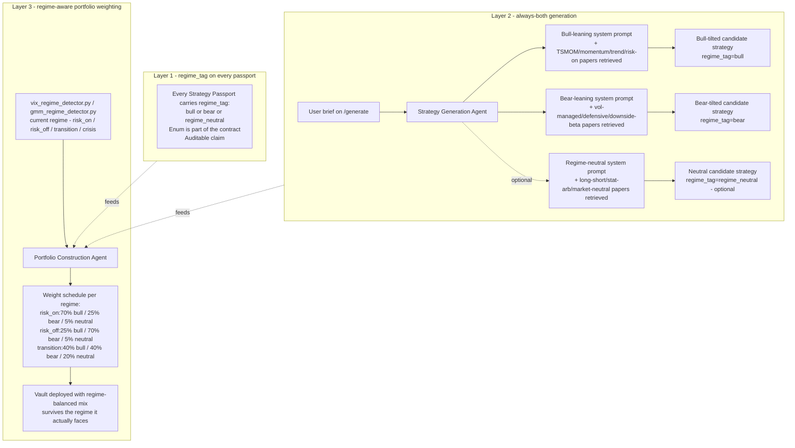
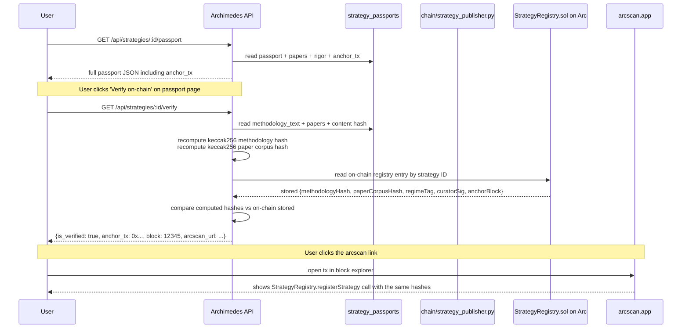

# Strategy Passport — Architecture Reference

> **Status:** Canonical reference for the post-unification, multi-paper, regime-aware Strategy Passport. Supersedes the description-only sections of `docs/specs/strategy-passport-spec.md`; that spec is the implementation contract.
> **Audience:** Engineers, judges, future contributors trying to understand what makes Archimedes' strategies independently auditable.
> **Last revised:** 2026-05-23 PM, alongside the Track E launch plan landing.

---

## What is a Strategy Passport?

A **Strategy Passport** is the per-strategy document that lets any third party — judge, user, future agent, regulator — independently verify that an Archimedes strategy is what we claim it is. It is the load-bearing primitive that distinguishes Archimedes from the 19-study primary subset Xia et al. (2026, arxiv 2605.19337) audited — where **0/19** achieved R3 reproducibility and **15/19** shipped with no replayable artifacts at all.

A passport answers seven verifiable questions:

1. **Which paper(s)** does this strategy come from? (arxiv IDs, titles, authors, years, venues, DOIs, citation counts — for one paper *or many*, fusion-aware from day one)
2. **What methodology** does it implement? (canonical text + keccak256 content hash, tamper-evident)
3. **Who extracted it?** (LLM model + extraction prompt hash, OR a human curator's wallet address)
4. **How does it backtest?** (Sharpe, CAGR, max drawdown, sortino, calmar, win rate, total trades, full window dates — vs. paper-claimed numbers, delta surfaced honestly)
5. **Does it pass our rigor gate?** (DSR p-value, num trials in selection, PBO score, walk-forward OOS Sharpe, look-ahead audit boolean — all four selection-bias controls per López de Prado)
6. **What regime is it built for?** (bull / bear / regime_neutral — every passport carries a regime tag so the portfolio agent can balance bull + bear exposure across macro conditions)
7. **What is its on-chain anchor?** (`StrategyRegistry.sol` tx hash committing the strategy ID + methodology hash + paper corpus hash + curator signature to Arc — verifiable from any block explorer)

A strategy without a complete passport **cannot enter the Tier-1 library**. A strategy without on-chain registration **cannot be deployed to a Tier-1 vault**. The passport is the gate.

---

## Architecture — unified store, multi-paper, regime-aware, on-chain

```mermaid
flowchart TB
  subgraph SEED[Seed sources]
    PYFILE[analytics-engine/strategies/*.py<br/>curated strategies as Python files<br/>+ PAPER_ARXIV_IDS list, METHODOLOGY_TEXT,<br/>PAPER_CLAIMED_*, REGIME_TAG]
    FUSION[Fusion Generation Agent<br/>multi-paper synthesis<br/>brief + KB retrieval + LLM call<br/>emits papers: list of PaperRef]
    ARCHITECT[Architect Generation Agent<br/>curated-library selection<br/>copies passport from selected strategies]
    USER[User brief on /generate]
  end

  subgraph INGEST[Passport ingest pipeline]
    LOADER[passport_loader.py<br/>computes keccak256 methodology hash<br/>computes papers list of PaperRef<br/>derives regime_tag from regime classifier<br/>writes to unified store]
  end

  subgraph STORE[Unified Strategy Store Postgres]
    PG[(strategy_passports table<br/>ALL passport fields as typed columns<br/>curated AND generated, single row per strategy)]
    PRRL[(paper_refs table<br/>foreign-keyed list-of-PaperRef<br/>handles single-paper AND fusion)]
    RG[(rigor_results table<br/>DSR + PBO + OOS Sharpe + look-ahead audit)]
    BTR[(backtest_results table<br/>real backtest outputs + paper-claim deltas)]
  end

  subgraph RIGOR[Rigor gate Tier-1 admission]
    BT[Backtest engine<br/>backtrader runs strategy_code_hash on real data]
    DSREV[rigor_evaluator.py<br/>Deflated Sharpe Bailey + Lopez de Prado 2014]
    PBOEV[fusion_evaluator.py<br/>PBO via CSCV combinatorially]
    LAEV[look-ahead static audit<br/>AST scan for future-data references]
    GATE{passes_rigor_gate?}
    BT --> DSREV --> GATE
    BT --> PBOEV --> GATE
    BT --> LAEV --> GATE
  end

  subgraph ANCHOR[On-chain anchoring Arc]
    PUB[chain/strategy_publisher.py<br/>fires on Tier-1 promotion only]
    SR[StrategyRegistry.sol<br/>registerStrategy strategyId, methodologyHash,<br/>paperCorpusHash, regimeTag, curatorSig]
    RTR[ReasoningTraceRegistry.sol<br/>per-decision trace anchors<br/>already deployed]
  end

  subgraph SURFACE[Surface API + UI]
    API[/api/strategies/:id/passport<br/>returns full multi-paper passport with rigor + regime + anchor tx]
    APIL[/api/strategies?regime=bear<br/>filterable list]
    PP[StrategyPassport.jsx<br/>strategy/:id page<br/>renders all N papers, rigor, regime, on-chain link to arcscan]
    LIB[Strategies.jsx<br/>library list + Generated/Examples tabs<br/>regime-faceted filters]
  end

  USER --> FUSION
  USER --> ARCHITECT
  PYFILE --> LOADER
  FUSION --> LOADER
  ARCHITECT --> LOADER
  LOADER --> PG
  LOADER --> PRRL
  PG --> BT
  BT --> BTR
  GATE -- pass --> PUB
  GATE -- fail --> PG
  PUB --> SR
  PG --> API
  PG --> APIL
  API --> PP
  APIL --> LIB

  classDef store fill:#1f3a2f,stroke:#10b981,color:#10b981
  classDef gate fill:#3a2f1f,stroke:#e0a64f,color:#e0a64f
  classDef chain fill:#1f2a3a,stroke:#3b82f6,color:#3b82f6
  classDef surface fill:#2a1f3a,stroke:#a855f7,color:#a855f7
  class STORE,PG,PRRL,RG,BTR store
  class RIGOR,BT,DSREV,PBOEV,LAEV,GATE gate
  class ANCHOR,PUB,SR,RTR chain
  class SURFACE,API,APIL,PP,LIB surface
```

**Reading the diagram:**

- **Single seed pipeline → single store.** Whether a strategy comes from a curated file (`analytics-engine/strategies/*.py`), the fusion agent (multi-paper synthesis), or the architect agent (library selection), it lands in the same `strategy_passports` Postgres table via `passport_loader.py`. There is **one Strategy Passport**, not two divergent stores.
- **Multi-paper from day one.** `papers` is a foreign-key relation to a `paper_refs` table; single-paper strategies have one row, fusion strategies have N. The passport never assumes one paper.
- **Regime-aware.** Every passport carries a `regime_tag` (bull / bear / regime_neutral). The library is filterable by regime; the Portfolio Construction Agent reads it to balance bull + bear exposure (see "Bear-strategy architecture" below).
- **Rigor gate is mandatory.** A strategy doesn't reach Tier-1 status without passing DSR + PBO + walk-forward OOS + look-ahead-clean. Failed strategies stay in `strategy_passports` with `passes_rigor_gate=false` — visible failure, not silent drop.
- **On-chain anchor is mandatory for Tier-1.** `chain/strategy_publisher.py` fires on Tier-1 promotion only (`passes_rigor_gate = True`). The `StrategyRegistry.sol` contract records strategy ID + methodology hash + paper corpus hash + regime tag + curator signature. The on-chain anchor is a Tier-1 *prerequisite*, not an afterthought.

---

## Multi-paper structure (the fusion enabler)

Today's `Strategy` dataclass has scalar `paper_arxiv_id`, `paper_title`, etc. — fundamentally broken for fusion strategies, which by definition synthesize from multiple papers. The new shape:

```python
@dataclass
class PaperRef:
    arxiv_id: str | None        # nullable for non-arxiv papers
    doi: str | None
    title: str
    authors: list[str]
    venue: str | None
    year: int | None
    citation_count: int | None
    contribution: str | None    # what this paper contributed to the fusion ("provided the volatility-managed sizing primitive")

@dataclass
class StrategyPassport:
    id: str                                  # deterministic: keccak256(papers[].arxiv_id sorted || methodology_hash)[:32]
    papers: list[PaperRef]                   # ≥1; fusion strategies have N
    methodology_text: str                    # canonical methodology, full text
    methodology_hash: str                    # keccak256 of methodology_text (matches on-chain anchor)
    regime_tag: Literal["bull", "bear", "regime_neutral"]
    # ... rigor fields, backtest fields, on-chain anchor fields ...
```

**Why this matters operationally:**

```mermaid
flowchart LR
  subgraph CUR[Curated strategy single-paper]
    C1[Faber 2007 SMA200]
    C1P[papers list with 1 PaperRef:<br/>arxiv_id=ssrn-962461,<br/>title='Quantitative Approach to TAA',<br/>authors=Faber]
    C1 --> C1P
  end

  subgraph FUS[Fusion strategy multi-paper]
    F1[Vol-Managed Trend Momentum]
    F1P[papers list with 3 PaperRefs:<br/>1. Moskowitz Ooi Pedersen 2012 TSMOM<br/>2. Moreira Muir 2017 Vol-Managed<br/>3. Asness Moskowitz Pedersen 2013 Value+Momentum]
    F1 --> F1P
  end

  PASS[Same StrategyPassport shape]
  C1P --> PASS
  F1P --> PASS

  PASS --> ANCHOR[StrategyRegistry.sol<br/>paperCorpusHash = keccak256<br/>papers[].arxiv_id sorted]
```

**Paper-claim deltas in the fusion case.** When N > 1 papers contribute, `paper_claimed_sharpe` becomes a *weighted blend* of each paper's claim, weighted by the paper's contribution-vector embedding in the fusion. Surfaced in the UI as a per-paper table:

| Paper | Paper claim Sharpe | Contribution to fusion | Implied weighted claim |
|---|---|---|---|
| Moskowitz et al. 2012 (TSMOM) | 1.39 | 0.45 | 0.626 |
| Moreira & Muir 2017 (vol-managed) | 0.95 | 0.35 | 0.333 |
| Asness et al. 2013 (value+momentum) | 1.21 | 0.20 | 0.242 |
| **Fusion strategy actual Sharpe** | — | — | **1.18** (vs. blended claim 1.20, delta -0.02) |

This is the rigor-honest version of the paper-claim delta. The fusion strategy isn't beating its papers; it's matching the blended expectation within noise.

---

## Bear-strategy architecture (Option D — full)

StockBench (Chen et al. 2026, arxiv 2510.02209) documented that **all 14 evaluated LLM trading agents underperformed the passive baseline during the January–April 2025 downturn**. The diagnosis is structural: agents are long-biased because their training corpora are. If we ship a one-sided agent, we ship a system that gets eaten alive when macro conditions flip.

Our answer is structural too: **regime_tag on every passport, always-both generation, regime-aware portfolio weighting.**



**Why three layers and not just one:**

- **regime_tag alone** is a column; it doesn't change behavior. It would make the passport auditable on regime claim but wouldn't stop us from deploying a 100%-bull portfolio in a bear market.
- **Always-both alone** generates options but doesn't pick. The user is left to decide regime exposure manually.
- **Regime-aware weighting alone** picks but has nothing to pick from if the library is one-sided.

All three together = **structural diversification against macro regime risk**, baked in from generation through deployment. This is the pitch beat: *"We don't pretend our agents are downturn-proof. We engineer the portfolio to survive the regime it's actually in."*

**Operational specifics:**

- **Always-both** skips a variant only if the KB has no candidate papers for that regime matching the brief (visible "no bear candidate available — your brief is structurally bull-only" message; honest empty state, not a silent drop). Default behavior is "try both, report both."
- **Weight schedule** is a hardcoded constant per risk profile in v1 (conservative / moderate / aggressive each have their own schedule). v2 makes it user-configurable in the WelcomeProfileModal.
- **Regime classification** comes from the wired `vix_regime_detector.py` (rule-based VIX/MA, #660), with `gmm_regime_detector.py` (data-driven Gaussian Mixture, #661) as a drop-in. The Live Execution Agent's cost-benefit sub-agent reads it each tick; on regime transitions, the portfolio agent gets a recompute trigger and rebalances toward the new regime's weight schedule (subject to cost-benefit, of course).
- **Corpus seeding adjustment.** The bear bucket of our 10k-paper corpus seed v2 needs explicit attention: vol-managed portfolios (Moreira-Muir 2017 already in), volatility risk premium (Bondarenko, Whaley), defensive sector rotation, downside beta (Ang/Chen/Xing 2006), short-interest factor research. Without bear-friendly corpus material, always-both generation degenerates to "no bear candidate" for most briefs.

---

## On-chain anchor (the wow moment)



**The contract surface.** `contracts/src/StrategyRegistry.sol`:

```solidity
interface IStrategyRegistry {
    event StrategyRegistered(
        bytes32 indexed strategyId,
        bytes32 methodologyHash,
        bytes32 paperCorpusHash,
        uint8   regimeTag,        // 0=bull, 1=bear, 2=regime_neutral
        address indexed curator,
        uint256 registeredAt
    );

    function registerStrategy(
        bytes32 strategyId,
        bytes32 methodologyHash,
        bytes32 paperCorpusHash,
        uint8   regimeTag,
        bytes calldata curatorSig    // signed (strategyId, methodologyHash, paperCorpusHash, regimeTag, timestamp)
    ) external;

    function getStrategy(bytes32 strategyId) external view returns (
        bytes32 methodologyHash,
        bytes32 paperCorpusHash,
        uint8   regimeTag,
        address curator,
        uint256 registeredAt
    );

    function isRegistered(bytes32 strategyId) external view returns (bool);
}
```

**Anchoring policy.** `chain/strategy_publisher.py` fires on Tier-1 promotion only (the moment a strategy's `passes_rigor_gate` flips from `false` to `true`). Candidate strategies that fail rigor are NOT anchored — they remain in the database as visible failures, but they don't pollute the on-chain registry. This keeps gas costs bounded (~$0.01/strategy on Arc testnet) and the registry meaningful ("if it's on-chain, it passed our gate").

**Curator signature.** v1 = Dan's wallet signs every promotion (single-sig). v2 = curator multisig (Dan + Önder + a third) before promotion. v3 = on-chain DAO vote with token-weighted approval. The contract is signature-agnostic; the policy is what evolves.

---

## What was wrong before this rewrite (the "junk" we exterminated)

For future-Dan reading this six months from now: here's what the passport looked like at the moment this doc was written, and what we fixed in Track E.

| Problem | Pre-Track-E state | Post-Track-E state |
|---|---|---|
| **Scalar paper fields** breaks fusion | `paper_arxiv_id: str`, `paper_title: str`, etc. — assumes one paper | `papers: list[PaperRef]` — multi-paper from day one |
| **Two divergent stores** | `Strategy` dataclass loaded from files (full passport); `StrategyRecord` ORM in Postgres (slim JSON-blob shape, used for fusion outputs) | One `strategy_passports` Postgres table with all passport fields as typed columns; file-based seed loader writes into it; fusion + architect agents write into it |
| **Fusion strategies can't go through rigor gate** | StrategyRecord ORM doesn't have typed rigor fields → fusion outputs have no DSR/PBO/OOS to check | Unified store has typed rigor fields → fusion strategies pass through the same rigor pipeline as curated strategies |
| **`on_chain_registration_tx` always None** | Field exists in dataclass + API + UI but no contract to call | `StrategyRegistry.sol` ships; `chain/strategy_publisher.py` populates the field on Tier-1 promotion |
| **No regime awareness** | All strategies implicitly long-biased; portfolio agent doesn't know which strategies survive which regime | `regime_tag` enum on every passport; always-both generation; regime-aware portfolio weighting |
| **Methodology hash uses SHA-256, on-chain uses keccak256** | Hash divergence prevents on-chain verification | Both use keccak256 — verification is one keccak256 recompute |
| **Spec doc stale** | `strategy-passport-spec.md` describes Postgres tables that don't exist; endpoints (`/api/decisions/*`) that don't exist | Spec rewritten to match the unified architecture |
| **Junk fields** | `extraction_prompt_hash`, `curator_validation_at`, `signals: []`, `extraction_reasoning: ""`, `stub_*` family — all always null/empty | Removed from dataclass; if/when LLM extraction lands, fields come back with semantics |

---

## How to read a passport (for users + judges)

A passport JSON looks like this in production:

```json
{
  "id": "f3b1a2c4d5e6...",
  "papers": [
    {
      "arxiv_id": "2509.11420",
      "title": "Time Series Momentum",
      "authors": ["Tobias J. Moskowitz", "Yao Hua Ooi", "Lasse Heje Pedersen"],
      "venue": "Journal of Financial Economics",
      "year": 2012,
      "citation_count": 2847,
      "contribution": "Provided the cross-sectional momentum signal + 12-month lookback window"
    },
    {
      "arxiv_id": "1707.00099",
      "title": "Volatility-Managed Portfolios",
      "authors": ["Alan Moreira", "Tyler Muir"],
      "venue": "Journal of Finance",
      "year": 2017,
      "citation_count": 891,
      "contribution": "Provided the inverse-realized-variance sizing rule"
    }
  ],
  "methodology_text": "Long the top-decile of TSMOM signal across the asset universe, sized inversely to realized 30-day variance per Moreira-Muir...",
  "methodology_hash": "0x7a3f9b...",
  "regime_tag": "bull",
  "extraction_llm": "glm-4.7",
  "curator_wallet": "0xab12...",
  "real_sharpe": 1.18,
  "real_max_drawdown": -0.187,
  "deflated_sharpe_ratio": 0.94,
  "dsr_p_value": 0.023,
  "pbo_score": 0.18,
  "out_of_sample_sharpe": 1.04,
  "look_ahead_audit_passed": true,
  "passes_rigor_gate": true,
  "paper_claim_blended_sharpe": 1.20,
  "paper_claim_delta": -0.02,
  "on_chain_registration_tx": "0x9f4e...",
  "on_chain_registration_block": 1834201,
  "arcscan_url": "https://testnet.arcscan.app/tx/0x9f4e..."
}
```

**The "Verify on-chain" button on `/strategy/:id`** does this in browser:
1. Fetches the passport.
2. Locally recomputes `keccak256(methodology_text)` and `keccak256(papers[].arxiv_id sorted joined)`.
3. Compares against the on-chain `getStrategy(id)` view from `StrategyRegistry.sol`.
4. Shows ✓ VERIFIED (green) with the arcscan link, OR ✗ MISMATCH (red) with the divergence highlighted.

**Anyone can do step 1-3 from a script. The verifiability is the product.**

---

## File map (where the code lives, post-Track E)

```
backend/archimedes/
├── models/
│   ├── strategy.py                  # StrategyPassport dataclass (multi-paper)
│   ├── paper_ref.py                 # PaperRef dataclass + Postgres ORM
│   └── strategy_store.py            # StrategyPassport ORM + queries (replaces old StrategyRecord)
├── services/
│   ├── passport_loader.py           # NEW: ingest pipeline (curated files + fusion + architect → unified store)
│   ├── strategy_provider.py         # SHIM: backward-compat wrapper; reads from passport_loader
│   ├── strategy_fusion.py           # Multi-paper synthesis; emits papers: list[PaperRef]
│   ├── strategy_architect.py        # Curated selection
│   ├── rigor_evaluator.py           # DSR + Sharpe CI
│   └── fusion_evaluator.py          # PBO via CSCV
├── chain/
│   ├── strategy_publisher.py        # NEW: fires StrategyRegistry.registerStrategy on Tier-1 promotion
│   └── trace_publisher.py           # existing: per-decision trace anchoring (unchanged)
└── api/
    └── strategies_routes.py         # /api/strategies/* returns the unified passport shape

contracts/
└── src/
    ├── StrategyRegistry.sol         # NEW: per-strategy on-chain anchor
    └── ReasoningTraceRegistry.sol   # existing: per-decision trace anchor (unchanged)

ui/src/components/
├── StrategyPassport.jsx             # /strategy/:id full passport page (multi-paper table + regime tag + verify button + arcscan link)
└── Strategies.jsx                   # Library list with regime-faceted filter

docs/
├── specs/strategy-passport-spec.md  # implementation contract (current)
└── diagrams/strategy-passport-architecture.md  # this file (reference + diagrams)
```

---

## Why this is a wedge

In Xia et al.'s 2026 audit of 19 trading-agent studies:
- **0/19** anchor their strategies' methodology hash on a public ledger.
- **0/19** verifiably bind a paper's methodology to executable backtest code.
- **0/19** carry a multi-paper provenance structure for ensemble or fusion strategies.
- **0/19** ship a regime tag that lets a portfolio agent balance macro exposure.
- **15/19** ship no replayable artifacts at all.

The Strategy Passport answers every one of these. **It is the artifact that makes Archimedes auditable, fusion-honest, regime-aware, and the first production trading-agent system targeting Xia's R3 reproducibility bar.**

---

*Last revised 2026-05-23 alongside Track E launch plan landing. Cross-references: `docs/specs/strategy-passport-spec.md` (implementation contract), `docs/archive/launch-execution-plan-2026-05-23.md` §§ 4-Track E (build specs), `docs/specs/selection-bias-corrections-spec.md` (rigor gate detail), Xia et al. 2026 arxiv 2605.19337 (academic backstop), Chen et al. 2026 arxiv 2510.02209 (StockBench bear-market finding that motivates Layer 1-3 of the bear-strategy architecture).*
