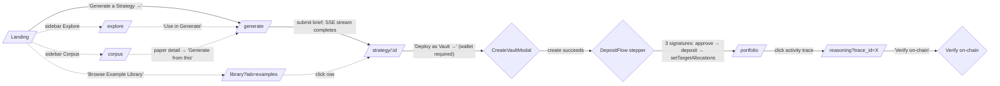
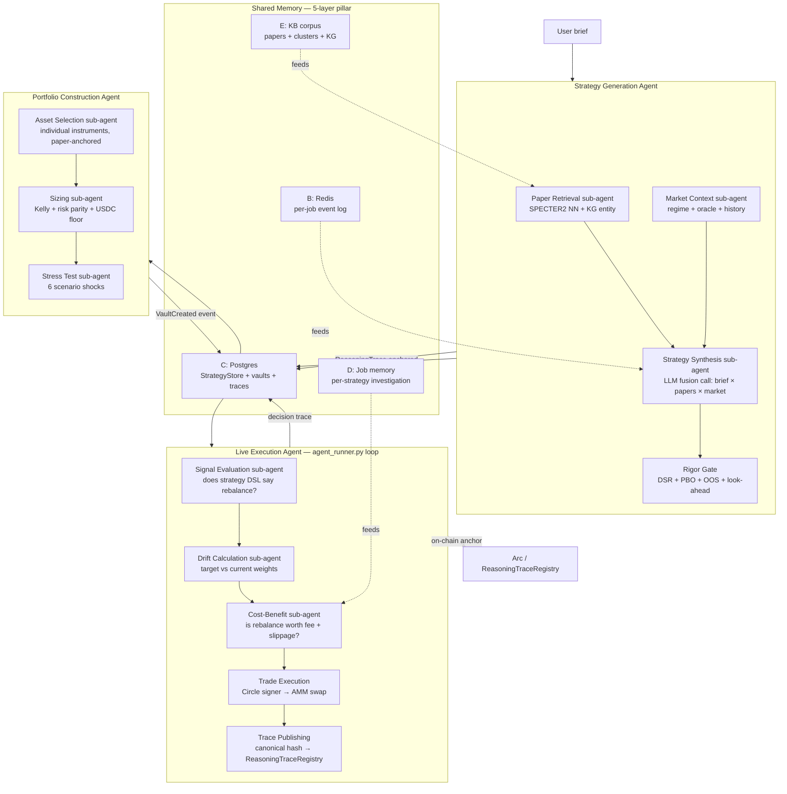

# Archimedes Launch Execution Plan

**Window:** Saturday 2026-05-23 → Sunday 2026-05-24 (target submission) → Monday 2026-05-25 23:59 ET (hard deadline; buffer day).
**Author:** Daniel Browne, with Claude (Opus 4.7) as planner. Marten + Chuan signed off on Phase 4/5 driver authority 2026-05-23 AM. Chuan confirmed full AWS provisioning autonomy for the `t2o2` bot system 2026-05-23 AM.
**Status:** Locked. Issue specs ready to file.

---

## Context

We are 36–48 hours from submission of the Agora Agents Hackathon (Canteen × Circle × Arc). This document is the single source of truth for what we ship between now and the deadline, who drives each track, and how we verify the bot system's output before merging to `main`.

The plan compresses three things into one document so a teammate (or a fresh Claude session) can pick it up cold:

1. **The locked product/scope decisions** that resolved planning ambiguity (Section 1).
2. **Executable, machine-grade issue specs** for the bot system to consume (Sections 4–6).
3. **Four parallel-track Maestro prompts** so Claude sessions on separate Macs can run independent tracks without stepping on each other (Section 8).

Pitch framing locked: Wall Street has the rigor toolkit (DSR/PBO/walk-forward OOS/look-ahead audit + multi-asset NAV vaults + stress tests + multi-agent risk pricing); most people don't. Archimedes brings that rigor to anyone with idle USDC. *Win more than you lose, not never lose.*

---

## Table of contents

1. [Locked decisions](#1-locked-decisions)
2. [Operating mechanics](#2-operating-mechanics)
   - [Naming conventions](#21-naming-conventions-cleared-up)
   - [Issue lifecycle (manual `t2o2` assignment)](#22-issue-lifecycle-manual-t2o2-assignment)
   - [PR disposition + merge order](#23-pr-disposition--merge-order)
   - [Spec writing protocol — machine-grade template](#24-spec-writing-protocol--machine-grade-template)
   - [Verification protocol](#25-verification-protocol)
3. [Pitch frame + architecture](#3-pitch-frame--architecture)
   - [Canonical pitch frame](#31-canonical-pitch-frame)
   - [User journey — directed click-graph](#32-user-journey--directed-click-graph)
   - [Agent architecture — 3 top-level agents × sub-agents × shared memory](#33-agent-architecture)
   - [Shared memory — 5-layer pillar (Linus lineage)](#34-shared-memory--5-layer-pillar-linus-lineage)
   - [Corpus seeding strategy](#35-corpus-seeding-strategy)
4. [Track A — vault execution path (T1.x)](#4-track-a--vault-execution-path-t1x)
5. [Track B — UI/UX surface cleanup (T2.x)](#5-track-b--uiux-surface-cleanup-t2x)
6. [Track C — AWS infrastructure + KB pipeline (T3.x)](#6-track-c--aws-infrastructure--kb-pipeline-t3x)
7. [Security pillar (TS.x)](#7-security-pillar-tsx)
8. [Manual deliverables (M.x)](#8-manual-deliverables-mx)
9. [Parallel-track Maestro prompts](#9-parallel-track-maestro-prompts)
10. [Saturday → Sunday → Monday execution timeline](#10-execution-timeline-utc)
11. [Risks + degradation plan](#11-risks--degradation-plan)
12. [Appendices](#12-appendices)
    - [Bot system operational notes](#a-bot-system-operational-notes)
    - [Foreground Explore subagent verification prompt](#b-foreground-explore-subagent-verification-prompt)
    - [Claude design prompt for the design-language refresh](#c-claude-design-prompt-for-design-language-refresh)

---

## 1. Locked decisions

| Decision | Locked answer |
|---|---|
| **Scope tier** | All Tier A demo essentials + real KB pipeline on bot-provisioned GPU EC2 + AWS S3/DynamoDB papers infrastructure. **No required auth**; wallet IS the identity. Optional opt-in profile (name/email/interests/attribution/marketing-opt-in) after wallet connect. |
| **Generate consolidation** | Single input + single Generate button. Backend `_pick_pipeline()` heuristic auto-routes between Fusion (novel synthesis — default), Architect (fast curated-library preview — fallback), and the agentic SSE pipeline (third). All three result components remain; UI renders whichever the backend picked. |
| **KB pipeline** | Bot system stands up GPU EC2 + runs SPECTER2 embeddings + HDBSCAN clusters + REBEL/SciSpacy KG over the 10k q-fin corpus + persists artifacts to S3 + DynamoDB + serves via `/api/papers/corpus/graph` + `/kg`. |
| **Identity** | Wallet = identity. No required signup. Optional `WelcomeProfileModal` on first wallet connect captures display_name + email + interests + attribution + marketing_opt_in. All fields optional; user can Skip. Header shows "Welcome, &lt;name&gt;" when set. |
| **HTTPS** | Chuan's bots register domain via AWS Route 53 + obtain Let's Encrypt cert via certbot + configure nginx + force HTTP→HTTPS + HSTS. Candidate domains: `archimedes-arc.app` OR `archimedes.hackagora.com`. Chuan's call on which. |
| **LLM backend** | GLM-4.7 stays primary (working, tested, free tier). Ship BYOK header support (`X-Anthropic-Api-Key`) so judges + users can self-fund Claude direct. Bedrock spec is filed on-record but **unassigned** to `t2o2`; we activate it only if we choose to deploy. |
| **Submission deadline** | Hard: Monday 2026-05-25 23:59 ET (Tue 04:59 UTC). Personal target: Sunday 2026-05-24 23:59 CT. Monday is buffer (final video re-record, late docs polish). |
| **Delivery surface** | Three artifacts: (1) public GitHub repo at `hackagora/archimedes-arcadia`, (2) live HTTPS website at the new domain, (3) ≤ 3-minute demo video. All other docs are supporting evidence. |
| **Security posture** | First-class pillar (Section 7). Zero-trust, secrets out of `.env` into AWS SSM Parameter Store + IAM instance profile, HTTPS everywhere, security headers, CORS lockdown, rate limits, dependency scanning, secret-leak detection, user-data minimization with KMS encryption. Same rigor as the statistical pipeline. |
| **AWS account ownership** | Chuan's AWS account. The `t2o2` bot system provisions into it; Chuan absorbs the spend with anti-goals + budget alarms keeping costs bounded. |
| **Process: t2o2 assignment** | Claude + subagents **file** every issue but **do not assign** `t2o2`. Dan manually assigns + tracks via the GitHub Kanban board. This gives Dan a review-and-tweak gate before each issue fires; protects against spec ambiguity propagating into bot work. |
| **PR ordering** | (1) Daniel R's #144 (UI prep — touches 18 files that collide with our T2.x specs); (2) Dan's #142 (Phase 4 scaffold; bring out of draft + merge); (3) Dan's #143 (Phase 5 runbook doc). Track A specs (T1.x) land after #142 + #143 merge. Track B specs (T2.x) land after #144 merges. |

---

## 2. Operating mechanics

### 2.1 Naming conventions (cleared up)

- **Chuan** = the human teammate (CTO @ Gyld Finance; owner of contracts + on-chain integration + infra).
- **t2o2** = Chuan's GitHub bot system handle. Assignment of an issue to `t2o2` triggers autonomous execution against `main`.
- **moonshot** = Chuan's Discord handle in the Archimedes Arcadia server. **Not the same** as the unrelated `moonshot` Discord handle in the Canteen admin server (which is Anuhya, a Canteen admin). Avoid the name "moonshot" in this plan to prevent confusion; we use Chuan and t2o2 instead.
- **Hackagora** = our GitHub organization (`github.com/hackagora`). Reflected in the domain candidate `archimedes.hackagora.com`.

### 2.2 Issue lifecycle (manual `t2o2` assignment)

```
human/Claude drafts spec  →  gh issue create  →  Dan reviews + (if needed) tweaks
                                                 →  Dan manually adds t2o2 assignee
                                                 →  bot picks up + executes
                                                 →  bot commits to main (squash/rebase)
                                                 →  Dan + Claude run Verification Protocol
                                                 →  approve or file follow-up issue
```

**Issues filed without `t2o2` assignment sit safely on the Kanban board.** Dan moves them through the pipeline at the pace he can review them. This is the lever that keeps spec quality high and bot drift low.

### 2.3 PR disposition + merge order

| PR | Title | Owner | Action | Why first/later |
|---|---|---|---|---|
| **#144** | UI fixes: onboarding tour, analytics viz, footer spacing | Daniel R. | **Merge first** | Touches 18 frontend files including Landing/Layout/Generate/Portfolio/Reasoning — direct collision with T2.x specs. Merge first; specs reference latest code; avoid conflicts. |
| **#142** | Phase 4 scaffold (StrategyPassport route + Deploy modal + Stress panel) | Dan | Bring out of draft, then merge | Track A's DepositFlow stepper (T1.3) builds on CreateVaultModal which ships in #142. Marten/Chuan signed off on the 5 default choices 2026-05-23 AM. |
| **#143** | Phase 5 planning-only runbook | Dan | Merge | T1.5 (end-to-end smoke test) references the runbook. Docs-only change. |
| **T2.x specs** | UI/UX cleanup batch | Claude → t2o2 | File after #144 merges | Re-read Daniel R's changes; tweak T2.1/T2.2/T2.6/T2.7 specs if his onboarding-spotlight + Layout changes shift the surgery surface. |
| **T1.x specs** | Vault execution batch | Claude → t2o2 | File after #142 + #143 merge | Track A depends on CreateVaultModal + runbook. |
| **T3.x specs** | AWS + KB pipeline | Claude → t2o2 | File independently (no PR collision) | T3.1 is the foundation; T3.2 depends on T3.1. |
| **TS.x specs** | Security pillar | Claude → t2o2 | File alongside T3.x | TS.2 depends on T3.1's IAM pattern; TS.3 depends on TS.1's 443 server block. |

### 2.4 Spec writing protocol — machine-grade template

Every issue follows this shape. **Imperative. Grep-checkable acceptance. Explicit anti-goals. Cited precedent.**

```
APIN - <Area> - <Imperative title>

## TLDR
(one paragraph — optional, for humans scrolling the queue)

## Summary
(2–3 sentences MAX. What + why, one line each.)

## Scope
Files to ADD: <list>
Files to MODIFY: <list>
Files to NOT TOUCH: <list>
("Do exactly this, nothing more.")

## Acceptance
- [ ] <each criterion is a runnable command + EXACT expected output>
- [ ] (no prose. no "robust"/"production-ready"/"comprehensive".)

## Verify
<literal commands a reviewer + bot will run, in order>

## Anti-goals
- DO NOT <thing>
- DO NOT <thing>

## Precedent
<existing file/PR/test to copy shape — the bot reuses, doesn't invent>

## Lane note
"Lane: <area>. <human reviewer> reviews. If blocked on <X>, comment + leave open."
(NO `Assigned to t2o2` line — Dan does that manually after his review.)

## Depends on
#<N> #<M>
```

Discipline rules:

- Pin the environment if cold-clone matters (e.g. `clean clone, no docker, no env vars`).
- Author runs the acceptance commands before filing.
- No "make it nice"/"make it good"/"improve the UX" — all anti-language.
- "Match precedent X exactly" beats "follow best practices."
- If a bot PR doesn't satisfy acceptance, reopen with the failing command pasted in a comment as evidence. Do not accept "should be done" without grep proof.

### 2.5 Verification protocol

Every bot PR landing on `main` gets verified against the originating issue's `## Acceptance` section. **"Closed" does not equal "fixed"** — the bot system sometimes leaves issues stale-open even when code lands, and sometimes closes issues without resolving them. We re-check independently.

Two modes, chosen by PR size:

**Maestro inline** — for PRs touching ≤ 5 files / single concept:

1. Read PR diff via `gh pr diff <n>` or `gh pr view <n> --json files`.
2. Run each acceptance command from the originating issue inline (Bash + Read).
3. Paste failing commands into a PR comment if any fail.
4. Approve only if every line passes.

**Foreground Explore subagent fan-out** — for PRs touching > 5 files / multiple concepts / the heavy KB pipeline:

1. Spawn 1 foreground Explore subagent per PR (or 2–3 in parallel for a batch).
2. Use the prompt template in [Appendix B](#b-foreground-explore-subagent-verification-prompt).
3. Maestro reads the subagent's structured pass/fail report and makes the merge call.

**Rejection bar (non-negotiable).** Reject + file a follow-up issue if ANY of:

- Any acceptance criterion fails its runnable command.
- The PR introduces TODO / FIXME / placeholder strings the spec didn't authorize.
- The PR adds files outside the `## Scope` list (scope creep).
- The PR weakens or removes tests to "make CI pass."
- The PR contains fake/mock/canned data where the spec required real.
- The PR closes the issue but doesn't satisfy the acceptance criteria.

---

## 3. Pitch frame + architecture

### 3.1 Canonical pitch frame

**The problem.** Turning a trading idea into a *rigorously backtested, statistically analyzed, deployable* strategy is gatekept. Wall Street has the toolset (Deflated Sharpe, Probability of Backtest Overfitting, walk-forward OOS, stress tests, multi-agent risk pricing); most people don't. That's why Ken Griffin owns Citadel. Archimedes brings that rigor to anyone with idle USDC.

**The product.** Describe what you want in plain English. Archimedes' multi-agent system fuses your intent with 10,000 peer-reviewed q-fin papers and live market data into novel strategies, gates them through DSR + PBO + walk-forward OOS + look-ahead audit rigor, executes them in non-custodial vaults on Arc, and anchors every decision on-chain.

**The wedge.** Rigor as the curation protocol. The November-2025 crisis showed trust-based curation breaks under stress. We prove the method, not the returns. *Win more than you lose, not never lose.*

**The multi-agent narrative.** Fusion (novel synthesis from papers) + Architect (curated library picks) + Portfolio Advisor (Kelly sizing + risk parity) + Stress Engine (six-scenario shock testing). Shared memory primitive borrowed from Linus's 5-layer pillar (Section 3.4). Settlement on Arc with USDC; reasoning traces hashed on-chain via `ReasoningTraceRegistry`.

**Tagline candidates:** *Rigor for the rest of us.* / *Wall Street rigor, without the Wall Street gates.* / *Where the agora reasons with rigor.*

### 3.2 User journey — directed click-graph



**Canonical happy path = 7 click steps from cold land to verified on-chain decision.** Every other surface (Library tabs other than examples, Corpus Graph/KG, Explore sparklines, Learnings) is supplementary — reachable from the sidebar but not required for the demo narrative.

**UI constraint:** each page surfaces ONE primary action (the bold button); secondary actions are visually subordinate. T2.1/T2.2/T2.3/T2.5/T2.6/T2.7 enforce this; M.9 visual-review pass checks it.

### 3.3 Agent architecture

Three top-level agents × sub-agents, connected by shared memory.



**Mapping to existing code today:**

| Architecture role | File(s) | LOC |
|---|---|---|
| Strategy Generation orchestrator | `services/generation_pipeline.py` | 643 |
| ├ Paper Retrieval | `services/corpus_service.py` + `strategy_fusion.py::load_corpus` | 295 + n |
| ├ Market Context | `services/asset_market_service.py` + `services/statistical_regime.py` | 195 + 463 |
| ├ Strategy Synthesis | `services/strategy_fusion.py` (Fusion) + `services/portfolio_agent.py` (Agent) + `services/strategy_architect.py` (Architect) | 621 + 851 + 369 |
| └ Rigor Gate | `services/rigor_evaluator.py` + `services/fusion_evaluator.py` | 348 + 339 |
| Portfolio Construction | `services/portfolio_optimizer.py` + `services/strategy_guardrail.py` | 235 + 169 |
| └ Stress Test | `services/stress_engine.py` | 380 |
| Live Execution | `chain/agent_runner.py` | 744 |
| └ Signal Evaluation | `services/strategy_signal_evaluator.py` | 529 |
| └ Trade Execution | `chain/executor.py` + `chain/circle_signer.py` | 442 + 246 |
| └ Trace Publishing | `chain/trace_publisher.py` | 196 |
| Shared Memory B (Redis) | `services/redis_state.py` | 258 |
| Shared Memory C (Postgres) | `models/strategy_store.py` + `models/backtest_store.py` | 188 + 165 |

Our architecture is already multi-agent in the TradingAgents / Linus tradition; T2.8 makes it visibly so by reorganizing the files into a `backend/archimedes/agents/` subpackage with a shared `base_agent.py`.

### 3.4 Shared memory — 5-layer pillar (Linus lineage)

Borrowed primitive from Dan's Linus orchestration project. Names the persistence layers our agents operate over; gives the pitch a concrete "why we're different from rosetta-alpha" beat.

| Layer | Lifetime | Linus substrate | Archimedes substrate |
|---|---|---|---|
| A — Intra-step latent | Single forward pass | KV cache | LLM context (implicit) |
| B — Within-session scratchpad | Single session | In-context window | SSE event log + RedisState per-job |
| C — Cross-session episodic | Persistent | SQLite + content hashes + git | StrategyStore + Postgres `papers` + `vault_metadata` |
| D — Investigation memory | Task-scoped | SQLite `investigations.db` | `generation_pipeline.py` event log per job + `redis_state.recent_traces()` |
| E — Semantic knowledge | Persistent | KnowledgeBase (RDF + property graph) | q-fin corpus + KB pipeline artifacts (S3 + DynamoDB) |

### 3.5 Corpus seeding strategy

One-time manual rebuild via `python -m archimedes.scripts.run_kb_pipeline --rebuild --seed-config corpus_seed_v2.yaml`. No scheduled auto-refresh in v1.

| Bucket | Categories / sources | Target count |
|---|---|---|
| q-fin foundations | arxiv `q-fin.*` (ST/MF/CP/RM/PM/TR/GN/PR/EC) | 5,000 |
| Machine learning for finance | arxiv `cs.LG` + `stat.ML` AND title/abstract has finance/trading/portfolio | 2,000 |
| Agentic AI architecture | arxiv `cs.AI` + `cs.CL` AND query: "trading agent" OR "financial agent" OR "multi-agent finance" OR "tool-use" OR "ReAct" + manual additions: **TradingAgents** (Tauric Research), **Trading-R1** (arxiv 2509.11420), **QuantAgent**, **FinGPT**, **AlphaSeek**, **AutoGen** | 500 |
| Pure mathematics (relevant) | arxiv `math.OC` (optimization+control), `math.PR` (probability), `math.ST` (statistics theory), `stat.AP` (applied stats) | 1,500 |
| Econometrics | arxiv `econ.EM` | 1,000 |
| **Total seed target** | | **~10,000** |

**Why the math + ML buckets matter for our wedge:** SPECTER2 embeddings cluster a TSMOM paper near an LLM-tool-use paper near an optimal-stopping math paper; the fusion engine then synthesizes a strategy drawing from all three. That cross-domain neighborhood is what makes fusion genuinely novel rather than keyword-rearrangement.

---

## 4. Track A — vault execution path (T1.x)

Goal: ship the real on-chain trade flow so a judge can connect a wallet on Sunday's demo and execute a real testnet trade end-to-end.

### T1.3 — DepositFlow stepper modal

```
APIN - Frontend - DepositFlow stepper modal: USDC approve → vault.deposit → setTargetAllocations

## TLDR
After CreateVaultModal (PR #142) deploys a vault, currently nothing happens. This issue ships
the multi-step wallet flow: three viem writeContract calls, each with progress + tx-link state.

## Summary
Add `ui/src/components/DepositFlow.jsx` — three-step stepper triggered from CreateVaultModal
on successful vault create. Steps: (1) USDC.approve(vault, amount), (2) vault.deposit(amount,
receiver), (3) vault.setTargetAllocations(tokens, weights_bps). Each step independent and
retryable; tx hashes link to testnet.arcscan.app.

## Scope
Files to ADD:
- ui/src/components/DepositFlow.jsx

Files to MODIFY:
- ui/src/components/CreateVaultModal.jsx — on POST /api/vaults/create success, render
  <DepositFlow vault={...} strategy={...} /> instead of closing the modal.
- ui/src/config.js — confirm USDC_ADDRESS + USDC ABI export. Add Vault ABI export if missing.

Files to NOT TOUCH:
- contracts/
- Any backend file
- environment.yml, docker-compose*.yml

## Acceptance
- [ ] `grep -rn "DepositFlow" ui/src/components/CreateVaultModal.jsx` → at least one match
- [ ] `grep -rn "USDC.*approve.*writeContract\|vault.*deposit.*writeContract\|setTargetAllocations.*writeContract" ui/src/components/DepositFlow.jsx` → three matches (one per step)
- [ ] Manual: after CreateVaultModal creates a vault on testnet, DepositFlow opens with three
      pending steps. Clicking Step 1 prompts wallet for USDC.approve; on signature, step shows
      tx hash + arcscan link + checkmark. Steps 2 + 3 follow the same pattern.
- [ ] If user closes the modal mid-flow, state persists in localStorage keyed by vault address;
      reopening from /portfolio resumes from last incomplete step.
- [ ] `docker compose build nginx` succeeds with no new warnings.

## Verify
docker compose up -d --build nginx
# Browser with MetaMask on Arc testnet: generate strategy → deploy → complete 3 stepper steps
# Verify all 3 tx hashes on testnet.arcscan.app

## Anti-goals
- DO NOT change /api/vaults/create or /api/vaults/metadata.
- DO NOT use server-side signing (user-wallet signed only).
- DO NOT add new backend service.
- DO NOT add toast/notification libraries — use existing UI primitives.
- DO NOT introduce wagmi or other new wallet libs — viem only.

## Precedent
- viem writeContract shape: `ui/src/components/WalletConnect.jsx`.
- Multi-step modal UX: `ui/src/components/OnboardingTour.jsx`.

## Lane note
Frontend lane (Daniel R. reviews). If blocked on Vault ABI / USDC ABI, comment + leave open.

## Depends on
#142 (must merge first to land CreateVaultModal)
```

### T1.4 — `/api/health/amm` + agent-runner polls VaultFactory

```
APIN - Backend - /api/health/amm endpoint + agent_runner picks up new vaults via VaultFactory poll

## TLDR
Two coupled backend additions: (1) health endpoint reporting per-pool AMM liquidity so we
can verify pools have enough USDC depth before a demo, (2) agent_runner adds a
VaultFactory.getAllVaults() poll to each tick so newly-created user vaults get picked up
within one interval.

## Summary
Adds GET /api/health/amm to backend/archimedes/api/agent_routes.py reporting per-synth
pool {symbol, liquidity_usdc, oracle_price, last_update}. Extends
backend/archimedes/chain/agent_runner.py tick loop to call VaultFactory.getAllVaults()
and add any address not currently in AGENT_VAULT_ADDRESSES/state to the rebalance queue.

## Scope
Files to MODIFY:
- backend/archimedes/api/agent_routes.py — add /health/amm handler.
- backend/archimedes/api/schemas.py — add AMMHealthResponse Pydantic model.
- backend/archimedes/chain/agent_runner.py — add VaultFactory polling at top of tick.
- backend/archimedes/services/amm_bootstrap.py — expose pool_liquidity(symbol) helper if missing.

Files to NOT TOUCH:
- contracts/, frontend/, environment.yml, docker-compose*.yml

## Acceptance
- [ ] `curl -s http://localhost:8000/api/health/amm | jq '.pools | length'` → ≥ 1
- [ ] `curl -s http://localhost:8000/api/health/amm | jq '.pools[0] | keys'` →
      ["last_update","liquidity_usdc","oracle_price","symbol"]
- [ ] `grep -n "VaultFactory.*getAllVaults\|all_vaults" backend/archimedes/chain/agent_runner.py`
      → at least one match in the tick loop
- [ ] `pytest -q backend/tests/test_api_routes.py -k "amm or health"` → all pass
- [ ] Create vault via POST /api/vaults/create (test fixture); on next agent tick, vault
      appears in redis_state.get_managed_vaults() without manual env var update.

## Verify
docker compose up -d --build backend
curl -s http://localhost:8000/api/health/amm | jq
docker compose logs agent | tail -50  # expect "discovered new vault 0x..." line

## Anti-goals
- DO NOT change setTargetAllocations or rebalance semantics.
- DO NOT remove or weaken existing env-var control on agent runner.
- DO NOT add new docker-compose service.
- DO NOT alter Vault contract.

## Precedent
- Copy /api/health handler shape from existing health route.
- VaultFactory ABI binding: backend/archimedes/chain/contracts.py::ContractLoader.

## Lane note
Chain integration lane (Chuan reviews). If blocked on VaultFactory ABI, comment + leave open.

## Depends on
none (can land in parallel with T1.3)
```

### T1.5 — End-to-end testnet smoke test (evidence capture)

```
APIN - Verification - End-to-end testnet smoke: real wallet → real deposit → agent rebalance → on-chain trace verify

## TLDR
Scripted reproducible smoke test that exercises the entire vault lifecycle on Arc testnet,
captures evidence (arcscan tx hashes, trace verify response), saves to a runbook artifact
we can show judges.

## Summary
Adds backend/archimedes/scripts/verify_arc_e2e.py — given a dev wallet private key + USDC
balance, runs the happy-path verification per docs/specs/phase5-execution-runbook.md.
Writes output to docs/runbooks/arc-testnet-e2e-evidence.md with all arcscan links.

## Scope
Files to ADD:
- backend/archimedes/scripts/verify_arc_e2e.py
- docs/runbooks/arc-testnet-e2e.md

## Acceptance
- [ ] `python -m archimedes.scripts.verify_arc_e2e --dry-run` → exits 0 with clear
      "next steps" list (no signing without --execute)
- [ ] `python -m archimedes.scripts.verify_arc_e2e --execute --wallet <key>` (manual)
      produces populated docs/runbooks/arc-testnet-e2e-evidence.md containing:
      vault address, deposit tx hash, rebalance tx hash, trace anchor tx hash, and
      is_verified=true from /api/traces/{trace_id}/verify
- [ ] Both runbook files exist.

## Verify
python -m archimedes.scripts.verify_arc_e2e --dry-run

## Anti-goals
- DO NOT commit any private keys or test wallet seed phrases.
- DO NOT skip evidence capture — every step must record its tx hash to the evidence file.

## Precedent
- Script pattern: backend/archimedes/scripts/bootstrap_vaults.py
- Trace verification: existing GET /api/traces/{trace_id}/verify handler.

## Lane note
Verification lane. Dan reviews.

## Depends on
#142 (merged) + T1.3 + T1.4
```

---

## 5. Track B — UI/UX surface cleanup (T2.x)

Goal: every page on the live site does what its page-roles-spec says, with no slop, no placeholder, no broken CTA.

**Sequencing note.** Daniel R's PR #144 merges first. After merge, re-read the changed files (Landing, Layout, Generate, Portfolio, Reasoning, Strategies, OnboardingTour, PortfolioAdvisor, RigorExplainer) and confirm the T2.x specs below still match reality; tweak as needed before filing.

### T2.1 — Home page sidebar parity + CTA differentiation

```
APIN - Frontend - Home page: apply Layout sidebar to /; differentiate Strategies vs Browse Library CTAs

## TLDR
Landing has its OWN fixed minimal header (Landing.jsx lines 41–64); WalletConnect IS in the
minimal header (line 61). Apply Layout (sidebar + topbar) to / AND differentiate the CTAs
so users have two distinct paths: create (→ /generate) vs browse (→ /library?tab=examples).

## Summary
Wrap Landing in <Layout>; remove the local minimal header (Layout's topbar takes over).
Re-target the header "Strategies" button to onNavigate('generate'). Re-target the hero
"Browse Example Library" button to onNavigate('library', { tab: 'examples' }). Library
accepts tab as a prop or query param and opens to Examples when set.

## Scope
Files to MODIFY:
- ui/src/App.jsx — confirm / route renders <Layout>{<Landing />}</Layout>
- ui/src/components/Landing.jsx — remove local <header> (lines 40–64); rely on Layout's
  topbar; re-target hero CTAs.
- ui/src/components/Layout.jsx — confirm WalletConnect in topbar; sidebar on every route.
- ui/src/components/Strategies.jsx (or /library renderer) — accept tab prop and default to it.

Files to NOT TOUCH: backend.

## Acceptance
- [ ] Open http://localhost (no wallet) → Layout sidebar visible on left; WalletConnect in topbar
- [ ] Hero "Generate a Strategy →" lands on /generate
- [ ] Hero "Browse Example Library" lands on /library?tab=examples with Examples tab active
- [ ] `grep -c "onNavigate('library')" ui/src/components/Landing.jsx` → 0
- [ ] `grep -n "WalletConnect" ui/src/components/Layout.jsx` → at least one match
- [ ] No regression on /explore /generate /library /portfolio /reasoning /corpus /learnings

## Verify
docker compose up -d --build nginx
# Browser: sidebar on left; wallet top-right; click each hero CTA; click each sidebar item

## Anti-goals
- DO NOT remove hero copy (tagline, headline, marketing paragraph).
- DO NOT change OnboardingTour first-visit gating.
- DO NOT introduce a new routing library; use existing onNavigate() pattern.
- DO NOT add new dependencies.

## Precedent
- /explore /generate /portfolio all use <Layout> wrapper — match that shape.

## Lane note
Daniel R / Marten review.

## Depends on
PR #144 (Daniel R's UI fixes — touches the same files; merge first)
```

### T2.2 — Generate UI consolidation (single input + backend auto-route)

```
APIN - Frontend+Backend - Generate page: single input; backend _pick_pipeline() auto-routes Fusion (default) → Architect → agent

## TLDR
Generate.jsx currently has mode picker `'agent' | 'architect' | 'fusion'` (line 30) with three
forms. Collapse to ONE form. Remove mode picker. Backend _pick_pipeline() decides
fusion/architect/agent based on (fusion_enabled, corpus_size, llm_available, n_candidates).
All three result components stay — UI renders whichever the backend picked.

## Summary
Single text input + risk picker + asset classes + depth (replaces max_papers UI) + Generate
button. POST /api/generate/start accepts unified payload, routes internally. SSE stream's
FIRST event after brief_validated is pipeline_selected { pipeline, reason } so frontend
renders the right result component on job completion.

## Scope
Files to MODIFY:
- ui/src/components/Generate.jsx — DELETE mode picker (three "Streaming agent / Architect
  / Fusion" buttons). Replace with ONE form. Keep imports of StrategyArchitect,
  GenerationStream, FusionResult — they render on job completion, gated by
  pipeline_selected event payload.
- backend/archimedes/services/generation_pipeline.py — add
  _pick_pipeline(brief, env) → ("fusion"|"architect"|"agent", reason: str). Decision tree:
    fusion if fusion_enabled() AND corpus_count >= 20 AND llm_backend_alive()
    else architect if curated library has ≥3 matches for intent
    else agent (SSE portfolio-advisor path)
  Emit pipeline_selected SSE event as FIRST event after brief_validated.
- backend/archimedes/api/generate_routes.py — /start payload accepts
  {brief: {intent, risk_appetite, asset_classes?, depth?}} without `mode` field. If caller
  passes `mode`, ignore (backwards-compat).
- backend/archimedes/api/generate_schemas.py — add pipeline_selected event model.

Files to NOT TOUCH:
- services/strategy_fusion.py, services/strategy_architect.py, services/portfolio_agent.py
  (all three pipelines stay intact).

## Acceptance
- [ ] `grep -c "Streaming agent\|Architect (fast preview)\|Fusion (novel)\|setMode\|useState('agent')" ui/src/components/Generate.jsx` → 0
- [ ] `grep -n "_pick_pipeline\b" backend/archimedes/services/generation_pipeline.py` → at least one match
- [ ] `grep -n "pipeline_selected" backend/archimedes/api/generate_schemas.py backend/archimedes/api/generate_routes.py backend/archimedes/services/generation_pipeline.py` → at least 3 matches
- [ ] `curl -X POST http://localhost:8000/api/generate/start -H "Content-Type: application/json" -d '{"brief":{"intent":"trend-following with low drawdown","risk_appetite":"moderate"}}'` returns 202 with job_id
- [ ] SSE stream emits pipeline_selected event with payload {pipeline, reason} as first event after brief_validated
- [ ] Browser /generate shows ONE form (no mode tabs)
- [ ] On job completion, correct result component renders based on pipeline_selected event
- [ ] `pytest -q backend/tests/services/test_generation_pipeline.py` → all pass

## Verify
docker compose up -d --build
curl -X POST http://localhost:8000/api/generate/start -H "Content-Type: application/json" \
  -d '{"brief":{"intent":"trend-following","risk_appetite":"moderate"}}' | jq
# Browser /generate; one input form; submit; pipeline_selected event arrives first.

## Anti-goals
- DO NOT delete strategy_architect.py, strategy_fusion.py, or portfolio_agent.py.
- DO NOT change SSE event schema for existing events.
- DO NOT couple frontend to a specific pipeline.
- DO NOT add new dependencies.

## Precedent
- SSE event registry: backend/archimedes/api/generate_schemas.py.
- services/generation_pipeline.py::_validate_brief heuristic style for _pick_pipeline.

## Lane note
Daniel R + Daniel B review (cross-lane).

## Depends on
PR #144 (Daniel R's UI fixes)
```

### T2.3 — Explore page real oracle prices

```
APIN - Backend+Frontend - asset_market_service reads on-chain PriceOracle (not yfinance); Explore.jsx renders with non-stale guards

## TLDR
explore_routes.py (36 lines) is correctly structured; the bug is in asset_market_service.py
(yfinance source returns empty / stale) AND Explore.jsx not handling response shape.
For demo we want ON-CHAIN PriceOracle reads (oracle Chuan's runner pushes to). Wire
chain_client reads; cache 30s in Redis; fall back to yfinance only if oracle stale.

## Summary
Rewrite asset_market_service.list_assets() to read each synth's price from PriceOracle via
chain_client (parallel async). Compose 24h/7d/30d change from vault_monitor snapshots in
Redis. Surface last_updated from oracle's lastPushTimestamp(symbol). If a symbol is missing
or stale > 5 min, mark stale: true and render yellow "Stale" badge — no silent zero.

## Scope
Files to MODIFY:
- backend/archimedes/services/asset_market_service.py
- backend/archimedes/api/explore_schemas.py — add stale + last_updated fields if missing
- ui/src/components/Explore.jsx — render table; show "Stale" badge when stale: true;
  render explicit empty state (NOT zeros) when assets empty.

Files to NOT TOUCH:
- backend/archimedes/api/explore_routes.py (already correctly structured)
- contracts/, frontend wallet code, OnboardingTour, Layout

## Acceptance
- [ ] `curl -s http://localhost:8000/api/explore/assets | jq '.assets | length'` → ≥ 7
- [ ] `curl -s http://localhost:8000/api/explore/assets | jq '.assets[0] | keys'` includes
      ["symbol","current_price","oracle_address","last_updated","stale","explanations"]
- [ ] At least one asset has current_price > 0 AND stale == false
- [ ] Browser /explore renders populated table with ≥ 7 rows, real prices (not 0.00 / "—" / "Loading...")
- [ ] Hover any metric → tooltip with plain-English explanation
- [ ] First-render < 1.5s on local stack (Redis cache hit)
- [ ] If all oracle reads stale, page renders "Oracle feed paused — last update <ts>" empty state (NOT silent zeros)
- [ ] `pytest -q backend/tests/services/test_asset_market_service.py` → all pass (mock chain_client)

## Verify
docker compose up -d --build backend nginx
curl -s http://localhost:8000/api/explore/assets | jq '.assets[] | {symbol, current_price, stale, last_updated}'
# Browser /explore → populated table; no Loading... stuck state.

## Anti-goals
- DO NOT introduce fake/stub asset data.
- DO NOT silently return 0.00 when oracle unavailable; show "Stale" or empty state.
- DO NOT make page wallet-gated.
- DO NOT block on synchronous chain reads (Redis cache + 5s timeout per read).
- DO NOT change oracle contract or oracle_runner.py.

## Precedent
- 30s Redis cache: backend/archimedes/chain/oracle_updater.py
- chain_client: backend/archimedes/chain/client.py
- AssetSummary schema: backend/archimedes/api/explore_schemas.py (extend, don't rewrite)

## Lane note
Daniel R + Chuan review.

## Depends on
none
```

### T2.4 — Corpus polish (Catalog default + plain-English category labels)

```
APIN - Frontend - Corpus page: Catalog as default tab + plain-English category labels everywhere

## TLDR
/corpus opens Overview by default; should open Catalog. Category badges show `q-fin.ST`
and don't translate to plain English on hover. corpus_categories.py exists but isn't
applied at API serialization or in badge tooltips.

## Summary
Default tab on /corpus → Catalog. Render plain-English category_label tooltip via the
corpus_categories.py mapping wherever primary_category or categories[] renders. Apply at
API serialization in papers_routes.py so frontend gets both fields.

## Scope
Files to MODIFY:
- ui/src/components/CorpusExplorer.jsx — defaultTab = "catalog"; badges with
  <Tooltip>{label}</Tooltip>
- backend/archimedes/api/papers_routes.py — inject category_label next to primary_category
  in PaperResponse serialization.
- backend/archimedes/services/corpus_categories.py — confirm CATEGORY_LABELS dict complete
  per docs/specs/spine-plus-v2-plan.md § 3.2.

Files to NOT TOUCH: backend models, contracts.

## Acceptance
- [ ] Browser /corpus → Catalog tab active by default
- [ ] `curl -s http://localhost:8000/api/papers/ | jq '.papers[0].category_label'` → non-null plain English
- [ ] Hover any q-fin category badge → tooltip plain English ("Statistical Finance" etc.), not arxiv code
- [ ] `grep -c "q-fin\." ui/src/components/CorpusExplorer.jsx` → only inside CATEGORY_LABELS-equivalent constant; no bare codes in visible text

## Verify
docker compose up -d --build
# Browser: /corpus opens to Catalog; hover any category badge

## Anti-goals
- DO NOT remove arxiv ID display.
- DO NOT translate authors or titles.
- DO NOT change paper sort order.

## Precedent
- corpus_categories.py CATEGORY_LABELS dict; existing Tooltip component.

## Lane note
Frontend + light backend; Daniel R reviews.

## Depends on
none
```

### T2.5 — Reasoning Verify-on-chain wired

```
APIN - Frontend - Reasoning: "Verify on-chain" button actually calls /api/traces/{id}/verify

## TLDR
Backend /api/traces/{trace_id}/verify EXISTS (traces_routes.py:252) and recomputes hash +
checks ReasoningTraceRegistry. UI button currently sets state to "Verifying..." and does
nothing. Wire promise resolution + render VERIFIED ✓ / MISMATCH ✗ with arcscan link.

## Summary
Frontend Reasoning.jsx wires the Verify button onClick to fetch
/api/traces/{trace_id}/verify, shows the result + link to arcscan.

## Scope
Files to MODIFY:
- ui/src/components/Reasoning.jsx — wire Verify button to endpoint.

Files to NOT TOUCH: backend, ReasoningTraceRegistry.sol, trace_publisher.py.

## Acceptance
- [ ] `curl -s http://localhost:8000/api/traces/<trace_id>/verify` for a real trace_id returns 200 with
      {is_verified, computed_hash, on_chain_hash, anchor_tx, block_number}
- [ ] Browser /reasoning → click "Verify on-chain" on any trace → button flips to
      "VERIFIED ✓" (green) or "MISMATCH ✗" (red) within 2s
- [ ] Verified result renders arcscan.app/tx/<anchor_tx> link
- [ ] If trace has no on-chain anchor, button shows "Not yet anchored" with explanation
- [ ] `pytest -q backend/tests -k "verify and trace"` → all pass

## Verify
docker compose up -d --build
TRACE_ID=$(curl -s http://localhost:8000/api/traces?limit=1 | jq -r '.traces[0].id')
curl -s http://localhost:8000/api/traces/${TRACE_ID}/verify | jq

## Anti-goals
- DO NOT alter canonical JSON / hash convention.
- DO NOT add a new contract method.
- DO NOT cache verify results (each click is a fresh check).

## Precedent
- chain/trace_publisher.py::compute_hash canonical JSON pattern.
- ReasoningTraceRegistry ABI in contracts/abis/.

## Lane note
Frontend; Daniel R reviews.

## Depends on
PR #144
```

### T2.6 — Portfolio Recent Agent Activity honesty

```
APIN - Frontend+Backend - Portfolio: Recent Agent Activity shows only real persisted traces; click navigates to specific trace

## TLDR
Feed currently displays junk/fake traces; clicking lands on generic /reasoning instead
of the specific trace. Honesty fix: render only real redis_state.recent_traces() entries;
click → /reasoning?trace_id=<id> which scrolls + highlights that trace.

## Summary
Backend confirms GET /api/traces?wallet=<addr>&limit=20 returns only real persisted traces.
Frontend Portfolio.jsx consumes this; click → /reasoning?trace_id=<id>. Reasoning page
consumes the param to scroll + highlight.

## Scope
Files to MODIFY:
- backend/archimedes/api/traces_routes.py — confirm wallet filtering + no fixture leakage
- ui/src/components/Portfolio.jsx — wire activity feed; click → /reasoning?trace_id=<id>
- ui/src/components/Reasoning.jsx — read ?trace_id=; scroll + apply "highlighted" class for 3s

Files to NOT TOUCH: backend models; trace_publisher.

## Acceptance
- [ ] Browser /portfolio → Recent Agent Activity shows only traces with non-null vault_address
      matching connected wallet's vaults (or empty state if none)
- [ ] No trace has a "fake" or "demo" tag.
- [ ] Click any trace → URL becomes /reasoning?trace_id=<id>; that card is visible
      (scrolled) and highlighted ~3s
- [ ] `grep -n "trace_id" ui/src/components/Reasoning.jsx` → handler for query param exists
- [ ] If no real traces, feed renders "No agent activity yet — deploy a vault to see decisions here"
      with link to /generate

## Verify
# After deploying ≥ 1 vault on testnet:
open http://localhost/portfolio  # Activity feed only real entries
# Click one → /reasoning?trace_id=...; trace highlighted.

## Anti-goals
- DO NOT seed feed with example traces.
- DO NOT render any trace lacking an on-chain anchor as "anchored on Arc" — badge matches reality.

## Precedent
- redis_state.recent_traces() shape; existing /api/traces endpoint.

## Lane note
Daniel R reviews; cross-lane (backend tiny change).

## Depends on
PR #144
```

### T2.7 — WelcomeProfileModal + personalized header

```
APIN - Frontend+Backend - WelcomeProfileModal on first wallet connect + personalized header

## TLDR
After first wallet connect, optionally collect display_name + email + interests +
attribution + marketing_opt_in via non-blocking WelcomeProfileModal. Persist to new
user_profiles table keyed by wallet. Header shows "Welcome, <name>" (or truncated wallet
fallback) when profile set. UX feels like login.

## Summary
New backend: user_profiles table + GET/POST /api/user/profile. New frontend:
WelcomeProfileModal.jsx opens once on first wallet connect (localStorage gate). All fields
optional except auto-captured wallet address. On save, header switches to "Welcome, <name>".
"Your strategies" / "Your vaults" copy applied throughout.

## Scope
Files to ADD:
- ui/src/components/WelcomeProfileModal.jsx
- backend/archimedes/api/user_routes.py (NEW dedicated router; NOT in routes.py)
- backend/archimedes/api/user_schemas.py
- backend/archimedes/models/user_profile.py (UserProfile ORM)

Files to MODIFY:
- backend/archimedes/main.py — include user_router
- backend/archimedes/db.py — idempotent CREATE TABLE for user_profiles (match existing
  papers.cluster_id patch pattern)
- ui/src/components/Layout.jsx — header renders display_name if set, else truncated wallet
- ui/src/components/WalletConnect.jsx — on first successful connect, open
  WelcomeProfileModal (localStorage gate: welcomeProfileSeen:<wallet>)
- ui/src/components/Portfolio.jsx, Strategies.jsx, Learnings.jsx — copy update to
  "Your strategies" / "Your vaults" / "Your traces"

Files to NOT TOUCH: contracts; environment.yml beyond DATABASE_URL.

## Acceptance
- [ ] `curl -s http://localhost:8000/api/user/profile/<wallet>` → 404 for unknown wallet
- [ ] `curl -X POST http://localhost:8000/api/user/profile -d '{"wallet":"0x...","display_name":"Dan","email":"d@x.com","marketing_opt_in":true}'`
      → 200 with saved record
- [ ] Browser: fresh wallet connect → WelcomeProfileModal opens once
- [ ] Modal fields: display_name (optional), email (optional), interests (optional checkboxes:
      Equities/Bonds/Commodities/Crypto/FX), attribution (free text), marketing_opt_in
      (default unchecked); Submit + Skip both work
- [ ] After saving name "Alice", header reads "Welcome, Alice" until disconnect
- [ ] Modal does NOT reopen after Submit or Skip (localStorage gate works)
- [ ] `grep -n "Your strategies\|Your vaults\|Your traces" ui/src/components/` → ≥ 3 matches
- [ ] No required field on the modal; user can connect wallet and never fill profile
- [ ] `pytest -q backend/tests -k "user_profile or user_routes"` → all pass

## Verify
docker compose up -d --build
# Browser: connect wallet → modal opens → fill name+email+opt-in → Submit
# header now shows "Welcome, <name>"

## Anti-goals
- DO NOT make modal blocking — user can always Skip.
- DO NOT require email or any field except auto-captured wallet address.
- DO NOT add separate "account creation" flow — wallet IS the account.
- DO NOT add password / 2FA / session token concepts.
- DO NOT add this router to routes.py.
- DO NOT send email immediately — opt-in just sets a flag for future use.

## Precedent
- Router pattern: backend/archimedes/api/chat_routes.py (clean 145-line router)
- ORM pattern: backend/archimedes/models/strategy_store.py::StrategyRecord
- Modal-with-localStorage gate: ui/src/components/OnboardingTour.jsx

## Lane note
Daniel R reviews; cross-lane (backend new ORM + router).

## Depends on
T2.1 (Layout/header changes touch same files)
```

### T2.8 — Refactor agentic services into `backend/archimedes/agents/` subpackage (MUST)

```
APIN - Backend - Refactor agentic services into agents/ subpackage with shared base_agent.py

## TLDR
Move strategy_fusion.py, strategy_architect.py, portfolio_agent.py, generation_pipeline.py
into backend/archimedes/agents/. Extract common interface as agents/base.py. Re-export
from services/__init__.py for backwards-compat in any external callers. Makes the
multi-agent architecture visible to judges reading the repo (matches the agent-architecture
diagram in launch-execution-plan-2026-05-23.md § 3.3).

## Summary
Create backend/archimedes/agents/ with __init__.py + base.py (Protocol class). Move four
files; update imports across the codebase; re-export from services for backwards-compat.
Single coherent commit; no behavioral changes.

## Scope
Files to ADD:
- backend/archimedes/agents/__init__.py
- backend/archimedes/agents/base.py (Protocol for AgentLike + shared utilities)

Files to MOVE:
- backend/archimedes/services/strategy_fusion.py → backend/archimedes/agents/strategy_fusion.py
- backend/archimedes/services/strategy_architect.py → backend/archimedes/agents/strategy_architect.py
- backend/archimedes/services/portfolio_agent.py → backend/archimedes/agents/portfolio_agent.py
- backend/archimedes/services/generation_pipeline.py → backend/archimedes/agents/generation_pipeline.py

Files to MODIFY:
- backend/archimedes/services/__init__.py — re-export the four moved modules for backwards-compat
- All import sites across backend/ + scripts/ — update to `from archimedes.agents import ...`

Files to NOT TOUCH:
- The behavior of any moved file.
- contracts/, frontend/, environment.yml.

## Acceptance
- [ ] `ls backend/archimedes/agents/` shows: __init__.py base.py strategy_fusion.py
      strategy_architect.py portfolio_agent.py generation_pipeline.py
- [ ] `grep -rn "from archimedes.services.strategy_fusion\|from archimedes.services.strategy_architect\|from archimedes.services.portfolio_agent\|from archimedes.services.generation_pipeline" backend/`
      → 0 matches (all updated to agents.)
- [ ] `pytest -q backend/tests` → same pass count as before (no behavioral change)
- [ ] `python -c "from archimedes.services import strategy_fusion; assert strategy_fusion"`
      → succeeds (backwards-compat re-export works)
- [ ] `python -c "from archimedes.agents.base import AgentLike"` → succeeds

## Verify
docker compose up -d --build backend
docker compose logs backend | tail -30  # no import errors
pytest -q backend/tests

## Anti-goals
- DO NOT change any behavior of moved files.
- DO NOT change any public API surface.
- DO NOT split or combine the four files.
- DO NOT add new dependencies.

## Precedent
- backend/archimedes/chain/ subpackage layout.

## Lane note
Daniel R + Daniel B review.

## Depends on
PR #144 + T2.1 + T2.2 (avoid mid-flight import churn)
```

---

## 6. Track C — AWS infrastructure + KB pipeline (T3.x)

Goal: production-grade AWS substrate (S3, DynamoDB, GPU EC2 for KB pipeline) with least-privilege IAM and budget caps so the KB pipeline ships.

### T3.1 — S3 + DynamoDB + IAM foundation

```
APIN - Infra - AWS S3 + DynamoDB for paper artifacts + IAM role for backend/bot access

## TLDR
Per Daniel R's architecture call: stop bloating EC2 with paper PDFs + KB artifacts.
Provision S3 buckets + DynamoDB metadata index + IAM roles. Bot system provisions via
Terraform (or aws CLI) under infra/.

## Summary
Bot provisions:
1. S3 bucket archimedes-corpus-artifacts-prod (versioning on, public read OFF)
2. S3 bucket archimedes-paper-pdfs-prod (versioning on, public read OFF)
3. DynamoDB table archimedes-papers-index (PK: arxiv_id; GSI cluster_id, year)
4. IAM role archimedes-backend-role with read/write on both buckets + DynamoDB
5. Backend env vars: AWS_S3_ARTIFACTS_BUCKET, AWS_S3_PDFS_BUCKET, AWS_DYNAMODB_PAPERS_TABLE, AWS_REGION

## Scope
Files to ADD:
- infra/terraform/s3_papers.tf
- infra/terraform/dynamodb_papers.tf
- infra/terraform/iam_archimedes_backend.tf
- backend/archimedes/services/s3_artifact_store.py — thin boto3 wrapper
- backend/archimedes/services/dynamodb_paper_index.py — thin boto3 wrapper

Files to MODIFY:
- .env.example — add 4 new env vars
- backend/archimedes/db.py or corpus_service.py — wire DynamoDB as primary paper-metadata
  read (Postgres fallback for first cycle)
- backend/requirements.txt or environment.yml — add boto3 if missing

Files to NOT TOUCH: contracts; frontend.

## Acceptance
- [ ] `aws s3 ls s3://archimedes-corpus-artifacts-prod/` → succeeds
- [ ] `aws s3 ls s3://archimedes-paper-pdfs-prod/` → succeeds
- [ ] `aws dynamodb describe-table --table-name archimedes-papers-index --region <region>` → ACTIVE
- [ ] IAM role attached to backend EC2 OR temporary credentials configured
- [ ] `python -c "from archimedes.services.s3_artifact_store import S3ArtifactStore; print(S3ArtifactStore().list_keys()[:5])"` → succeeds (empty list OK)
- [ ] `pytest -q backend/tests/services/test_s3_artifact_store.py` → all pass (mock; no real AWS)
- [ ] `grep -n "AWS_S3_ARTIFACTS_BUCKET" .env.example` → match

## Verify
aws sts get-caller-identity
aws s3 ls s3://archimedes-corpus-artifacts-prod/

## Anti-goals
- DO NOT make either bucket publicly readable.
- DO NOT hardcode AWS account ID in any committed file.
- DO NOT commit AWS credentials; use IAM role + STS.
- DO NOT add cross-region replication for v1.
- DO NOT change Postgres schema for papers (DynamoDB is additive index).

## Precedent
- infra/ already has terraform for EC2 (see docs/infra-setup.md); copy provider/region pattern.

## Lane note
Chuan reviews. Bot has full AWS provisioning autonomy in Chuan's AWS account.

## Depends on
none
```

### T3.2 — GPU EC2 + KB pipeline run + artifact persist

```
APIN - Intelligence - Provision GPU EC2 + run KnowledgeBase pipeline on 10k corpus → S3 artifacts + DynamoDB index

## TLDR
Run full submodules/KnowledgeBase pipeline (PyMuPDF + SPECTER2 + HDBSCAN + BERTopic +
REBEL + SciSpacy) on 10k q-fin corpus. Use g4dn.xlarge spot EC2 (~$0.50/hr). Outputs:
embeddings.npy + ids.json + clusters.json + topics.json + kg_triples.jsonl + kg_graph.json
→ S3. cluster_id + topic_label backfilled in Postgres + DynamoDB. Tear down GPU after.

## Summary
Bot provisions g4dn.xlarge spot (~3h runtime), runs
`python -m archimedes.scripts.run_kb_pipeline --corpus-dir /srv/corpus-text --artifact-dir
s3://archimedes-corpus-artifacts-prod/run-<ts>/`, triggers manifest update + DynamoDB
backfill. Tears down GPU on completion.

## Scope
Files to ADD:
- backend/archimedes/scripts/run_kb_pipeline.py — confirm/expand existing skeleton
- backend/archimedes/services/kb_runner.py — confirm body (one-shot fine, no cron required)
- infra/scripts/provision_gpu_ec2.sh — bot's provisioning script

Files to MODIFY:
- backend/archimedes/db.py — confirm cluster_id + topic_label columns exist (they do per Day-11 audit)
- backend/archimedes/services/corpus_service.py — add backfill_from_kb_artifact(s3_key) to
  read manifest + update papers table + DynamoDB

Files to NOT TOUCH: submodules/KnowledgeBase/*; contracts.

## Acceptance
- [ ] `aws s3 ls s3://archimedes-corpus-artifacts-prod/run-*/` shows at least one run with:
      embeddings.npy, ids.json, clusters.json, topics.json, kg_triples.jsonl, kg_graph.json,
      manifest.json
- [ ] manifest.json contains: run_ts, paper_count ≥ 9000, cluster_count > 1,
      kg_node_count > 100, kg_edge_count > 100
- [ ] `psql -c "SELECT COUNT(*) FROM papers WHERE cluster_id IS NOT NULL;"` → ≥ 9000
- [ ] `psql -c "SELECT COUNT(*) FROM papers WHERE topic_label IS NOT NULL;"` → ≥ 9000
- [ ] DynamoDB query on arxiv_id returns cluster_id + topic_label for at least 5 sampled papers
- [ ] GPU instance was terminated after run (bot includes proof in PR comment via
      `aws ec2 describe-instances`)
- [ ] `pytest -q backend/tests/services/test_corpus_service.py -k "backfill"` → all pass

## Verify
aws s3 ls s3://archimedes-corpus-artifacts-prod/
psql -c "SELECT cluster_id, COUNT(*) FROM papers WHERE cluster_id IS NOT NULL GROUP BY cluster_id ORDER BY 2 DESC LIMIT 10;"

## Anti-goals
- DO NOT leave GPU instance running.
- DO NOT re-implement KB pipeline algorithms — invoke submodule directly.
- DO NOT block API container on this pipeline (separate process / instance).
- DO NOT update submodule pin in this issue (separate manual step under M.1).

## Precedent
- submodules/KnowledgeBase/papers_analysis/*.py is reference implementation.
- kb_runner.py skeleton already exists.
- Postgres ALTER TABLE pattern from db.py.

## Lane note
Cross-cutting (AWS infra + backend + intelligence). Long-running — budget 4-6h cold start.
If GPU spot capacity unavailable, fall back to g4dn.xlarge on-demand.
Chuan + Dan review.

## Depends on
T3.1
```

### T3.3 — `/api/papers/corpus/graph` + `/kg` read real artifacts

```
APIN - Backend - Corpus Graph + KG endpoints read from S3-backed KB artifacts (replace metadata-derived stubs)

## TLDR
Replace metadata-derived placeholders with real SPECTER2 similarity graph + REBEL/SciSpacy
KG read from S3 artifacts (T3.2 output).

## Summary
/api/papers/corpus/graph returns UMAP-projected 2D scatter of SPECTER2 embeddings (read S3
embeddings.npy + ids.json; compute UMAP on first call, cache to Redis).
/api/papers/corpus/kg?entity=<name> returns subgraph from kg_graph.json (read S3, filter
by entity neighborhood).

## Scope
Files to MODIFY:
- backend/archimedes/api/corpus_routes.py — replace metadata-derived handlers with
  S3-artifact-backed implementations.
- backend/archimedes/services/corpus_service.py — add load_kb_artifacts() reading S3.

## Acceptance
- [ ] `curl -s "http://localhost:8000/api/papers/corpus/graph" | jq '.points | length'` → ≥ 1000
- [ ] `curl -s "http://localhost:8000/api/papers/corpus/graph" | jq '.points[0] | keys'` includes
      ["arxiv_id","x","y","cluster_id"]
- [ ] `curl -s "http://localhost:8000/api/papers/corpus/kg?entity=momentum" | jq '.nodes | length'` → > 5
- [ ] `curl -s "http://localhost:8000/api/papers/corpus/kg?entity=momentum" | jq '.edges | length'` → > 5
- [ ] Endpoint < 2s on second call (Redis cache working)
- [ ] If no artifact in S3, endpoint returns 503 with {error: "kb_artifact_not_found", retry_after: 60}
      — NOT a fake fallback

## Verify
curl -s "http://localhost:8000/api/papers/corpus/graph" | jq '. | {point_count: (.points | length), cluster_count: ([.points[].cluster_id] | unique | length)}'

## Anti-goals
- DO NOT fall back to metadata-derived output if S3 artifact missing — return 503.
- DO NOT recompute UMAP on every request (Redis cache 1h).
- DO NOT load entire embeddings.npy on every request — stream / partial load.

## Precedent
- Existing corpus_routes.py skeleton.
- KB pipeline output format: docs/specs/kb-integration-spec.md.

## Lane note
Chuan + Daniel R review.

## Depends on
T3.2
```

### T3.4 — CorpusGraph + CorpusKG UI render real data

```
APIN - Frontend - CorpusGraph + CorpusKG components render real SPECTER2 similarity + REBEL KG

## TLDR
Frontend reads real endpoints from T3.3 and renders force-directed graph (SPECTER2
colored by cluster) + queryable knowledge graph (REBEL entities + relations).

## Summary
Extract CorpusGraph + CorpusKG from CorpusExplorer.jsx into their own components. Use
d3-force or react-force-graph for layout. Color nodes by cluster_id. KG tab has entity
search wiring to /api/papers/corpus/kg?entity=<q>.

## Scope
Files to ADD:
- ui/src/components/CorpusGraph.jsx
- ui/src/components/CorpusKG.jsx

Files to MODIFY:
- ui/src/components/CorpusExplorer.jsx — Graph + KG tabs render new components; delete
  "(metadata-derived) placeholder" copy.

Files to NOT TOUCH: backend.

## Acceptance
- [ ] `grep -rn "metadata-derived\|metadata derived\|pending KB pipeline" ui/src/` → empty
- [ ] Browser /corpus → Graph tab renders interactive scatter with ≥ 1000 nodes colored by
      cluster_id; hover shows arxiv_id + title
- [ ] /corpus → Knowledge Graph tab has search input; entering "momentum" renders ≥ 5 entity
      nodes + relations
- [ ] When backend returns 503, UI renders "KB pipeline still running — first artifact pending"
      empty state (NOT fake data)
- [ ] Graph render < 5s first paint

## Verify
# After T3.2 + T3.3 land:
open http://localhost/corpus  # check Graph + KG tabs

## Anti-goals
- DO NOT render fake / generated graph data.
- DO NOT block page render on graph request (lazy-load).

## Precedent
- d3 / force-graph library already in package.json? If not, add react-force-graph-2d.

## Lane note
Frontend; Daniel R reviews.

## Depends on
T3.3
```

### T3.5 — Bedrock migration (OPTIONAL; file but do NOT assign t2o2)

```
APIN - Backend+Security - Add AWS Bedrock as primary LLM with IAM auth; keep GLM as fallback; BYOK header

## STATUS
**OPTIONAL.** Filed on-record. **Do NOT assign t2o2 by default.** Dan activates this only
if we choose to deploy Bedrock. GLM stays primary; BYOK ships independently.

## TLDR
Add AWS Bedrock (Claude Opus 4.7 via IAM) as primary LLM, keep GLM as fallback for cost
control, support BYOK from judges via X-Anthropic-Api-Key header. Closes env-var-secret
risk + upgrades quality. CloudWatch alarm at $100/day Bedrock spend.

## Summary
Add BedrockBackend class to services/llm_backend.py implementing existing LLMBackend
Protocol. Updated make_llm_backend() factory tries Bedrock first (if LLM_PROVIDER=bedrock
and IAM allows bedrock:InvokeModel), falls back to GLM, falls back to CannedBackend.
Add request-scoped BYOK middleware: if request has X-Anthropic-Api-Key, use that for the
call (do NOT log; do NOT persist). CloudWatch alarm at $100/day Bedrock spend.

## Scope
Files to MODIFY:
- backend/archimedes/services/llm_backend.py
- backend/archimedes/main.py — request-scoped BYOK middleware reads X-Anthropic-Api-Key
- backend/requirements.txt — add boto3 if missing
- .env.example — add LLM_PROVIDER=bedrock + AWS_BEDROCK_REGION + AWS_BEDROCK_MODEL_ID

Files to ADD:
- infra/terraform/bedrock_iam.tf — IAM role gets bedrock:InvokeModel on model ARN
- infra/terraform/bedrock_budget.tf — Budget: $100/day → SNS topic → email Dan

Files to NOT TOUCH: existing backend classes (additive only).

## Acceptance
- [ ] `curl -X POST .../api/generate/start -d '{"brief":...}'` works with Bedrock (no API key in env)
- [ ] LLM_PROVIDER=anthropic_compatible triggers GLM fallback path
- [ ] `curl -X POST .../api/generate/start -H "X-Anthropic-Api-Key: sk-ant-..." ...` uses
      supplied key for that single request only (verify via log + CloudTrail absence)
- [ ] AWS Budget for Bedrock spend $100/day exists; alarm threshold set
- [ ] `pytest -q backend/tests/services/test_llm_backend.py` → all pass
- [ ] grep for `os.environ["ANTHROPIC_API_KEY"]` in production code path → only in tests / .env.example

## Verify
aws bedrock list-foundation-models --region us-east-1 --query 'modelSummaries[?contains(modelId, `claude-opus`)].modelId'
aws budgets describe-budgets --account-id $(aws sts get-caller-identity --query Account --output text) --query 'Budgets[?BudgetName==`archimedes-bedrock-daily`]'

## Anti-goals
- DO NOT delete AnthropicBackend / AnthropicCompatibleBackend / CannedBackend.
- DO NOT log BYOK header value (treat as secret).
- DO NOT persist BYOK key anywhere (request-scoped only).
- DO NOT enable Bedrock cross-region inference.
- DO NOT use Bedrock for non-LLM calls (Titan embeddings, etc.) — separate decision.
- DO NOT remove LLM_PROVIDER env-var-driven selection.

## Precedent
- llm_backend.py factory pattern (existing).
- Boto3 Bedrock runtime client docs.

## Lane note
Cross-lane (backend + infra + security). Dan reviews IAM + budget.

## Depends on
TS.2 (SSM pattern), T3.1 (IAM role to extend)
```

---

## 7. Security pillar (TS.x)

First-class. Same rigor as the statistical pipeline. Zero-trust posture, secrets out of `.env`, IAM-scoped resource access, HTTPS everywhere, security headers + CORS + rate limits, dependency scanning, user-data minimization.

### Must-ship by Sunday

| ID | Title | Why must-ship |
|---|---|---|
| TS.1 | Domain registered via Route 53 + Let's Encrypt cert on nginx + HTTPS-everywhere + HSTS | Plain HTTP is the #1 visible red flag; certbot + nginx is a 30-min job once DNS is configured |
| TS.2 | Secrets out of `.env` on EC2 → AWS SSM Parameter Store + IAM instance profile; backend reads at startup; rotate any committed secret | Single biggest secrets-mgmt win; closes the "leaked .env" attack surface |
| TS.3 | Security headers on nginx (HSTS, CSP, X-Frame-Options, X-Content-Type-Options, Referrer-Policy, Permissions-Policy) | 10-line config; closes XSS / clickjacking / MIME-sniffing classes |
| TS.4 | CORS on FastAPI restricted to `https://<our-domain>` only | Closes browser-side CSRF + cross-origin data theft |
| TS.5 | Rate limiting on FastAPI (slowapi or fastapi-limiter); 60 req/min per IP public, 5 req/min on `/api/generate/start`, 1 req/min on `/api/user/profile` POST | Throttles DOS + brute-force; gentle on real users |
| TS.6 | IAM least-privilege for backend → S3 / DynamoDB / SSM; EC2 uses instance profile, never long-lived keys | Foundational AWS hygiene; T3.1 + T3.5 depend on this |
| TS.7 | GitHub: Dependabot + secret scanning + push protection; pre-commit `detect-secrets` hook + `.secrets.baseline` | Catches leaked secrets at commit time before they hit history |
| TS.8 | User-data minimization on T2.7 profile: encrypt email at rest with KMS, scrub from logs, never echo in API responses except to authenticated wallet owner | Right thing to do; trivial implementation |

### Production-roadmap (pitch as v2 in deck; not implementing today)

- VPC + private subnets for backend + Postgres + Redis
- CloudTrail + GuardDuty + AWS Config baseline
- Custom anomaly detection: oracle delta > 5σ in 60s, agent decision count surge, multi-IP same-wallet, vault flows > $10k
- WAF in front of nginx (basic OWASP ruleset)
- Smart contract Slither + Foundry fuzz tests + invariants (Chuan; out of scope this weekend)
- Incident response runbooks + kill switches (pause oracle, pause agent runner, pause new vault creation)
- Daily pg_dump → S3 backup (Track D will add as a quick item if time permits)

### TS.1 — Route 53 + HTTPS via Let's Encrypt (bot-provisioned end-to-end)

```
APIN - Infra - Domain registered via Route 53; HTTPS via Let's Encrypt on nginx; HSTS + force-redirect

## TLDR
Plain HTTP at http://13.40.112.220/ is the #1 visible security issue for judges. Bot
system registers the domain via AWS Route 53, creates A record → 13.40.112.220, installs
certbot, configures nginx for 443 with HTTPS-everywhere + HSTS + auto-renew.

## Summary
Bot proposes a domain name from these candidates (Chuan's call):
  (a) archimedes-arc.app
  (b) archimedes.hackagora.com  (requires hackagora.com root domain registration first if not already owned)

Bot registers via Route 53, creates A record to 13.40.112.220, installs certbot on EC2,
runs `certbot --nginx -d <domain>` with auto-renew cron. Updates nginx config to redirect
80 → 443. Adds HSTS header (max-age=31536000, includeSubDomains).

## Scope
Files to ADD:
- infra/terraform/route53.tf — domain registration + A record
- infra/scripts/setup-https.sh — idempotent certbot + nginx + auto-renew script
- docs/runbooks/https-setup.md — runbook for re-runs

Files to MODIFY:
- infra/nginx/nginx.conf — add 443 server block + 80 redirect + security headers
- .env.example — add PUBLIC_DOMAIN env var
- ui/src/config.js — confirm wallet network config / API base uses HTTPS

Files to NOT TOUCH: contracts/, frontend wallet code, backend service code.

## Acceptance
- [ ] `curl -sI https://<domain>/` returns 200 with Strict-Transport-Security header
- [ ] `curl -sI http://<domain>/` returns 301 redirect to https://<domain>/
- [ ] Browser → https://<domain>/ → green padlock; no cert warning
- [ ] `nginx -t` exits 0
- [ ] certbot timer / cron scheduled (verify `systemctl list-timers | grep certbot` OR `crontab -l | grep certbot`)
- [ ] Route 53 hosted zone exists with A record → 13.40.112.220

## Verify
DOMAIN=<the-domain>
curl -sI "https://${DOMAIN}/" | grep -E "^(HTTP|Strict-Transport)"
curl -sI "http://${DOMAIN}/" | grep -E "^(HTTP|Location)"
aws route53 list-hosted-zones --query 'HostedZones[?Name==`<domain>.`]'

## Anti-goals
- DO NOT commit any private key or cert file.
- DO NOT disable HTTP entirely on port 80 (HTTP-01 challenge needs it for renewals).
- DO NOT use self-signed cert "to save time" — must be real Let's Encrypt.
- DO NOT change FastAPI internal port (still 8000); only nginx termination changes.
- DO NOT register .com or .io TLDs without Chuan's approval (cost variance).

## Precedent
- Existing nginx config in infra/nginx/
- standard certbot + nginx workflow per https://certbot.eff.org/

## Lane note
Chuan reviews. Bot has full Route 53 + EC2 access in Chuan's AWS account.

## Depends on
none
```

### TS.2 — Secrets to AWS SSM Parameter Store + IAM instance profile

```
APIN - Security - Migrate backend secrets from .env to AWS SSM Parameter Store; backend reads via IAM instance profile

## TLDR
EC2 currently has .env with LLM keys, Circle keys, oracle signer key, RPC URL. Single
point of failure if EC2 compromised. Move all secrets to AWS SSM Parameter Store under
/archimedes/prod/* (SecureString, KMS-encrypted). Backend reads via boto3 + IAM instance
profile at startup. Rotate every secret as part of migration.

## Summary
Create SSM params for: ANTHROPIC_AUTH_TOKEN (GLM), ARC_RPC_URL, CIRCLE_API_KEY,
CIRCLE_WALLET_ID, CIRCLE_ENTITY_SECRET, DATABASE_URL, REDIS_URL (and any agent signer
keys). All as SecureString. Backend secrets_service.py wraps boto3 ssm; main.py startup
hook loads params into env BEFORE other services init. Rotate any secret that's been in
git history.

## Scope
Files to ADD:
- backend/archimedes/services/secrets_service.py
- infra/scripts/seed-ssm-secrets.sh — operator runs once; reads values from a local file
  passed via arg (NOT committed with values)

Files to MODIFY:
- backend/archimedes/main.py — startup hook to load SSM params
- infra/terraform/iam_archimedes_backend.tf — IAM policy includes ssm:GetParameters,
  ssm:GetParametersByPath scoped to /archimedes/prod/*, kms:Decrypt for encrypted params
- .env.example — strip secret values; document SSM path convention
- docker-compose.yml (production) — drop secret env vars; rely on instance profile

Files to NOT TOUCH: any service file that reads os.environ[...] (startup hook pre-populates).

## Acceptance
- [ ] `aws ssm get-parameters-by-path --path /archimedes/prod/ --with-decryption --recursive | jq '.Parameters | length'` → ≥ 6
- [ ] `grep -nE "ANTHROPIC_API_KEY=|ANTHROPIC_AUTH_TOKEN=|CIRCLE_API_KEY=" /opt/archimedes/.env` on EC2 → empty
- [ ] Backend startup logs include "Loaded N secrets from SSM" with no secret values printed
- [ ] `pytest -q backend/tests/services/test_secrets_service.py` → all pass (mock boto3)
- [ ] On fresh restart, all services (LLM, Circle, chain client) work end-to-end
- [ ] Old .env file moved to .env.bak.<ts>; any committed secrets in git history are documented + rotated

## Verify
aws ssm get-parameters-by-path --path /archimedes/prod/ --with-decryption --recursive --query 'Parameters[*].Name'
ssh ubuntu@<host> "grep -c '_API_KEY=\\|_PRIVATE_KEY=\\|_AUTH_TOKEN=' /opt/archimedes/.env || echo 0"
# expect: 0

## Anti-goals
- DO NOT commit any secret value in this PR.
- DO NOT remove .env mechanism for LOCAL DEV — local dev still uses .env.
- DO NOT introduce new secrets manager (Vault, Doppler) — use SSM.
- DO NOT touch contracts/.
- DO NOT skip rotation of any secret previously in git history.

## Precedent
- AWS boto3 ssm patterns docs.
- IAM instance profile pattern in T3.1.

## Lane note
Cross-lane (security + infra). Chuan reviews IAM policy.

## Depends on
T3.1 (creates the IAM role pattern this extends)
```

### TS.3 — Nginx security headers

```
APIN - Infra - Nginx security headers: HSTS, CSP, X-Frame-Options, X-Content-Type-Options, Referrer-Policy, Permissions-Policy

## TLDR
10-line nginx config that closes a class of browser-side attack surfaces.

## Summary
Add standard security headers to nginx 443 server block. Tune CSP to allow viem +
wallet-injected scripts; allow oracle + arcscan.app + ipfs.io for content.

## Scope
Files to MODIFY:
- infra/nginx/nginx.conf — add to server block:
  add_header Strict-Transport-Security "max-age=31536000; includeSubDomains" always;
  add_header X-Frame-Options "DENY" always;
  add_header X-Content-Type-Options "nosniff" always;
  add_header Referrer-Policy "same-origin" always;
  add_header Permissions-Policy "geolocation=(), microphone=(), camera=()" always;
  add_header Content-Security-Policy "default-src 'self'; script-src 'self' 'unsafe-inline' 'unsafe-eval'; connect-src 'self' https://rpc.testnet.arc.network https://testnet.arcscan.app https://*.coingecko.com https://*.alchemyapi.io https://api.z.ai https://api.anthropic.com wss://*; img-src 'self' data: https:; style-src 'self' 'unsafe-inline'; font-src 'self' data:;" always;

Files to NOT TOUCH: backend, frontend bundle, contracts/.

## Acceptance
- [ ] `curl -sI https://<domain>/` includes all 6 headers
- [ ] Browser DevTools → Network → main document → all 6 present
- [ ] Site functions end-to-end (wallet connect, generate, deploy modal, viem reads) — no CSP errors

## Verify
DOMAIN=<the-domain>
curl -sI "https://${DOMAIN}/" | grep -E "^(Strict-Transport|X-Frame|X-Content|Referrer-Policy|Permissions-Policy|Content-Security-Policy)" | wc -l
# expect: 6
# Browser walkthrough with DevTools console open; no CSP violations

## Anti-goals
- DO NOT set CSP to report-only — enforce.
- DO NOT add 'unsafe-eval'/'unsafe-inline' on script-src beyond what's required.
- DO NOT block wss:// — wallet libraries use websockets.

## Precedent
- Mozilla observatory recommendations.
- Existing nginx config in infra/nginx/.

## Lane note
Chuan reviews.

## Depends on
TS.1 (needs 443 server block to exist)
```

### TS.4–TS.8 — compact specs

- **TS.4 CORS lockdown:** edit `backend/archimedes/main.py` `app.add_middleware(CORSMiddleware, allow_origins=[settings.public_domain])` (no `*`); env var drives allowed origin; preflight cache 600s.
- **TS.5 Rate limiting:** add `slowapi` to deps; decorate `/api/generate/start` (5/min), `/api/user/profile` POST (1/min), public GETs (60/min); Redis-backed limiter.
- **TS.6 IAM least-privilege:** covered by T3.1 + T3.5 specs; elevate to explicit checklist in those PRs.
- **TS.7 GitHub Dependabot + secret scanning + push protection + `detect-secrets`:** Dan toggles 3 repo Settings; spec adds `.pre-commit-config.yaml` + `.secrets.baseline` (Claude runs `detect-secrets scan > .secrets.baseline` on current main first; commits the baseline).
- **TS.8 User-data minimization:** in T2.7 PR review, ensure email encrypted at rest (DynamoDB SSE with KMSMasterKeyId), email + display_name scrubbed from any logger.info(), API responses return profile ONLY to authenticated wallet matching owner_wallet.

---

## 8. Manual deliverables (M.x)

| ID | Title | Owner | Window |
|---|---|---|---|
| M.0 | Review + merge PR #144 (Daniel R) | Dan | Sat AM (load-bearing first move) |
| M.1 | Update submodule pins for KnowledgeBase + Linus (pulls Linus `experiments/2026-05-22-kb-pipeline-completion/`) | Dan | Sat AM |
| M.2 | `pytest -q` baseline to lock the pass count | Dan | Sat AM |
| M.3 | Demo video v1 (rough cut OK; Loom / QuickTime; ≤ 3 min) | Dan + Marten | Sat evening |
| M.4 | Pitch + demo doc refresh (critical) — see "Documents to align" below | Dan + Claude (Track D) | Sat → Sun AM |
| M.5 | Docs sweep + archive (stale → `docs/archive/`) | Dan + Claude | Sun AM |
| M.6 | ARC-OSS-FORM-DRAFT placeholder fill + Google Form submission | Dan | Sun afternoon |
| M.7 | Demo video v2 (clean cut after Saturday merges settle) | Dan + Marten | Sun AM |
| M.8 | Main hackathon submission form | Dan | Sun afternoon (CT midnight target) |
| M.9 | Visual review pass — Playwright + Claude multimodal review of every route at 4 breakpoints (375/768/1440/1920) | Claude | Sat evening before M.3 |
| **M.10** | **Final repo polish + doc audit** — dedicated subagent does deep + aggressive doc audit; archive/remove intermediate build artifacts; ensure architecture/design/strategy/narrative docs are coherent + consistent; remove stale info; professional polish for public viewing | Claude (Track D) | **Sun afternoon (after T-tracks land)** |
| **M.11** | **arc-canteen telemetry backfill** — `update-product` calls for last 5 days' worth of merges (Phase 4–9, KB integration, 10-contract deploy, Phase 8/9 UI ship); `update-traction` calls for any user/judge conversations; ongoing for every meaningful ship Sat → Sun | Dan + Claude | Sat AM + ongoing |

**Documents to align in M.4 (each gets refreshed to the canonical pitch frame in Section 3.1):**

- `docs/demo-script-pitch-deck-outline.md`
- `docs/specs/claude-design-prompts.md` (if exists; create if not, using Appendix C)
- `docs/competitor-landscape.md` (add rosetta-alpha as the most credible competitor)
- `docs/judging-rubric-assessment.md` (refresh Day-12 score with TS + Bedrock additions)
- `docs/anti-features.md` (add security non-claims + BYOK posture)
- `README.md` (top fold updated; quick-start updated to HTTPS domain)
- `ARC-OSS-SHOWCASE.md` (add TS pillar as forkable primitives)

**M.10 deliverable detail (write the subagent prompt now so we don't lose it).** Sunday afternoon, after all functional work is merged and the app validated, spawn a foreground general-purpose subagent with this prompt:

```
You're doing the final pre-submission repo polish for Archimedes (Agora Agents Hackathon).
Goal: ensure the public repo presents the FINAL PRODUCT cleanly — no intermediate build
artifacts, no stale framing, all narrative docs coherent + consistent.

Do a DEEP and AGGRESSIVE audit:

1. List every file in docs/, ARC-OSS-*.md, README.md, OPERATIONS.md, ARC.md, CLAUDE.md,
   AGENTS.md. For each, decide: KEEP / UPDATE / ARCHIVE (move to docs/archive/) / DELETE.
   Bias toward archiving aggressively — judges should see only the final product.

2. Re-read every doc tagged KEEP or UPDATE. Cross-check internal consistency:
   - Does the pitch frame in README.md match the deck outline?
   - Do architecture diagrams reference current code paths (post-T2.8 refactor)?
   - Do strategy / narrative docs all reference the same canonical product spine?
   - Are claim numbers (paper count, contract count, vault count, trace count) consistent?

3. Identify and fix:
   - Stale "PENDING" / "TODO" / "v1 framing" language referencing already-merged work.
   - Phase-N planning docs that describe shipped features (move to docs/archive/).
   - Duplicate or conflicting design docs (consolidate or pick canonical).
   - Broken internal links.

4. Confirm submodule states (KnowledgeBase + Linus + context-arc) reflect latest pins.

5. Final pass: read top-fold README + ARC-OSS-SHOWCASE + the pitch deck outline as if you
   were a judge with 5 minutes. Flag anything that reads "intermediate" / "in-progress" /
   "unfinished" / "we were planning to".

Output: a punch list of (a) files moved to archive, (b) files updated and what changed,
(c) files deleted, (d) remaining issues you couldn't fix yourself + recommended owner.

Don't sanitize honesty — the pitch wedge IS operational candor. But DO remove stale
intermediate artifacts that distract from the final product.
```

---

## 9. Parallel-track Maestro prompts

Dan can drive 2–4 concurrent Claude Code sessions. Each track prompt is self-contained: the session reads this plan file + the track prompt; no further context required.

**Universal rule across all 4 tracks:** file issues UNASSIGNED. Dan manually adds `t2o2` assignee after his review. **Do not run `gh issue edit <n> --add-assignee t2o2` from any subagent or Maestro session.**

### Track A — vault execution path (T1.x)

```
You're driving Track A of the Archimedes launch plan. Goal: ship the real on-chain trade
flow so a judge can connect a wallet on Sunday's demo and execute a real testnet trade.

Repo: /Users/dbrowne/Desktop/Programming/GitHub/Agora/archimedes  (branch off main)
Plan file: docs/specs/launch-execution-plan-2026-05-23.md

Read first:
- The plan file sections 1, 2.3, 4 (T1.3 / T1.4 / T1.5 specs in full).
- docs/specs/phase5-execution-runbook.md (PR #143's planning doc).
- backend/archimedes/chain/agent_runner.py
- ui/src/components/CreateVaultModal.jsx (PR #142 ships this).

Execute in order:
1. WAIT for Dan to merge PR #142 (out of draft) + PR #143. Confirm both on main before proceeding.
2. Copy T1.3 spec body into a new gh issue. Title prefix "APIN - Frontend -". DO NOT
   add t2o2 assignee. Note the issue number.
3. Same for T1.4 ("APIN - Backend - ..."). Mark "Depends on #<T1.3 number>".
4. Dan will assign t2o2 manually. Watch for the bot's PR. When it lands, run the
   Verification Protocol from § 2.5 (Maestro inline or spawn one foreground Explore
   subagent with the template in Appendix B). Approve only if every acceptance command
   passes; reject + file follow-up issue if any fails, pasting the failing command as evidence.
5. Copy T1.5 spec into an issue (depends on T1.3 + T1.4). UNASSIGNED.
6. After T1.5 lands, run the e2e smoke yourself with a fresh testnet wallet. Capture
   arcscan tx links + /api/traces/<id>/verify response. Commit evidence to
   docs/runbooks/arc-testnet-e2e-evidence.md.

Anti-goals:
- No Solidity edits without Chuan.
- No env-var / docker-compose / terraform changes (Track C owns those).
- No UI work outside DepositFlow + the existing CreateVaultModal call site.
- Do NOT assign t2o2 to any issue — Dan does that manually.

Done = T1.3 + T1.4 + T1.5 merged on main, evidence file committed, end-to-end trade
visible at testnet.arcscan.app.
```

### Track B — UI/UX surface cleanup (T2.x)

```
You're driving Track B of the Archimedes launch plan. Goal: every page on the live site
does what its page-roles-spec says, with no slop / no placeholder / no broken CTA.

Repo: as Track A.
Plan file: docs/specs/launch-execution-plan-2026-05-23.md

Read first:
- Sections 1, 2.3, 5 (T2.1 through T2.8 in full).
- docs/specs/page-roles-spec.md
- The 5 UI components that need surgery: ui/src/components/{Landing,Generate,Explore,
  Reasoning,Portfolio}.jsx
- Snapshot what each page renders today via curl http://13.40.112.220/<route> for
  context (current code is the source of truth).

Execute in order:
1. WAIT for Dan to merge Daniel R's PR #144 first — it touches 18 files that collide
   with our T2.x specs. After merge, re-read Landing/Layout/Generate/Portfolio/Reasoning/
   Strategies/OnboardingTour/PortfolioAdvisor/RigorExplainer; confirm specs still match;
   tweak T2.1/T2.2/T2.6/T2.7 if needed.
2. File T2.1 (Home page sidebar parity + CTA differentiation). UNASSIGNED.
3. File T2.4 (Corpus polish: Catalog default + plain-English labels). UNASSIGNED. Smallest, ship-fast.
4. File T2.3 (Explore real prices). UNASSIGNED. Backend route handler is fine (36 lines).
5. File T2.5 (Reasoning Verify-on-chain). UNASSIGNED. Backend verify endpoint already
   works (traces_routes.py:252). Frontend-only fix.
6. File T2.6 (Portfolio activity feed honesty). UNASSIGNED.
7. File T2.2 (Generate UI consolidation). UNASSIGNED. Biggest backend touch.
8. File T2.7 (WelcomeProfileModal). UNASSIGNED.
9. File T2.8 (agents/ subpackage refactor). UNASSIGNED. Depends on T2.1 + T2.2 stability.

Verification: § 2.5. Reject any PR that introduces TODO / FIXME / placeholder / fake-data
strings. Reject any PR that removes tests to make CI pass.

Anti-goals:
- No backend service rewrites beyond targeted helpers (asset_market_service, generation_pipeline._pick_pipeline).
- No new routing libraries.
- No deletion of strategy_fusion / strategy_architect / portfolio_agent.
- Do NOT assign t2o2 to any issue — Dan does that manually.

Done = 8 PRs merged, every page passes M.9 visual review pass.
```

### Track C — AWS infrastructure + KB pipeline (T3.x)

```
You're driving Track C of the Archimedes launch plan. Goal: stand up the production AWS
substrate (S3, DynamoDB, GPU EC2 for KB pipeline) with least-privilege IAM and budget
caps.

Repo: as Track A.
Plan file: docs/specs/launch-execution-plan-2026-05-23.md

Read first:
- Sections 1, 6 (T3.1 / T3.2 / T3.3 / T3.4 / T3.5) + Section 7 (TS.6 + TS.8).
- docs/specs/kb-integration-spec.md
- submodules/KnowledgeBase/papers_analysis/ (read-only)
- backend/archimedes/services/kb_runner.py

Execute in order (strict serial due to dependencies):
1. File T3.1 (S3 + DynamoDB + IAM). UNASSIGNED. Foundation. After Dan assigns + bot lands:
     aws s3 ls s3://archimedes-corpus-artifacts-prod/
     aws dynamodb describe-table --table-name archimedes-papers-index
2. File T3.2 (GPU EC2 + KB pipeline). UNASSIGNED. Cold-start expected 4-6h.
   Anti-goals enforced HARD: g4dn.xlarge maximum; spot if available; teardown confirmed
   in PR comment.
3. After T3.2 produces S3 artifact: file T3.3 (corpus graph + KG endpoints). UNASSIGNED.
4. After T3.3: file T3.4 (CorpusGraph + CorpusKG UI render real data). UNASSIGNED.
5. T3.5 (Bedrock): file the spec but DO NOT prompt Dan to assign it. It stays on-record
   only.

Daily AWS spend monitor: at end of every Sat-night session,
`aws ce get-cost-and-usage --time-period Start=<today>,End=<tomorrow> --granularity DAILY --metrics UnblendedCost`
and post the number. If > $50 in a day, pause and audit.

Anti-goals:
- DO NOT spin up compute > g4dn.xlarge.
- DO NOT use on-demand if spot capacity exists for the GPU job.
- DO NOT enable cross-region replication / data transfer for v1.
- DO NOT make S3 buckets public.
- DO NOT hardcode AWS account IDs.
- DO NOT touch contracts/.
- DO NOT assign t2o2 to any issue — Dan does that manually.

Done = T3.1 + T3.2 + T3.3 + T3.4 merged; S3 + DynamoDB populated; KB pipeline artifact
in S3; Corpus Graph + KG tabs render real data on the live site.
```

### Track D — Security + manual deliverables (TS.x + M.x)

```
You're driving Track D of the Archimedes launch plan. Goal: ship the security pillar to
"no obvious vulnerability" state AND complete the manual deliverables (demo video, docs
sweep, ARC-OSS form, hackathon form, final repo polish).

Repo: as Track A.
Plan file: docs/specs/launch-execution-plan-2026-05-23.md

Read first:
- Section 7 (security pillar) in full.
- Section 8 (manual deliverables) in full.
- Pitch + demo docs to refresh per M.4 list.

Execute in parallel:

SECURITY (TS.x) — all UNASSIGNED:
1. TS.1 HTTPS via Route 53 — file once T3.1's IAM pattern is approvable.
2. TS.2 SSM secrets — file after T3.1 lands.
3. TS.3 security headers — file after TS.1.
4. TS.4 CORS lockdown — file anytime.
5. TS.5 rate limiting — file anytime.
6. TS.6 IAM least-privilege — covered in T3.1 + T3.5 specs.
7. TS.7 Dependabot + detect-secrets — Dan toggles repo Settings; bot adds
   .pre-commit-config.yaml + .secrets.baseline.
8. TS.8 user-data minimization — folded into T2.7 PR review.

MANUAL (M.x):
- M.1: update submodule pins (KnowledgeBase + Linus). Pull Linus
  experiments/2026-05-22-kb-pipeline-completion/ via `git submodule update --remote`.
  Commit the new SHAs.
- M.2: `pytest -q` once after #142/#143 merge. Record pass count.
- M.3: demo video v1 Saturday evening. Loom / QuickTime. ≤ 3 min. Hit the canonical
  user journey end-to-end.
- M.4: pitch + demo doc refresh (canonical pitch frame from § 3.1). 7 docs listed in § 8.
- M.5: archive stale specs to docs/archive/.
- M.6: ARC-OSS form fill + submission.
- M.7: demo video v2 Sunday morning.
- M.8: hackathon submission form Sunday afternoon (CT midnight target).
- M.9: visual review pass Saturday evening before M.3.
- M.10: FINAL REPO POLISH SUBAGENT PASS. Sunday afternoon, after all functional work
  validates. Spawn foreground general-purpose subagent with the prompt embedded in § 8.
- M.11: arc-canteen telemetry backfill. Sat AM + ongoing.

PITCH FRAME (canonical — every doc aligns):
See § 3.1.

Anti-goals:
- DO NOT submit any form before demo video URL is final.
- DO NOT delete any docs before archiving them to docs/archive/.
- DO NOT push to main on Sunday after 23:00 CT (cutoff buffer).
- DO NOT assign t2o2 to any issue — Dan does that manually.

Done = HTTPS live; all TS.1-TS.8 merged; ARC-OSS submitted; hackathon form submitted;
v2 demo video uploaded; M.10 repo polish complete; every doc aligned to pitch frame.
```

---

## 10. Execution timeline (UTC)

```
SAT 14:00–15:00  Dan: pytest baseline; submodule pin updates; archive stale docs into
                  docs/archive/; MERGE PR #144 (Daniel R) — UI prep — load-bearing first;
                  MERGE PR #142 (out of draft); MERGE PR #143
SAT 15:00–17:00  File all bot issues UNASSIGNED — Dan triages on Kanban + manually
                  assigns t2o2 at his review pace. T3.1 / T3.2 filed FIRST so KB pipeline
                  starts running early (4-6h cold start).
SAT 17:00–20:00  Bots execute parallel where possible; serial where deps require.
                  Track C (KB pipeline) is long pole. Verification Protocol runs continuously.
SAT 19:00–21:00  Demo video v1 (rough cut OK). Live demo run-through.
SAT 21:00–24:00  M.9 visual review pass. Final integration review; resolve merge conflicts on main.
SUN 00:00–06:00  (T3.2 may still be running KB pipeline; that's fine — async)
SUN 06:00–10:00  Dan wakes (Chicago tz); morning integration pass.
                  T1.5 (e2e smoke test) executed live with real wallet.
                  Re-record demo video v2 (clean cut).
SUN 10:00–14:00  ARC-OSS form fill + submission. Pitch deck final polish.
                  README + judging-rubric refresh + archive sweep landing.
SUN 14:00–18:00  M.10 final repo polish + doc audit subagent pass.
                  Main hackathon submission form.
                  Buffer for unexpected issues. Live-demo rehearsal.
SUN 23:59 CT     Personal target: done + submitted.
MON (buffer)     Final video re-record if needed; second doc-polish pass; late submission
                  if anything slipped Sunday night.
MON 23:59 ET     Hard deadline.
```

---

## 11. Risks + degradation plan

**Watch list:**

1. **T3.2 budget overrun.** SPECTER2 + REBEL on 10k papers may take 3-5h on g4dn even with GPU. File T3.2 FIRST so it starts running early.
2. **T2.2 + T2.7 touch overlapping Layout/header files.** Sequence: T2.1 → T2.7 → T2.2 to avoid conflicts.
3. **PR #144 conflicts with our specs.** Mitigation: merge #144 FIRST; re-read changed files; tweak T2.1/T2.2/T2.6/T2.7 specs before filing.
4. **Bot over-engineering T3.1 with cross-region replication / lifecycle policies.** Anti-goals explicitly exclude these.
5. **AWS spend spike.** Daily Cost Explorer query at end of each session; pause if > $50/day.
6. **Recent bot merges may have closed-without-fixing.** M.10 doc audit catches this; Verification Protocol guards forward.

**Graceful degradation (if Sunday goes sideways):**

1. PR #142 + #143 + #144 merged → product still demonstrates StrategyPassport + Deploy modal + UI polish.
2. Demo video v1 recorded Saturday → submission has a working video regardless.
3. Generate page works (Fusion or Architect both shippable).
4. Explore can render via direct oracle reads from frontend (viem.readContract) if backend endpoint isn't wired in time.
5. Reasoning page traces exist (Verify button may no-op — acceptable for video walkthrough).
6. README + ARC-OSS-SHOWCASE current — judges have docs even without Sunday polish.
7. Form submitted with whatever we have.

If KB pipeline doesn't land: hide Graph + KG tabs from /corpus (one PR, minimal change).

---

## 12. Appendices

### A. Bot system operational notes

- The `t2o2` bot picks up issues only when assigned. Dan does the assignment manually after his review.
- Bots commit directly to `main` (squash / rebase merges); we review POST-merge.
- `t2o2` sometimes closes issues without resolving them, and sometimes leaves issues stale-open when code lands. **Always verify against acceptance regardless of issue close status.**
- File follow-on issues (unassigned) if bot work is incomplete or wrong.
- GitHub-comment steering is NOT implemented; don't plan to use it. File-close-refile is the only mid-PR redirect path.
- Bot system has full AWS provisioning autonomy in Chuan's AWS account. Anti-goals on T3.1 / T3.2 / T3.5 contain the spend.

### B. Foreground Explore subagent verification prompt

Copy + paste, fill in `<...>`:

```
You're verifying a bot-authored PR against its originating issue's acceptance criteria.
**Read-only audit only — do not modify any file.**

PR: #<n>
Originating issue: #<m>
Branch: <branch>

For EACH acceptance criterion in issue #<m>:
1. Quote the criterion verbatim.
2. Run the exact command(s) from it.
3. Report PASS or FAIL with the command's actual output (first 30 lines).
4. If FAIL, hypothesize the smallest change that would make it pass.

Also flag:
- Any file touched in the PR that's NOT in the issue's `## Scope` list (scope creep).
- Any anti-goal violation from the issue's `## Anti-goals` section.
- Any added prose / comment / placeholder that looks like slop ("TODO", "FIXME",
  "for now", "in the future", "in production we would", "@deprecated", mock data,
  fake addresses, fake hashes, fake numbers).

Report format:
- Criterion 1: PASS/FAIL — <evidence>
- Criterion 2: ...
- Scope creep: <list or "none">
- Anti-goal violations: <list or "none">
- Slop flags: <list or "none">
- Merge recommendation: APPROVE / REQUEST CHANGES with specific commit-pinned asks

Under 600 words.
```

### C. Claude design prompt for design-language refresh

For M.4. Drop into a Claude session whose only file context is `docs/demo-script-pitch-deck-outline.md` and the live screenshots:

```
You're refreshing the visual + copy language of Archimedes — a multi-agent platform that
turns peer-reviewed quant research into rigor-gated, executable strategies on Arc.

Pitch frame to honor in every screen:
- Problem: Wall Street has the rigor toolkit; most people don't. Archimedes brings
  DSR + PBO + walk-forward OOS + look-ahead-clean to anyone with idle USDC.
- Wedge: "Rigor as the curation protocol." Not "we predict returns."
- Win more than you lose, not never lose.
- Multi-agent under the hood: Fusion + Architect + Portfolio Advisor + Stress Engine,
  with shared memory borrowed from Linus (5-layer pillar).
- Settlement: non-custodial vaults on Arc, USDC, every decision hashed on-chain.

Design system (already in code; honor it):
- Background: deep almost-black with subtle texture
- Accent: warm gold (#e0a64f / var(--accent))
- Serif headings (Playfair-adjacent); sans body; mono for data
- Honest empty states everywhere (no canned data)

For each route, the page does ONE primary thing — the primary action is a single
prominent button; secondary actions are visually subordinate. Sidebar nav is the
only navigation surface; no in-content "navigation" links.

Copy rules:
- No marketing fluff. No "AI-powered" / "revolutionary" / "next-gen".
- Every claim is verifiable. If something isn't shipped, the UI says so explicitly.
- Never claim "fastest" / "best returns" / "guaranteed"; always claim "verifiable" /
  "auditable" / "research-grounded".

Output per route: (1) one-sentence purpose, (2) one primary CTA copy, (3) secondary CTA
copy if any, (4) empty-state copy, (5) error-state copy.
```

---

*End of launch execution plan. Next read: pick up your assigned Maestro track prompt in § 9.*
